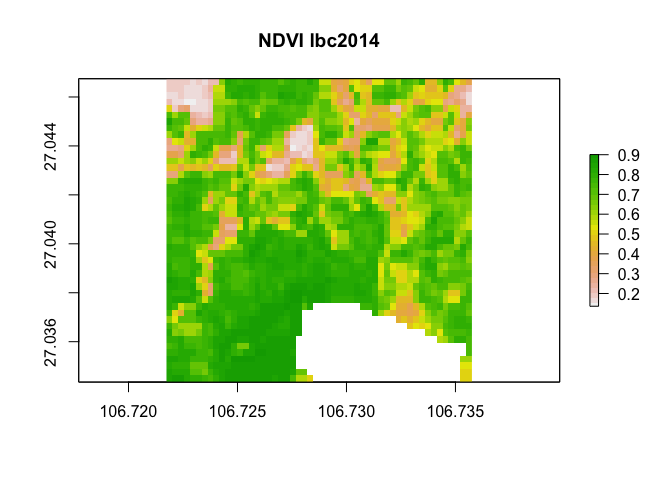
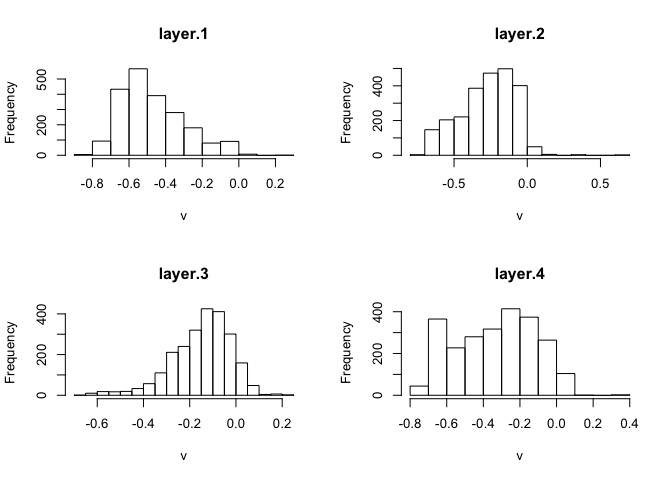

spot analysis of taobao village sites
================
Xiaowei Wang

## Spot analysis of taobao village sites

spot analysis of taobao village sites and villages sites that are not
taobao
    villages

``` r
library(mapview)      #interactive maps, raster + vector layers
```

    ## Loading required package: leaflet

``` r
library(raster)       #Main raster library
```

    ## Loading required package: sp

``` r
library(tidyverse)    #our old friend
```

    ## ── Attaching packages ───────────────────────────────────────────────────────────────────────────── tidyverse 1.2.1 ──

    ## ✔ ggplot2 2.2.1.9000     ✔ purrr   0.2.4     
    ## ✔ tibble  1.4.2          ✔ dplyr   0.7.4     
    ## ✔ tidyr   0.7.2          ✔ stringr 1.3.0     
    ## ✔ readr   1.1.1          ✔ forcats 0.2.0

    ## Warning: package 'tibble' was built under R version 3.4.3

    ## Warning: package 'stringr' was built under R version 3.4.3

    ## ── Conflicts ──────────────────────────────────────────────────────────────────────────────── tidyverse_conflicts() ──
    ## ✖ ggplot2::calc()  masks raster::calc()
    ## ✖ tidyr::extract() masks raster::extract()
    ## ✖ dplyr::filter()  masks stats::filter()
    ## ✖ dplyr::lag()     masks stats::lag()
    ## ✖ dplyr::select()  masks raster::select()

``` r
library(sf)           #to work with simple features data
```

    ## Warning: package 'sf' was built under R version 3.4.3

    ## Linking to GEOS 3.6.1, GDAL 2.1.3, proj.4 4.9.3

``` r
library(dplyr)
```

## Read in and get some stats

``` r
lbc2014 <- brick('data/lbc-raster-cropped/lbc_2014_cropped.tif')
lbc2015 <- brick('data/lbc-raster-cropped/lbc_2015_cropped.tif')
lbc2016 <- brick('data/lbc-raster-cropped/lbc_2016_cropped.tif')
lbc2017 <- brick('data/lbc-raster-cropped/lbc_2017_cropped.tif')

lbc2014
```

    ## class       : RasterBrick 
    ## dimensions  : 46, 52, 2392, 14  (nrow, ncol, ncell, nlayers)
    ## resolution  : 0.0002694946, 0.0002694946  (x, y)
    ## extent      : 106.7217, 106.7358, 27.03435, 27.04675  (xmin, xmax, ymin, ymax)
    ## coord. ref. : +proj=longlat +datum=WGS84 +no_defs +ellps=WGS84 +towgs84=0,0,0 
    ## data source : /Users/xiaoweirwang/Projects/taobao-villages/scripts/data/lbc-raster-cropped/lbc_2014_cropped.tif 
    ## names       : lbc_2014_cropped.1, lbc_2014_cropped.2, lbc_2014_cropped.3, lbc_2014_cropped.4, lbc_2014_cropped.5, lbc_2014_cropped.6, lbc_2014_cropped.7, lbc_2014_cropped.8, lbc_2014_cropped.9, lbc_2014_cropped.10, lbc_2014_cropped.11, lbc_2014_cropped.12, lbc_2014_cropped.13, lbc_2014_cropped.14 
    ## min values  :      -1.125000e+03,      -5.370000e+02,       1.870000e+02,       8.200000e+01,       1.080000e+03,       3.440000e+02,       1.540000e+02,       2.957000e+03,       2.922000e+03,        6.600000e+01,        3.220000e+02,        0.000000e+00,        1.357031e-01,        1.406691e+12 
    ## max values  :       1.563000e+03,       1.672000e+03,       2.062000e+03,       2.469000e+03,       5.057000e+03,       4.181000e+03,       5.077000e+03,       3.025000e+03,       2.977000e+03,        2.280000e+02,        3.860000e+02,        0.000000e+00,        9.007264e-01,        1.406691e+12

``` r
lbc2015
```

    ## class       : RasterBrick 
    ## dimensions  : 46, 52, 2392, 14  (nrow, ncol, ncell, nlayers)
    ## resolution  : 0.0002694946, 0.0002694946  (x, y)
    ## extent      : 106.7217, 106.7358, 27.03435, 27.04675  (xmin, xmax, ymin, ymax)
    ## coord. ref. : +proj=longlat +datum=WGS84 +no_defs +ellps=WGS84 +towgs84=0,0,0 
    ## data source : /Users/xiaoweirwang/Projects/taobao-villages/scripts/data/lbc-raster-cropped/lbc_2015_cropped.tif 
    ## names       : lbc_2015_cropped.1, lbc_2015_cropped.2, lbc_2015_cropped.3, lbc_2015_cropped.4, lbc_2015_cropped.5, lbc_2015_cropped.6, lbc_2015_cropped.7, lbc_2015_cropped.8, lbc_2015_cropped.9, lbc_2015_cropped.10, lbc_2015_cropped.11, lbc_2015_cropped.12, lbc_2015_cropped.13, lbc_2015_cropped.14 
    ## min values  :       1.240000e+02,       2.270000e+02,       4.960000e+02,       3.460000e+02,       1.321000e+03,       1.157000e+03,       6.070000e+02,       2.897000e+03,       2.883000e+03,        6.600000e+01,        3.220000e+02,        0.000000e+00,        1.429886e-01,        1.428809e+12 
    ## max values  :       1.996000e+03,       2.272000e+03,       2.856000e+03,       3.233000e+03,       4.079000e+03,       1.109100e+04,       1.456500e+04,       2.949000e+03,       2.929000e+03,        2.280000e+02,        3.220000e+02,        0.000000e+00,        8.287406e-01,        1.437103e+12

``` r
lbc2016
```

    ## class       : RasterBrick 
    ## dimensions  : 46, 52, 2392, 14  (nrow, ncol, ncell, nlayers)
    ## resolution  : 0.0002694946, 0.0002694946  (x, y)
    ## extent      : 106.7217, 106.7358, 27.03435, 27.04675  (xmin, xmax, ymin, ymax)
    ## coord. ref. : +proj=longlat +datum=WGS84 +no_defs +ellps=WGS84 +towgs84=0,0,0 
    ## data source : /Users/xiaoweirwang/Projects/taobao-villages/scripts/data/lbc-raster-cropped/lbc_2016_cropped.tif 
    ## names       : lbc_2016_cropped.1, lbc_2016_cropped.2, lbc_2016_cropped.3, lbc_2016_cropped.4, lbc_2016_cropped.5, lbc_2016_cropped.6, lbc_2016_cropped.7, lbc_2016_cropped.8, lbc_2016_cropped.9, lbc_2016_cropped.10, lbc_2016_cropped.11, lbc_2016_cropped.12, lbc_2016_cropped.13, lbc_2016_cropped.14 
    ## min values  :       9.600000e+01,       1.790000e+02,       3.050000e+02,       2.520000e+02,       7.460000e+02,       5.710000e+02,       3.780000e+02,       2.880000e+03,       2.867000e+03,        6.600000e+01,        3.220000e+02,        0.000000e+00,        1.801529e-01,        1.455075e+12 
    ## max values  :       1.212000e+03,       1.466000e+03,       1.995000e+03,       2.239000e+03,       4.673000e+03,       3.475000e+03,       3.211000e+03,       3.017000e+03,       2.975000e+03,        2.280000e+02,        3.220000e+02,        0.000000e+00,        9.206731e-01,        1.471663e+12

``` r
lbc2017
```

    ## class       : RasterBrick 
    ## dimensions  : 46, 52, 2392, 14  (nrow, ncol, ncell, nlayers)
    ## resolution  : 0.0002694946, 0.0002694946  (x, y)
    ## extent      : 106.7217, 106.7358, 27.03435, 27.04675  (xmin, xmax, ymin, ymax)
    ## coord. ref. : +proj=longlat +datum=WGS84 +no_defs +ellps=WGS84 +towgs84=0,0,0 
    ## data source : /Users/xiaoweirwang/Projects/taobao-villages/scripts/data/lbc-raster-cropped/lbc_2017_cropped.tif 
    ## names       : lbc_2017_cropped.1, lbc_2017_cropped.2, lbc_2017_cropped.3, lbc_2017_cropped.4, lbc_2017_cropped.5, lbc_2017_cropped.6, lbc_2017_cropped.7, lbc_2017_cropped.8, lbc_2017_cropped.9, lbc_2017_cropped.10, lbc_2017_cropped.11, lbc_2017_cropped.12, lbc_2017_cropped.13, lbc_2017_cropped.14 
    ## min values  :      -2.650000e+02,       1.300000e+01,       2.730000e+02,       1.790000e+02,       1.037000e+03,       6.610000e+02,       3.130000e+02,       2.934000e+03,       2.907000e+03,        6.600000e+01,        3.220000e+02,        0.000000e+00,        1.513150e-01,        1.491017e+12 
    ## max values  :       1.618000e+03,       1.869000e+03,       2.274000e+03,       2.369000e+03,       6.053000e+03,       3.695000e+03,       4.299000e+03,       3.015000e+03,       2.978000e+03,        2.280000e+02,        3.860000e+02,        0.000000e+00,        9.478509e-01,        1.500694e+12

``` r
#12 band data from tif

plotRGB(lbc2014, r = 4, g = 3, b = 2, axes = TRUE, stretch = "lin",
        main = "Landsat True Color Composite lbc 2014")
```

<!-- -->

``` r
# plotRGB(lbc2015, r = 4, g = 3, b = 2, axes = TRUE, stretch = "lin",
#         main = "Landsat True Color Composite lbc2015")
# 
# plotRGB(lbc2016, r = 4, g = 3, b = 2, axes = TRUE, stretch = "lin",
#         main = "Landsat True Color Composite lbc2016")
# 
# plotRGB(lbc2017, r = 4, g = 3, b = 2, axes = TRUE, stretch = "lin",
#         main = "Landsat True Color Composite lbc2017")
```

\#\#compute ndvi for LBC

``` r
NDVI <- function(img, i, k) {
   bi <- img[[i]]
   bk <- img[[k]]
   vi <- (bk - bi) / (bk + bi)
   return(vi)
}
```

\#\#function for NDBI

``` r
NDBI <- function (img, w, n) {
  bw <- img[[w]]
  bn <- img[[n]]
  vn <- (bw - bn) / (bw + bn)
}
```

``` r
# For landsat 8, NIR is 5, red is 4.
ndvilbc_2014 <- NDVI(lbc2014, 4, 5)
ndvilbc_2015 <- NDVI(lbc2015, 4 , 5)
ndvilbc_2016 <- NDVI(lbc2016, 4, 5)
ndvilbc_2017 <- NDVI(lbc2017, 4, 5)


ndbilbc_2014 <- NDBI(lbc2014, 7, 5)
ndbilbc_2015 <- NDBI(lbc2015, 7 , 5)
ndbilbc_2016 <- NDBI(lbc2016, 7, 5)
ndbilbc_2017 <- NDBI(lbc2017, 7, 5)
```

``` r
plot(ndvilbc_2014, col = rev(terrain.colors(30)), main = 'NDVI lbc2014')
```

<!-- -->

``` r
plot(ndvilbc_2015, col = rev(terrain.colors(30)), main = 'NDVI lbc2015')
```

<!-- -->

``` r
 plot(ndvilbc_2016, col = rev(terrain.colors(30)), main = 'NDVI lbc2016')
```

<!-- -->

``` r
 plot(ndvilbc_2017, col = rev(terrain.colors(30)), main = 'NDVI lbc2017')
```

<!-- -->

``` r
# view distribution of NDVI values
# hist(ndvilbc_2014,
#   main = "NDVI: Distribution of pixels\n Landsat 2014 Libeicun",
#   col = "springgreen",
#   xlab = "NDVI lbc2014")
# 
```

``` r
plot(ndbilbc_2014, col = rev(terrain.colors(30)), main = 'NDBI lbc2014')
```

<!-- -->

``` r
# plot(ndbilbc_2015, col = rev(terrain.colors(30)), main = 'NDBI lbc2015')
# plot(ndbilbc_2016, col = rev(terrain.colors(30)), main = 'NDBI lbc2016')
# plot(ndbilbc_2017, col = rev(terrain.colors(30)), main = 'NDBI lbc2017')
```

## Calculate average NDVI as a time series

``` r
ndvi_lbc_stack <- stack(ndvilbc_2014,ndvilbc_2015,ndvilbc_2016, ndvilbc_2017)
#names(ndvi_lbc_stack) <- c(2014,2015,2016,2017)
avg_ndvi_lbc <- cellStats(ndvi_lbc_stack, mean)

avg_ndvi_lbc <- as_tibble(avg_ndvi_lbc)
# add a site column to our data


# add a "year" column to our data
avg_ndvi_lbc$'year' <- c(2014,2015,2016,2017)
hist(ndvi_lbc_stack)
```

<!-- -->

``` r
avg_ndvi_lbc <- avg_ndvi_lbc[c("year", "value")]
avg_ndvi_lbc = rename(avg_ndvi_lbc, `meanndvi` = value)
# avg_ndvi_lbc

ggplot(data = avg_ndvi_lbc, aes(x=year, y=meanndvi)) +
  geom_point()
```

<!-- -->

### Calculate average NDBI as a time series

``` r
ndbi_lbc_stack <- stack(ndbilbc_2014,ndbilbc_2015,ndbilbc_2016, ndbilbc_2017)
#names(ndbi_lbc_stack) <- c(2014,2015,2016,2017)
avg_ndbi_lbc <- cellStats(ndbi_lbc_stack, mean)

avg_ndbi_lbc <- as_tibble(avg_ndbi_lbc)
# add a site column to our data


# add a "year" column to our data
avg_ndbi_lbc$'year' <- c(2014,2015,2016,2017)
hist(ndbi_lbc_stack)
```

<!-- -->

``` r
avg_ndbi_lbc <- avg_ndbi_lbc[c("year", "value")]
avg_ndbi_lbc = rename(avg_ndbi_lbc, `meanndbi` = value)
# avg_ndbi_lbc

ggplot(data = avg_ndbi_lbc, aes(x=year, y=meanndbi)) +
  geom_point()
```

<!-- -->

## NDVI for non taobao village, 安徽省程楼村, Chengloucun

``` r
clc2014 <- brick('data/clc/clc_2014.tif')
clc2015 <- brick('data/clc/clc_2015.tif')
clc2016 <- brick('data/clc/clc_2016.tif')
clc2017 <- brick('data/clc/clc_2017.tif')
clc2014nl <- brick('data/clc/clc_2014_nlviirs.tif')


#12 band data from tif
plotRGB(clc2014, r = 4, g = 3, b = 2, axes = TRUE, stretch = "lin",
        main = "Landsat True Color Composite clc 2014")
```

<!-- -->

``` r
# plotRGB(clc2015, r = 4, g = 3, b = 2, axes = TRUE, stretch = "lin",
#         main = "Landsat True Color Composite clc2015")
# 
# plotRGB(clc2016, r = 4, g = 3, b = 2, axes = TRUE, stretch = "lin",
#         main = "Landsat True Color Composite clc2016")

plotRGB(clc2017, r = 4, g = 3, b = 2, axes = TRUE, stretch = "lin",
        main = "Landsat True Color Composite clc2017")
```

<!-- -->

``` r
ndviclc_2014 <- NDVI(clc2014, 4, 5)
ndviclc_2015 <- NDVI(clc2015, 4 , 5)
ndviclc_2016 <- NDVI(clc2016, 4, 5)
ndviclc_2017 <- NDVI(clc2017, 4, 5)
```

``` r
plot(clc2014nl, col = gray.colors(10, start = 0, end = 1, gamma = 2.2, alpha = NULL))
```

<!-- -->

``` r
plot(ndviclc_2014, col = rev(terrain.colors(30)), main = 'NDVI clc2014')
```

<!-- -->

``` r
# plot(ndviclc_2015, col = rev(terrain.colors(30)), main = 'NDVI clc2015')
# plot(ndviclc_2016, col = rev(terrain.colors(30)), main = 'NDVI clc2016')
# plot(ndviclc_2017, col = rev(terrain.colors(30)), main = 'NDVI clc2017')
# 


ndvi_clc_stack <- stack(ndviclc_2014,ndviclc_2015,ndviclc_2016, ndviclc_2017)
#names(ndvi_clc_stack) <- c(2014,2015,2016,2017)
avg_ndvi_clc <- cellStats(ndvi_clc_stack, mean)

avg_ndvi_clc <- as_tibble(avg_ndvi_clc)
# add a site column to our data


# add a "year" column to our data
avg_ndvi_clc$'year' <- c(2014,2015,2016,2017)
hist(ndvi_clc_stack)
```

<!-- -->

``` r
avg_ndvi_clc <- avg_ndvi_clc[c("year", "value")]
avg_ndvi_clc = rename(avg_ndvi_clc, `meanndvi` = value)
# avg_ndvi_clc

ggplot(data = avg_ndvi_clc, aes(x=year, y=meanndvi)) +
  geom_point()
```

<!-- -->

## NDVI for a Taobao village, 浙江省马丁村 Madingcun which was implemented as a Taobao village in 2015

``` r
mdc2014 <- brick('data/mdc/mdc_2014.tif')
mdc2015 <- brick('data/mdc/mdc_2015.tif')
mdc2016 <- brick('data/mdc/mdc_2016.tif')
mdc2017 <- brick('data/mdc/mdc_2017.tif')
mdc2014nl <- brick('data/mdc/mdc_2014_nlviirs.tif')

mdc2014
```

    ## class       : RasterBrick 
    ## dimensions  : 67, 77, 5159, 14  (nrow, ncol, ncell, nlayers)
    ## resolution  : 0.0002694946, 0.0002694946  (x, y)
    ## extent      : 120.1132, 120.1339, 29.39054, 29.4086  (xmin, xmax, ymin, ymax)
    ## coord. ref. : +proj=longlat +datum=WGS84 +no_defs +ellps=WGS84 +towgs84=0,0,0 
    ## data source : /Users/xiaoweirwang/Projects/taobao-villages/scripts/data/mdc/mdc_2014.tif 
    ## names       : mdc_2014.1, mdc_2014.2, mdc_2014.3, mdc_2014.4, mdc_2014.5, mdc_2014.6, mdc_2014.7, mdc_2014.8, mdc_2014.9, mdc_2014.10, mdc_2014.11, mdc_2014.12, mdc_2014.13, mdc_2014.14

``` r
#12 band data from tif


ndvimdc_2014 <- NDVI(mdc2014, 4, 5)
ndvimdc_2015 <- NDVI(mdc2015, 4 , 5)
ndvimdc_2016 <- NDVI(mdc2016, 4, 5)
ndvimdc_2017 <- NDVI(mdc2017, 4, 5)
```

``` r
plotRGB(mdc2014, r = 4, g = 3, b = 2, axes = TRUE, stretch = "lin",
        main = "Landsat True Color Composite mdc 2014")
```

<!-- -->

``` r
# plotRGB(mdc2015, r = 4, g = 3, b = 2, axes = TRUE, stretch = "lin",
#         main = "Landsat True Color Composite mdc2015")
# 
# plotRGB(mdc2016, r = 4, g = 3, b = 2, axes = TRUE, stretch = "lin",
#         main = "Landsat True Color Composite mdc2016")
# 
# plotRGB(mdc2017, r = 4, g = 3, b = 2, axes = TRUE, stretch = "lin",
#         main = "Landsat True Color Composite mdc2017")
plot(ndvimdc_2014, col = rev(terrain.colors(30)), main = 'NDVI mdc2014')
```

<!-- -->

``` r
# plot(ndvimdc_2015, col = rev(terrain.colors(30)), main = 'NDVI mdc2015')
# plot(ndvimdc_2016, col = rev(terrain.colors(30)), main = 'NDVI mdc2016')
# plot(ndvimdc_2017, col = rev(terrain.colors(30)), main = 'NDVI mdc2017')
# 


ndvi_mdc_stack <- stack(ndvimdc_2014,ndvimdc_2015,ndvimdc_2016, ndvimdc_2017)
#names(ndvi_mdc_stack) <- c(2014,2015,2016,2017)
avg_ndvi_mdc <- cellStats(ndvi_mdc_stack, mean)

avg_ndvi_mdc <- as_tibble(avg_ndvi_mdc)
# add a site column to our data


# add a "year" column to our data
avg_ndvi_mdc$'year' <- c(2014,2015,2016,2017)
hist(ndvi_mdc_stack)
```

<!-- -->

``` r
avg_ndvi_mdc <- avg_ndvi_mdc[c("year", "value")]
avg_ndvi_mdc = rename(avg_ndvi_mdc, `meanndvi` = value)
# avg_ndvi_mdc

ggplot(data = avg_ndvi_mdc, aes(x=year, y=meanndvi)) +
  geom_point()
```

<!-- -->

## Try another non-taobao village, Zizhucun

``` r
zzc2014 <- brick('data/zzc/zzc_2014.tif')
zzc2015 <- brick('data/zzc/zzc_2015.tif')
zzc2016 <- brick('data/zzc/zzc_2016.tif')
zzc2017 <- brick('data/zzc/zzc_2017.tif')

zzcnl_2014 <- brick('data/zzc/zzc_2014_nlviirs.tif')
zzcnl_2015 <- brick('data/zzc/zzc_2015_nlviirs.tif')
zzcnl_2016 <- brick('data/zzc/zzc_2016_nlviirs.tif')
zzcnl_2017 <- brick('data/zzc/zzc_2017_nlviirs.tif')


#12 band data from tif


ndvizzc_2014 <- NDVI(zzc2014, 4, 5)
ndvizzc_2015 <- NDVI(zzc2015, 4 , 5)
ndvizzc_2016 <- NDVI(zzc2016, 4, 5)
ndvizzc_2017 <- NDVI(zzc2017, 4, 5)
```

``` r
# plotRGB(zzc2014, r = 4, g = 3, b = 2, axes = TRUE, stretch = "lin",
#         main = "Landsat True Color Composite zzc 2014")
# 
# plotRGB(zzc2015, r = 4, g = 3, b = 2, axes = TRUE, stretch = "lin",
#         main = "Landsat True Color Composite zzc2015")
# 
# plotRGB(zzc2016, r = 4, g = 3, b = 2, axes = TRUE, stretch = "lin",
#         main = "Landsat True Color Composite zzc2016")
# 
# plotRGB(zzc2017, r = 4, g = 3, b = 2, axes = TRUE, stretch = "lin",
#         main = "Landsat True Color Composite zzc2017")
raster::plot(zzcnl_2014, col = gray.colors(10, start = 0, end = 1, gamma = 2.2, alpha = NULL))
```

<!-- -->

``` r
# raster::plot(zzc2015nl, col = gray.colors(10, start = 0, end = 1, gamma = 2.2, alpha = NULL))
# raster::plot(zzc2016nl, col = gray.colors(10, start = 0, end = 1, gamma = 2.2, alpha = NULL))
# raster::plot(zzc2017nl, col = gray.colors(10, start = 0, end = 1, gamma = 2.2, alpha = NULL))


plot(ndvizzc_2014, col = rev(terrain.colors(30)), main = 'NDVI zzc2014')
```

<!-- -->

``` r
# plot(ndvizzc_2015, col = rev(terrain.colors(30)), main = 'NDVI zzc2015')
# plot(ndvizzc_2016, col = rev(terrain.colors(30)), main = 'NDVI zzc2016')
# plot(ndvizzc_2017, col = rev(terrain.colors(30)), main = 'NDVI zzc2017')
# 


ndvi_zzc_stack <- stack(ndvizzc_2014,ndvizzc_2015,ndvizzc_2016, ndvizzc_2017)
nl_zzc_stack <- stack(zzcnl_2014,zzcnl_2015,zzcnl_2016, zzcnl_2017)

#names(ndvi_zzc_stack) <- c(2014,2015,2016,2017)
avg_ndvi_zzc <- cellStats(ndvi_zzc_stack, mean)

avg_ndvi_zzc <- as_tibble(avg_ndvi_zzc)
# add a site column to our data


# add a "year" column to our data
avg_ndvi_zzc$'year' <- c(2014,2015,2016,2017)
hist(ndvi_zzc_stack)
```

<!-- -->

``` r
avg_ndvi_zzc <- avg_ndvi_zzc[c("year", "value")]
avg_ndvi_zzc = rename(avg_ndvi_zzc, `meanndvi` = value)
# avg_ndvi_zzc

ggplot(data = avg_ndvi_zzc, aes(x=year, y=meanndvi)) +
  geom_point()
```

<!-- -->

``` r
# night lights
#names(ndvi_zzc_stack) <- c(2014,2015,2016,2017)
avg_nl_zzc <- cellStats(nl_zzc_stack, mean)

avg_nl_zzc <- as_tibble(avg_nl_zzc)
# add a site column to our data


# add a "year" column to our data
avg_nl_zzc$'year' <- c(2014,2015,2016,2017)
hist(nl_zzc_stack)
```

<!-- -->

``` r
avg_nl_zzc <- avg_nl_zzc[c("year", "value")]
avg_nl_zzc = rename(avg_nl_zzc, `meannl` = value)
avg_nl_zzc
```

    ## # A tibble: 4 x 2
    ##    year meannl
    ##   <dbl>  <dbl>
    ## 1 2014.   10.5
    ## 2 2015.   14.0
    ## 3 2016.   12.9
    ## 4 2017.   14.4

``` r
ggplot(data = avg_nl_zzc, aes(x=year, y=meannl)) +
  geom_point()
```

<!-- -->

## All four together

``` r
#Taobao villages
ggplot(data = avg_ndvi_lbc, aes(x=year, y=meanndvi)) +
  geom_point()
```

<!-- -->

``` r
ggplot(data = avg_ndvi_mdc, aes(x=year, y=meanndvi)) +
  geom_point()
```

<!-- -->

``` r
ggplot(data = avg_ndvi_clc, aes(x=year, y=meanndvi)) +
  geom_point()
```

<!-- -->

``` r
ggplot(data = avg_ndvi_zzc, aes(x=year, y=meanndvi)) +
  geom_point()
```

<!-- -->

``` r
hist(ndvi_lbc_stack)
```

<!-- -->

``` r
hist(ndvi_mdc_stack)
```

<!-- -->

``` r
hist(ndvi_clc_stack)
```

<!-- -->

``` r
hist(ndvi_zzc_stack)
```

<!-- -->
