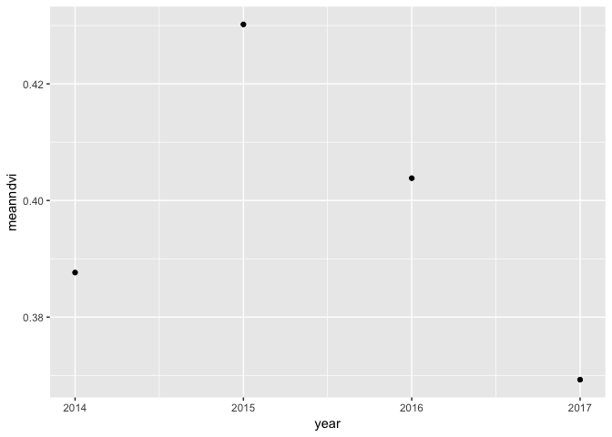

#Contents

This is a final project PDF document for DS421 stitched together from other experiments in this rpo. 

Some major goals were:
- Get satellite data/imagery for village and county names.
- Poke around household income data
- Poke around land use change for a few Taobao villages. 

## Section A
First we'll take a look at household income data from CHIP, an{rd geocode the counties based off a csv of "official administrative codes".

We'll also poke at the data a bit, looking at changes over time.

## Section B


##CHIP

CHIP (China Household Income Project) is put out by the CIID Beijing as a longitudinal survey. It's been happening since 1988 and includes all kinds of juicy stuff including land use.

Load up necessary libraries. Some data is in `.dta` which is Stata file. 


```r
library(tidyr)
library(tidyverse)
```

```
## Warning: package 'tibble' was built under R version 3.4.3
```

```
## Warning: package 'stringr' was built under R version 3.4.3
```

```r
library(dplyr)
library(foreign)
library(reticulate)
```

```
## Warning: package 'reticulate' was built under R version 3.4.4
```

```r
library(haven)
library(ggmap)
library(sf)
```

```
## Warning: package 'sf' was built under R version 3.4.3
```

```r
library(raster)
library(spData)        # load geographic data
```

```
## Warning: package 'spData' was built under R version 3.4.4
```

```r
library(httr)
library(jsonlite)
library(mapview)
library(leaflet)
```


```r
chips_rur_1988 <- read_dta('data/1988/09836-0002-Data.dta')
chips_rur_1995 <- read_tsv('data/1995/DS0002/03012-0002-Data.tsv')
```

```
## Warning in rbind(names(probs), probs_f): number of columns of result is not
## a multiple of vector length (arg 1)
```

```
## Warning: 198 parsing failures.
## row # A tibble: 5 x 5 col     row col     expected               actual file                         expected   <int> <chr>   <chr>                  <chr>  <chr>                        actual 1  1499 B904E_2 no trailing characters .9     'data/1995/DS0002/03012-000… file 2  1500 B904E_2 no trailing characters .9     'data/1995/DS0002/03012-000… row 3  1501 B904E_2 no trailing characters .3     'data/1995/DS0002/03012-000… col 4  1502 B904E_2 no trailing characters .9     'data/1995/DS0002/03012-000… expected 5  1503 B904E_2 no trailing characters .9     'data/1995/DS0002/03012-000…
## ... ................. ... .......................................................................... ........ .......................................................................... ...... .......................................................................... .... .......................................................................... ... .......................................................................... ... .......................................................................... ........ ..........................................................................
## See problems(...) for more details.
```

```r
chips_rur_2002<- read_tsv('data/2002/DS0006/21741-0006-Data.tsv')
```

```
## Warning in rbind(names(probs), probs_f): number of columns of result is not
## a multiple of vector length (arg 1)
```

```
## Warning: 244 parsing failures.
## row # A tibble: 5 x 5 col     row col   expected               actual           file                 expected   <int> <chr> <chr>                  <chr>            <chr>                actual 1  5632 p1_37 an integer             .100000001490116 'data/2002/DS0006/2… file 2  6685 p1_39 an integer             .5               'data/2002/DS0006/2… row 3  6780 p1_62 no trailing characters .5               'data/2002/DS0006/2… col 4  7848 p1_12 an integer             .5               'data/2002/DS0006/2… expected 5  8077 p1_62 no trailing characters .5               'data/2002/DS0006/2…
## ... ................. ... .......................................................................... ........ .......................................................................... ...... .......................................................................... .... .......................................................................... ... .......................................................................... ... .......................................................................... ........ ..........................................................................
## See problems(...) for more details.
```

```r
chips_rur_2007abc <- read_dta('data/2007 (2008)/RHS_w1_abc.dta')
chips_rur_2007d <- read_dta('data/2007 (2008)/RHS_w1_d.dta')
chips_rur_2007e1 <- read_dta('data/2007 (2008)/RHS_w1_e1.dta')
chips_rur_2007e2 <- read_dta('data/2007 (2008)/RHS_w1_e2.dta')
chips_rur_2007e3 <- read_dta('data/2007 (2008)/RHS_w1_e3.dta')
chips_rur_2007e4 <- read_dta('data/2007 (2008)/RHS_w1_e4.dta')
chips_rur_2007hhiexp <- read_dta('data/2007 (2008)/CHIP2007_income_and_expenditure_20150408.dta')
chips_rur_2008abc <- read_dta('data/2008 (2009)/RHS_w2_abc.dta')
chips_rur_2008d <- read_dta('data/2008 (2009)/RHS_w2_d.dta')
chips_rur_2008e <- read_dta('data/2008 (2009)/RHS_w2_e.dta')
chips_rur_2008f <- read_dta('data/2008 (2009)/RHS_w2_f.dta')
chips_rur_2008hgsg <- read_dta('data/2008 (2009)/RHS_w2_hgsg.dta')
chips_rur_2008hijk <- read_dta('data/2008 (2009)/RHS_w2_hijk.dta')
chips_rur_2008vill <- read_dta('data/2008 (2009)/RHS_w2_vill.dta')
chips_rur_2013 <- read_dta('data/2013/CHIP2013_rural_household_f_income_asset.dta')


name_vill_id_2007 <- read_dta('data/2007 (2008)/name_id_and_village_id_20151010.dta')
```


### Table of columns used:

| Year | Net household income | Land cultivated | Number of rooms in House | Fixed production assets | Total household exp on production
|---|---|---|---|---|---|
|1988| HNET88 | LAT | HHO | VHPFP | EFP88 |
|1995| B602 | B801 | B1001 | B804_1 | B7130 |
|2002| na| na| na| na| na|
|2007| income_net | na | na | na | na|
|2009| na | H01 | na | K01 | na|
|2013| F01_1 | L01_1 | na | F07_1 + F07_2 | F02_1 | 


```r
# Filter out some data from 1988 because there's missing values. They got rid of missing values in later datasets.

chips_rur_1988_filt <- chips_rur_1988 %>% filter(HNET88 != 99999999, LAT != 999.9, HHO != 99, VHPFP != 99999, EFP88 != 99999999 ) 

base::mean(chips_rur_1988_filt$HNET88)
```

```
## [1] 2739.51
```

```r
base::mean(chips_rur_1995$B602)
```

```
## [1] 6812.06
```

```r
base::mean(chips_rur_2007hhiexp$income_net)
```

```
## [1] 19451.19
```

```r
base::mean(chips_rur_2013$f01_1, na.rm=TRUE)
```

```
## [1] 45654.01
```

```r
meanNetIncome <- new_tibble(list(year = c(1988,1995,2007,2013), 
                     meanInNet = c(base::mean(chips_rur_1988_filt$HNET88), base::mean(chips_rur_1995$B602), base::mean(chips_rur_2007hhiexp$income_net), base::mean(chips_rur_2013$f01_1, na.rm=TRUE))))

ggplot(meanNetIncome, aes(year, meanInNet)) +
  geom_line() +
  geom_point() +
  geom_label(label=meanNetIncome$meanInNet, nudge_x = 2, nudge_y = 1)
```

<!-- -->


```r
chips_rur_1988_filt <- chips_rur_1988_filt %>%
  mutate(., PROVCOUNTY = paste0(PROVINCE, COUNTY)) 

chips_rur_1988_filt$UCODE <- substr(chips_rur_1988_filt$UCODE, 1,6)


#A1 is county and city code
chips_rur_1995 %>%
  mutate(., PROVCOUNTY = paste0(PROVINCE, COUNTY))
```

```
## # A tibble: 7,998 x 262
##        A1  B101  B401  B402  B403  B404  B405  B406  B407 B407A  B408
##     <int> <int> <int> <int> <int> <int> <int> <int> <int> <int> <int>
##  1 110221   101     1     1     2     2     2     2     2     0     1
##  2 110221   102     1     1     2     2     2     2     2     0     1
##  3 110221   103     1     1     2     2     2     2     2     0     1
##  4 110221   104     1     1     2     2     2     2     2     0     1
##  5 110221   105     1     1     2     2     2     2     2     0     1
##  6 110221   106     1     1     2     2     2     2     2     0     1
##  7 110221   107     1     1     2     2     2     2     2     0     1
##  8 110221   108     1     1     2     2     2     2     2     0     1
##  9 110221   109     1     1     2     2     2     2     2     0     1
## 10 110221   110     1     1     2     2     2     2     2     0     1
## # ... with 7,988 more rows, and 251 more variables: B409 <int>,
## #   B410 <int>, B411 <int>, B412 <int>, B412A <int>, B412B <int>,
## #   B412C <int>, B412D <int>, B413 <int>, B414 <int>, B501_1 <int>,
## #   B501_2 <int>, B501_3 <int>, B501A_1 <int>, B501A_2 <int>,
## #   B501A_3 <int>, B501B_1 <int>, B501B_2 <int>, B501B_3 <int>,
## #   B501C_1 <int>, B501C_2 <int>, B501C_3 <int>, B501D_1 <int>,
## #   B501D_2 <int>, B501D_3 <int>, B501E_1 <int>, B501E_2 <int>,
## #   B501E_3 <int>, B501F_1 <int>, B501F_2 <int>, B501F_3 <int>,
## #   B502_1 <int>, B502_2 <int>, B502_3 <int>, B502A_1 <int>,
## #   B502A_2 <int>, B502A_3 <int>, B502B_1 <int>, B502B_2 <int>,
## #   B502B_3 <int>, B502C_1 <int>, B502C_2 <int>, B502C_3 <int>,
## #   B502D_1 <int>, B502D_2 <int>, B502D_3 <int>, B502E_1 <int>,
## #   B502E_2 <int>, B502E_3 <int>, B502F_1 <int>, B502F_2 <int>,
## #   B502F_3 <int>, B502G_1 <int>, B502G_2 <int>, B502G_3 <int>,
## #   B502H_1 <int>, B502H_2 <int>, B502H_3 <int>, B503 <int>, B504 <int>,
## #   B504A <int>, B504B <int>, B504C <int>, B505 <int>, B506 <int>,
## #   B506A <int>, B506B <int>, B507 <int>, B508 <int>, B509 <int>,
## #   B510 <int>, B511_1 <int>, B511_2 <int>, B511A_1 <int>, B511A_2 <int>,
## #   B511B_1 <int>, B511B_2 <int>, B511C_1 <int>, B511C_2 <int>,
## #   B511D_1 <int>, B511D_2 <int>, B600 <int>, B601 <int>, B602 <int>,
## #   B700 <int>, B700A <int>, B701 <int>, B702 <int>, B703 <int>,
## #   B703A <int>, B703B <int>, B704 <int>, B705 <int>, B706 <int>,
## #   B707 <int>, B708 <int>, B708A <int>, B708B <int>, B708C <int>,
## #   B709 <int>, …
```

```r
chips_rur_2007hhiexp$name_id <- substr(chips_rur_2007hhiexp$name_id, 1, 6)
```


##County level variations in income


```r
chips_rur_1988_filt %>%
  group_by(UCODE) %>%
  summarise(mean = base::mean(HNET88)) %>%
  mutate(., diff_from_country_mean = mean-base::mean(chips_rur_1988_filt$HNET88)) %>%
  ggplot(aes(UCODE,mean)) +
           geom_point()
```

<!-- -->

```r
chips_rur_1995 %>%
  group_by(A1) %>%
  summarise(mean=base::mean(B602)) %>%
  mutate(., diff_from_country_mean = mean-base::mean(chips_rur_1995$B602))  %>%
  ggplot(aes(A1,mean)) +
           geom_point()
```

<!-- -->

```r
chips_rur_2007hhiexp %>%
  group_by(name_id) %>%
  summarise(mean=base::mean(income_net)) %>%
  mutate(., diff_from_country_mean = mean-base::mean(chips_rur_2007hhiexp$income_net)) %>%
  ggplot(aes(name_id,mean)) +
           geom_point()
```

<!-- -->

```r
chips_rur_2007hhiexp %>%
  group_by(name_id) 
```

```
## # A tibble: 8,000 x 14
## # Groups:   name_id [82]
##    name_id  exp1   exp2   exp3   exp4  exp5   exp6   exp7    exp8
##    <chr>   <dbl>  <dbl>  <dbl>  <dbl> <dbl>  <dbl>  <dbl>   <dbl>
##  1 130181  2670.    0.   2239. 1778.   971.  520.   386.    12.0 
##  2 130181  9633. 5364.   8978. 6396.   786. 1935.  1687.  1946.  
##  3 130181  4012.  442.   1941.  180.   120.  134.    13.0    3.00
##  4 130181  9487. 1986.   5853. 1020.   884. 4192.   386.   357.  
##  5 130181  3371. 1174.   2750.  712.   290.  270.    44.7   34.3 
##  6 130181  6559.   47.0 20386.  147.   432.  120.   102.    14.0 
##  7 130181  4449.  293.   1748.  201.  1254.  374.   118.    47.3 
##  8 130181  6968.  808.   1072.  147.   300.   69.2   72.0   65.4 
##  9 130181  3518.  742.   1344.  246.   567. 1162.   564.   137.  
## 10 130181  3805.  414.   9059.   48.0  959.  400.   473.   114.  
## # ... with 7,990 more rows, and 5 more variables: income_net <dbl>,
## #   income_net_1 <dbl>, income_net_2 <dbl>, income_net_3 <dbl>,
## #   income_net_4 <dbl>
```

```r
chips_rur_2013 %>%
  group_by(coun) %>%
  summarise(mean=base::mean(f01_1)) %>%
  mutate(., diff_from_country_mean = mean-base::mean(chips_rur_2013$f01_1, na.rm=TRUE)) %>%
  ggplot(aes(coun,mean)) +
           geom_point()
```

```
## Warning: Removed 12 rows containing missing values (geom_point).
```

<!-- -->
##dice off last 3 digits from `name id` of chips_rur_2007hhiexp 


```r
outlier_values_1988 <- boxplot.stats(chips_rur_1988_filt$HNET88)$out  # outlier values.
outlier_values_1995 <- boxplot.stats(chips_rur_1995$B602)$out  # outlier values.
outlier_values_2007 <- boxplot.stats(chips_rur_2007hhiexp$income_net)$out  # outlier values.
outlier_values_2013 <- boxplot.stats(chips_rur_2013$f01_1)$out  # outlier values.
boxplot(chips_rur_1988_filt$LAT, chips_rur_1988_filt$HNET88)
```

<!-- -->


## Geocode county addresses based off the county codes
Data from https://raw.githubusercontent.com/modood/Administrative-divisions-of-China/, basically there's a county code and name for each county. They are not geocoded however (by geocoded I mean "center" of county).


#Add long lat columns to the county code table


```r
counties_main <- read_csv('https://raw.githubusercontent.com/modood/Administrative-divisions-of-China/master/dist/areas.csv')

counties_main
```

```
## # A tibble: 2,856 x 4
##      code name     cityCode provinceCode
##     <int> <chr>       <int>        <int>
##  1 110101 东城区       1101           11
##  2 110102 西城区       1101           11
##  3 110105 朝阳区       1101           11
##  4 110106 丰台区       1101           11
##  5 110107 石景山区     1101           11
##  6 110108 海淀区       1101           11
##  7 110109 门头沟区     1101           11
##  8 110111 房山区       1101           11
##  9 110112 通州区       1101           11
## 10 110113 顺义区       1101           11
## # ... with 2,846 more rows
```

```r
counties_main$lat <- 'NA'
counties_main$long <- 'NA'

city_main <- read_csv('https://raw.githubusercontent.com/modood/Administrative-divisions-of-China/master/dist/cities.csv')
province_main <- read_csv('https://raw.githubusercontent.com/modood/Administrative-divisions-of-China/master/dist/provinces.csv')

prov_county_main <- left_join(counties_main, province_main,
                              by=c('provinceCode'='code'))

prov_county_main <- prov_county_main %>%
    rename('cityName' = name.y, 
           'countyName' = name.x) %>%
    mutate(., geocodeAdd = paste0(cityName,countyName))


prov_county_main
```

```
## # A tibble: 2,856 x 8
##      code countyName cityCode provinceCode lat   long  cityName geocodeAdd
##     <int> <chr>         <int>        <int> <chr> <chr> <chr>    <chr>     
##  1 110101 东城区         1101           11 NA    NA    北京市   北京市东城区…
##  2 110102 西城区         1101           11 NA    NA    北京市   北京市西城区…
##  3 110105 朝阳区         1101           11 NA    NA    北京市   北京市朝阳区…
##  4 110106 丰台区         1101           11 NA    NA    北京市   北京市丰台区…
##  5 110107 石景山区       1101           11 NA    NA    北京市   北京市石景山区…
##  6 110108 海淀区         1101           11 NA    NA    北京市   北京市海淀区…
##  7 110109 门头沟区       1101           11 NA    NA    北京市   北京市门头沟区…
##  8 110111 房山区         1101           11 NA    NA    北京市   北京市房山区…
##  9 110112 通州区         1101           11 NA    NA    北京市   北京市通州区…
## 10 110113 顺义区         1101           11 NA    NA    北京市   北京市顺义区…
## # ... with 2,846 more rows
```


## Batch geocode using ggmap, h/t shayne lynn
# Set an API key for ggmap so we don't go over the limit 


```r
ggmap_credentials()
register_google(key='insertyourkeyhere')
library(ggmap)
ggmap_credentials()
```

## Divide the table into two so as to preempt going over the free geocoding limit

```r
# pcoun_codes_1 <- filter(prov_county_main, code < 400000)
# pcoun_codes_2 <- filter(prov_county_main, code >= 400000)
```

This section is commented out to prevent geocoding thousands of rows everytime we knit....

```r
# infile <- 'pcoun_2'
# data <-pcoun_codes_2
# 
# addresses = data$geocodeAdd
# 
# #define a function that will process googles server responses for us.
# getGeoDetails <- function(address){
#    #use the gecode function to query google servers
#    geo_reply = geocode(address, output='all', messaging=TRUE, override_limit=TRUE)
#    #now extract the bits that we need from the returned list
# 
#    answer <- data.frame(lat=NA, long=NA, accuracy=NA, formatted_address=NA, address_type=NA, status=NA)
#    answer$status <- geo_reply$status
# 
#    #if we are over the query limit - want to pause for an hour
#    while(geo_reply$status == "OVER_QUERY_LIMIT"){
#        print("OVER QUERY LIMIT - Pausing for 1 hour at:")
#        time <- Sys.time()
#        print(as.character(time))
#        Sys.sleep(60*60)
#        geo_reply = geocode(address, output='all', messaging=TRUE, override_limit=TRUE)
#        answer$status <- geo_reply$status
#    }
# 
#    #return Na's if we didn't get a match:
#    if (geo_reply$status != "OK"){
#        return(answer)
#    }
#    #else, extract what we need from the Google server reply into a dataframe:
#    answer$lat <- geo_reply$results[[1]]$geometry$location$lat
#    answer$long <- geo_reply$results[[1]]$geometry$location$lng
#    if (length(geo_reply$results[[1]]$types) > 0){
#        answer$accuracy <- geo_reply$results[[1]]$types[[1]]
#    }
#    answer$address_type <- paste(geo_reply$results[[1]]$types, collapse=',')
#    answer$formatted_address <- geo_reply$results[[1]]$formatted_address
# 
#    return(answer)
# }
# 
# #initialise a dataframe to hold the results
# geocoded <- data.frame()
# # find out where to start in the address list (if the script was interrupted before):
# startindex <- 1
# #if a temp file exists - load it up and count the rows!
# tempfilename <- paste0(infile, '_temp_geocoded.rds')
# if (file.exists(tempfilename)){
#        print("Found temp file - resuming from index:")
#        geocoded <- readRDS(tempfilename)
#        startindex <- nrow(geocoded)+1
#        print(startindex)
# }
# 
# # Start the geocoding process - address by address. geocode() function takes care of query speed limit.
# for (ii in seq(startindex, length(addresses))) {
#    print(paste("Working on index", ii, "of", length(addresses)))
#    #query the google geocoder - this will pause here if we are over the limit.
# 
#    result = getGeoDetails(addresses[ii])
#    print(result$status)
#    result$index <- ii
#    #append the answer to the results file.
#    geocoded <- rbind(geocoded, result)
#    #save temporary results as we are going along
#    saveRDS(geocoded, tempfilename)
# }

# geocodedTable <- data.frame(matrix(ncol = 3, nrow = 1516))
# #now we add the latitude and longitude to the main data
# 
# geocodedTable$status <- geocoded$status
# geocodedTable$formatted_address <- geocoded$formatted_address
# geocodedTable$index <- geocoded$index
# geocodedTable$lat <- geocoded$lat
# geocodedTable$long <- geocoded$long
# geocodedTable$accuracy <- geocoded$accuracy
# 
# 
# 
# #finally write it all to the output files
# saveRDS(data, paste0("../data/", infile ,"_geocoded.rds"))
# write.table(geocodedTable, file=paste0("", infile ,"_geocoded.csv"), sep=",", row.names=FALSE)
```

# Now there's two tables because we split the county list, put together vertically


```r
a <- read_csv('data/pcoun_1_geocoded.csv')
b <- read_csv('data/pcoun_2_geocoded.csv')
geocoded_areas <- bind_rows(a,b)

prov_county_main$lat <- geocoded_areas$lat
prov_county_main$long <- geocoded_areas$long

prov_county_main$engAdd <- geocoded_areas$formatted_address
```


## Join prov_county_main to the tables

```r
chips_rur_1988_filt$UCODE <- strtoi(chips_rur_1988_filt$UCODE)
prov_county_main
```

```
## # A tibble: 2,856 x 9
##      code countyName cityCode provinceCode   lat  long cityName geocodeAdd
##     <int> <chr>         <int>        <int> <dbl> <dbl> <chr>    <chr>     
##  1 110101 东城区         1101           11  39.9  116. 北京市   北京市东城区…
##  2 110102 西城区         1101           11  39.9  116. 北京市   北京市西城区…
##  3 110105 朝阳区         1101           11  39.9  116. 北京市   北京市朝阳区…
##  4 110106 丰台区         1101           11  39.9  116. 北京市   北京市丰台区…
##  5 110107 石景山区       1101           11  39.9  116. 北京市   北京市石景山区…
##  6 110108 海淀区         1101           11  40.0  116. 北京市   北京市海淀区…
##  7 110109 门头沟区       1101           11  39.9  116. 北京市   北京市门头沟区…
##  8 110111 房山区         1101           11  39.7  116. 北京市   北京市房山区…
##  9 110112 通州区         1101           11  39.9  117. 北京市   北京市通州区…
## 10 110113 顺义区         1101           11  40.1  117. 北京市   北京市顺义区…
## # ... with 2,846 more rows, and 1 more variable: engAdd <chr>
```

```r
chips_rur_1988_geocoded <- chips_rur_1988_filt %>% 
  inner_join(prov_county_main, by=c('UCODE'='code')) %>%
  na.omit()
```


## Maps of survey locations

```r
leaflet(data = chips_rur_1988_geocoded) %>% 
  addTiles() %>%
  addMarkers(~long, ~lat, popup = ~as.character(HNET88), label = ~as.character(HNET88))
```

<!--html_preserve--><div id="htmlwidget-66d7af5e11623acc4227" style="width:672px;height:480px;" class="leaflet html-widget"></div>
<script type="application/json" data-for="htmlwidget-66d7af5e11623acc4227">{"x":{"options":{"crs":{"crsClass":"L.CRS.EPSG3857","code":null,"proj4def":null,"projectedBounds":null,"options":{}}},"calls":[{"method":"addTiles","args":["//{s}.tile.openstreetmap.org/{z}/{x}/{y}.png",null,null,{"minZoom":0,"maxZoom":18,"maxNativeZoom":null,"tileSize":256,"subdomains":"abc","errorTileUrl":"","tms":false,"continuousWorld":false,"noWrap":false,"zoomOffset":0,"zoomReverse":false,"opacity":1,"zIndex":null,"unloadInvisibleTiles":null,"updateWhenIdle":null,"detectRetina":false,"reuseTiles":false,"attribution":"&copy; <a href=\"http://openstreetmap.org\">OpenStreetMap<\/a> contributors, <a href=\"http://creativecommons.org/licenses/by-sa/2.0/\">CC-BY-SA<\/a>"}]},{"method":"addMarkers","args":[[39.141152,39.141152,39.141152,39.141152,39.141152,39.141152,39.141152,39.141152,39.141152,39.141152,39.141152,39.141152,39.141152,39.141152,39.141152,39.141152,39.141152,39.141152,39.141152,38.032148,38.032148,38.032148,38.032148,38.032148,38.032148,38.032148,38.032148,38.032148,38.032148,38.032148,38.032148,38.032148,38.032148,38.032148,38.032148,38.032148,38.032148,38.032148,38.032148,38.032148,38.032148,38.032148,38.032148,38.032148,38.032148,38.032148,38.032148,38.032148,38.032148,38.032148,38.032148,39.712813,39.712813,39.712813,39.712813,39.712813,39.712813,39.712813,39.712813,39.712813,39.712813,39.712813,39.712813,39.712813,39.712813,39.712813,39.712813,39.712813,39.712813,39.712813,39.712813,39.712813,39.712813,39.712813,39.712813,39.712813,39.712813,39.712813,39.712813,39.712813,39.712813,39.712813,39.712813,39.712813,39.712813,39.712813,39.712813,39.712813,38.576379,38.576379,38.576379,38.576379,38.576379,38.576379,38.576379,38.576379,38.576379,38.576379,38.576379,38.576379,38.576379,38.576379,38.576379,38.576379,38.576379,38.576379,38.576379,38.576379,38.576379,38.576379,38.576379,38.576379,38.576379,38.576379,38.576379,38.576379,38.576379,38.576379,38.576379,38.576379,38.576379,38.576379,38.576379,38.576379,38.576379,38.576379,38.576379,38.576379,38.576379,38.576379,38.576379,38.576379,38.576379,38.576379,38.576379,38.576379,38.576379,35.690141,35.690141,35.690141,35.690141,35.690141,35.690141,35.690141,35.690141,35.690141,35.690141,35.690141,35.690141,35.690141,35.690141,35.690141,35.690141,35.690141,35.690141,35.690141,35.690141,35.690141,35.690141,35.690141,35.690141,35.690141,35.690141,35.690141,43.960889,43.960889,43.960889,43.960889,43.960889,43.960889,43.960889,43.960889,43.960889,43.960889,43.960889,43.960889,43.960889,43.960889,43.960889,43.960889,43.960889,43.960889,43.960889,43.960889,43.960889,43.960889,43.960889,43.960889,43.960889,43.960889,41.601375,41.601375,41.601375,41.601375,41.601375,41.601375,41.601375,41.601375,41.601375,41.601375,41.601375,41.601375,41.601375,41.601375,41.601375,41.601375,41.601375,41.601375,41.601375,41.601375,41.601375,41.601375,41.601375,41.601375,41.601375,41.601375,41.601375,42.290781,42.290781,42.290781,42.290781,42.290781,42.290781,42.290781,42.290781,42.290781,42.290781,42.290781,42.290781,42.290781,42.290781,42.290781,42.290781,42.290781,42.290781,42.290781,42.290781,42.290781,42.290781,42.290781,42.290781,42.290781,42.290781,46.07981,46.07981,46.07981,46.07981,46.07981,46.07981,46.07981,46.07981,46.07981,46.07981,46.07981,46.07981,46.07981,46.07981,46.07981,46.07981,46.07981,46.07981,46.07981,46.07981,46.07981,46.07981,46.07981,46.07981,46.07981,46.07981,41.412767,41.412767,41.412767,41.412767,41.412767,41.412767,41.412767,41.412767,41.412767,41.412767,41.412767,41.412767,41.412767,41.412767,41.412767,41.412767,41.412767,41.412767,41.412767,41.412767,41.412767,41.412767,41.412767,41.412767,41.412767,41.412767,41.412767,41.666028,41.666028,41.666028,41.666028,41.666028,41.666028,41.666028,41.666028,41.666028,41.666028,41.666028,41.666028,41.666028,41.666028,41.666028,41.666028,41.666028,41.666028,41.666028,41.666028,41.666028,41.666028,41.666028,41.666028,41.666028,41.666028,41.666028,41.666028,41.666028,41.666028,41.666028,41.666028,41.666028,42.785791,42.785791,42.785791,42.785791,42.785791,42.785791,42.785791,42.785791,42.785791,42.785791,42.785791,42.785791,42.785791,42.785791,42.785791,42.785791,42.785791,42.785791,42.785791,42.785791,42.785791,42.785791,42.785791,42.785791,42.785791,42.785791,42.785791,42.785791,42.785791,42.785791,42.785791,42.785791,42.785791,42.785791,42.785791,41.12815,41.12815,41.12815,41.12815,41.12815,41.12815,41.12815,41.12815,41.12815,41.12815,41.12815,41.12815,41.12815,41.12815,41.12815,41.12815,41.12815,41.12815,44.432888,44.432888,44.432888,44.432888,44.432888,44.432888,44.432888,44.432888,44.432888,44.432888,44.432888,44.432888,44.432888,44.432888,44.432888,44.432888,44.432888,44.432888,44.432888,44.432888,44.432888,44.432888,44.432888,44.432888,44.432888,44.432888,44.432888,44.432888,44.432888,44.432888,44.432888,44.432888,44.432888,44.432888,44.432888,44.432888,43.67184,43.67184,43.67184,43.67184,43.67184,43.67184,43.67184,43.67184,43.67184,43.67184,43.67184,43.67184,43.67184,43.67184,43.67184,43.67184,43.67184,43.67184,43.67184,43.67184,43.67184,43.67184,43.67184,43.67184,43.67184,43.67184,43.67184,43.67184,43.67184,43.67184,43.67184,43.67184,43.67184,43.67184,43.112593,43.112593,43.112593,43.112593,43.112593,43.112593,43.112593,43.112593,43.112593,43.112593,43.112593,43.112593,43.112593,43.112593,43.112593,43.112593,43.112593,43.112593,43.112593,43.112593,43.112593,43.112593,43.112593,43.112593,43.112593,43.112593,43.112593,43.112593,43.112593,43.112593,43.112593,43.112593,43.112593,43.112593,43.112593,47.338665,47.338665,47.338665,47.338665,47.338665,47.338665,47.338665,47.338665,47.338665,47.338665,47.338665,47.338665,47.338665,47.338665,47.338665,47.338665,47.338665,47.338665,47.338665,47.338665,47.338665,47.338665,47.338665,47.338665,47.338665,47.338665,47.338665,47.338665,47.338665,47.338665,47.338665,47.338665,47.338665,47.338665,47.338665,47.338665,47.338665,47.338665,47.338665,47.59585,47.59585,47.59585,47.59585,47.59585,47.59585,47.59585,47.59585,47.59585,47.59585,47.59585,47.59585,47.59585,47.59585,47.59585,47.59585,47.59585,47.59585,47.59585,47.59585,47.59585,47.59585,47.59585,47.59585,47.59585,47.59585,47.59585,47.59585,47.59585,47.59585,47.59585,33.781331,33.781331,33.781331,33.781331,33.781331,33.781331,33.781331,33.781331,33.781331,33.781331,33.781331,33.781331,33.781331,33.781331,33.781331,33.781331,33.781331,33.781331,33.781331,33.781331,33.781331,33.781331,33.781331,33.781331,33.781331,33.781331,33.781331,33.781331,33.781331,33.781331,33.781331,33.781331,33.781331,33.781331,33.781331,33.781331,33.781331,33.781331,33.781331,33.781331,33.781331,33.781331,33.781331,33.781331,33.781331,33.781331,33.781331,33.990334,33.990334,33.990334,33.990334,33.990334,33.990334,33.990334,33.990334,33.990334,33.990334,33.990334,33.990334,33.990334,33.990334,33.990334,33.990334,33.990334,33.990334,33.990334,33.990334,33.990334,33.990334,33.990334,33.990334,33.990334,33.990334,33.990334,33.990334,33.990334,33.990334,33.990334,33.990334,33.990334,33.990334,33.990334,33.990334,32.970031,32.970031,32.970031,32.970031,32.970031,32.970031,32.970031,32.970031,32.970031,32.970031,32.970031,32.970031,32.970031,32.970031,32.970031,32.970031,32.970031,32.970031,32.970031,32.970031,32.970031,32.970031,32.970031,32.970031,32.970031,32.970031,32.970031,32.970031,32.970031,32.970031,32.970031,32.970031,32.970031,32.970031,32.970031,32.970031,32.970031,32.970031,32.970031,32.970031,32.970031,32.970031,32.970031,32.970031,32.970031,32.970031,32.970031,32.970031,32.709444,33.915477,33.915477,33.915477,33.915477,33.915477,33.915477,33.915477,33.915477,33.915477,33.915477,33.915477,33.915477,33.915477,33.915477,33.915477,33.915477,33.915477,33.915477,33.915477,33.915477,33.915477,33.915477,33.915477,33.915477,33.915477,33.915477,33.915477,33.915477,33.915477,33.915477,33.915477,33.915477,33.915477,33.915477,33.915477,33.915477,33.915477,33.915477,33.915477,33.915477,33.915477,33.915477,33.915477,33.915477,33.915477,33.915477,33.915477,33.915477,33.915477,26.150047,26.150047,26.150047,26.150047,26.150047,26.150047,26.150047,26.150047,26.150047,26.150047,26.150047,26.150047,26.150047,26.150047,26.150047,26.150047,26.150047,26.197364,26.197364,26.197364,26.197364,26.197364,26.197364,26.197364,26.197364,26.197364,26.197364,26.197364,26.197364,26.197364,26.197364,26.197364,26.197364,26.197364,26.197364,26.197364,26.261753,26.261753,26.261753,26.261753,26.261753,26.261753,26.261753,26.261753,26.261753,26.261753,26.261753,26.261753,26.261753,26.261753,26.261753,26.261753,26.261753,26.261753,26.261753,26.170171,26.170171,26.170171,26.170171,26.170171,26.170171,26.170171,26.170171,26.170171,26.170171,26.170171,26.170171,26.170171,26.170171,26.170171,26.170171,26.170171,26.170171,25.03078,25.03078,25.03078,25.03078,25.03078,25.03078,25.03078,25.03078,25.03078,25.03078,25.03078,25.03078,24.117102,24.117102,24.117102,24.117102,24.117102,24.117102,24.117102,24.117102,24.117102,24.117102,24.117102,24.117102,24.117102,24.117102,24.117102,24.117102,24.117102,24.117102,28.545556,28.545556,28.545556,28.545556,28.545556,28.545556,28.545556,28.545556,28.545556,28.545556,28.545556,28.545556,28.545556,28.545556,28.545556,28.545556,28.545556,28.545556,28.545556,28.545556,28.545556,28.545556,28.545556,28.545556,28.545556,28.545556,28.545556,28.545556,28.545556,28.545556,28.545556,28.545556,29.608431,29.608431,29.608431,29.608431,29.608431,29.608431,29.608431,29.608431,29.608431,29.608431,29.608431,29.608431,29.608431,29.608431,29.608431,29.608431,29.608431,29.608431,29.608431,29.608431,29.608431,29.608431,29.608431,29.608431,29.608431,29.608431,29.608431,29.608431,29.608431,29.608431,29.608431,29.608431,29.608431,29.608431,29.273414,29.273414,29.273414,29.273414,29.273414,29.273414,29.273414,29.273414,29.273414,29.273414,29.273414,29.273414,29.273414,29.273414,29.273414,29.273414,29.273414,29.273414,29.273414,29.273414,29.273414,29.273414,29.273414,29.273414,29.273414,29.273414,29.273414,29.273414,29.273414,29.273414,29.273414,29.273414,29.273414,29.273414,29.273414,34.411494,34.411494,34.411494,34.411494,34.411494,34.411494,34.411494,34.411494,34.411494,34.411494,34.411494,34.411494,34.411494,34.411494,34.411494,34.411494,34.411494,34.411494,34.411494,34.411494,34.411494,34.411494,34.411494,34.411494,34.411494,34.411494,34.411494,34.411494,34.411494,34.411494,34.411494,34.411494,34.411494,34.411494,34.411494,34.411494,34.411494,34.411494,34.411494,34.411494,34.411494,34.411494,34.411494,34.411494,34.411494,34.411494,34.411494,34.411494,34.421459,34.421459,34.421459,34.421459,34.421459,34.421459,34.421459,34.421459,34.421459,34.421459,34.421459,34.421459,34.421459,34.421459,34.421459,34.421459,34.421459,34.421459,34.421459,34.421459,34.421459,34.421459,34.421459,34.421459,34.421459,34.421459,34.421459,34.421459,34.421459,34.421459,34.421459,34.421459,34.421459,34.421459,34.421459,34.421459,34.421459,34.421459,34.421459,34.421459,34.421459,34.421459,34.421459,34.421459,34.421459,34.421459,34.421459,34.421459,34.421459,35.924514,35.924514,35.924514,35.924514,35.924514,35.924514,35.924514,35.924514,35.924514,35.924514,35.924514,35.924514,35.924514,35.924514,35.924514,35.924514,35.924514,35.924514,35.924514,35.924514,35.924514,35.924514,35.924514,35.924514,35.924514,35.924514,35.924514,35.924514,35.924514,35.924514,35.924514,35.924514,35.924514,35.924514,35.924514,35.924514,35.924514,35.201548,35.201548,35.201548,35.201548,35.201548,35.201548,35.201548,35.201548,35.201548,35.201548,35.201548,35.201548,35.201548,35.201548,35.201548,35.201548,35.201548,35.201548,35.201548,35.201548,35.201548,35.201548,35.201548,35.201548,35.201548,35.201548,35.201548,35.201548,35.201548,35.201548,35.201548,35.201548,35.201548,35.201548,35.201548,35.201548,35.201548,35.201548,35.201548,35.201548,35.201548,35.201548,35.201548,35.201548,35.201548,35.201548,35.201548,35.201548,27.014583,27.014583,27.014583,27.014583,27.014583,27.014583,27.014583,27.014583,27.014583,27.014583,27.014583,27.014583,27.014583,27.014583,27.014583,27.014583,27.014583,27.014583,27.014583,27.014583,27.014583,27.014583,27.014583,27.014583,27.014583,27.014583,27.014583,27.014583,27.014583,27.014583,27.014583,27.014583,27.014583,27.014583,27.014583,27.014583,27.014583,27.014583,27.014583,27.014583,27.014583,27.014583,27.014583,27.014583,27.014583,27.014583,27.014583,27.014583,27.014583,27.778958,27.778958,27.778958,27.778958,27.778958,27.778958,27.778958,27.778958,27.778958,27.778958,27.778958,27.778958,27.778958,27.778958,27.778958,27.778958,27.778958,27.778958,27.778958,27.778958,27.778958,27.778958,27.778958,27.778958,27.778958,27.778958,27.778958,27.778958,27.778958,27.778958,27.778958,27.778958,27.778958,27.778958,27.778958,27.778958,27.778958,27.778958,27.778958,27.778958,27.778958,27.778958,27.778958,27.778958,27.778958,27.778958,27.06032,27.06032,27.06032,27.06032,27.06032,27.06032,27.06032,27.06032,27.06032,27.06032,27.06032,27.06032,27.06032,27.06032,27.06032,27.06032,27.06032,27.06032,27.06032,27.06032,27.06032,27.06032,27.06032,27.06032,27.06032,27.06032,27.06032,27.06032,27.06032,27.06032,27.06032,27.06032,27.06032,27.06032,27.06032,27.06032,27.06032,27.06032,27.06032,27.06032,27.06032,27.06032,27.06032,27.06032,27.06032,27.06032,27.06032,27.06032,29.633236,29.633236,29.633236,29.633236,29.633236,29.633236,29.633236,29.633236,29.633236,29.633236,29.633236,29.633236,29.633236,29.633236,29.633236,29.633236,29.633236,29.633236,29.633236,29.633236,29.633236,29.633236,29.633236,29.633236,29.633236,29.633236,29.633236,29.633236,29.633236,29.633236,29.633236,29.633236,29.633236,29.633236,29.633236,29.633236,29.633236,29.633236,29.633236,29.633236,29.633236,29.633236,29.633236,29.633236,29.633236,29.633236,24.347782,24.347782,24.347782,24.347782,24.347782,24.347782,24.347782,24.347782,24.347782,24.347782,24.347782,24.347782,24.347782,24.347782,24.347782,24.347782,24.347782,24.347782,24.347782,24.347782,30.572331,30.572331,30.572331,30.572331,30.572331,30.572331,30.572331,30.572331,30.572331,30.572331,30.572331,30.572331,30.572331,30.572331,30.572331,30.572331,30.572331,30.572331,30.572331,30.572331,30.572331,30.572331,30.572331,30.572331,30.572331,30.572331,30.572331,30.572331,30.572331,30.572331,30.572331,30.572331,30.572331,30.572331,30.572331,30.572331,30.572331,29.181429,29.181429,29.181429,29.181429,29.181429,29.181429,29.181429,29.181429,29.181429,29.181429,29.181429,29.181429,29.181429,29.181429,29.181429,29.181429,29.181429,29.181429,29.181429,29.181429,29.181429,29.181429,29.181429,29.181429,29.181429,29.181429,29.181429,29.181429,29.181429,29.181429,29.181429,29.181429,29.181429,29.181429,29.181429,29.181429,29.181429,29.181429,29.181429,29.181429,29.181429,29.181429,29.181429,29.181429,29.181429,29.181429,29.181429,29.181429,29.181429,29.181429,29.181429,29.181429,29.181429,29.181429,29.181429,29.181429,29.181429,26.905396,26.905396,26.905396,26.905396,26.905396,26.905396,26.905396,26.905396,26.905396,26.905396,26.905396,26.905396,26.905396,26.905396,26.905396,26.905396,26.905396,26.905396,26.905396,26.905396,26.905396,26.905396,26.905396,26.905396,26.905396,26.952968,27.049109,27.049109,27.049109,27.049109,27.049109,27.049109,27.049109,27.049109,27.049109,27.049109,27.049109,27.049109,27.049109,27.049109,27.049109,27.049109,27.049109,27.049109,27.049109,27.049109,27.049109,27.049109,27.049109,27.049109,27.049109,27.049109,27.049109,27.049109,27.049109,27.078471,27.078471,27.078471,27.078471,27.078471,27.078471,27.078471,27.078471,27.078471,27.078471,27.078471,27.078471,27.078471,27.078471,27.078471,27.078471,27.078471,27.078471,27.078471,27.078471,27.078471,27.078471,27.078471,27.078471,27.078471,27.078471,27.078471,27.078471,27.078471,27.078471,25.221935,25.221935,25.221935,25.221935,25.221935,25.221935,25.221935,25.221935,25.221935,25.221935,25.221935,25.221935,25.221935,25.221935,25.221935,25.221935,25.221935,25.221935,25.221935,25.221935,25.221935,25.221935,25.221935,25.221935,25.221935,25.221935,25.221935,25.221935,25.221935,25.221935,24.688875,24.688875,24.688875,24.688875,24.688875,24.688875,24.688875,24.688875,24.688875,24.688875,24.688875,24.688875,24.688875,24.688875,24.688875,24.688875,24.688875,24.688875,24.688875,24.688875,24.688875,24.688875,24.688875,24.688875,24.688875,24.688875,24.688875,24.688875,24.688875,25.150111,25.150111,25.150111,25.150111,25.150111,25.150111,25.150111,25.150111,25.150111,25.150111,25.150111,25.150111,25.150111,25.150111,25.150111,25.150111,25.150111,25.150111,25.150111,25.150111,25.150111,25.150111,25.150111,25.150111,25.150111,25.150111,25.150111,25.150111,25.150111,25.150111,23.714316,23.714316,23.714316,23.714316,23.714316,23.714316,23.714316,23.714316,23.714316,23.714316,23.714316,23.714316,23.714316,23.714316,23.714316,23.714316,23.714316,23.714316,23.714316,23.714316,23.714316,23.714316,23.714316,23.714316,23.714316,23.714316,23.714316,23.714316,23.714316,23.714316,23.437782,23.437782,23.437782,23.437782,23.437782,23.437782,23.437782,23.437782,23.437782,23.437782,23.437782,23.437782,23.437782,23.437782,23.437782,23.437782,23.437782,23.437782,23.437782,23.437782,23.437782,23.437782,23.437782,23.437782,23.437782,23.437782,23.437782,23.437782,23.437782,23.437782,24.046386,24.046386,24.046386,24.046386,24.046386,24.046386,24.046386,24.046386,24.046386,24.046386,24.046386,24.046386,24.046386,24.046386,24.046386,24.046386,24.046386,24.046386,24.046386,24.046386,24.046386,24.046386,24.046386,24.046386,24.046386,24.046386,24.046386,24.046386,24.046386,26.453571,26.453571,26.453571,26.453571,26.453571,26.453571,26.453571,26.453571,26.453571,26.453571,26.453571,26.453571,26.453571,26.453571,26.453571,26.453571,26.453571,26.453571,26.453571,26.453571,26.453571,26.453571,26.453571,26.453571,26.453571,26.453571,26.453571,26.453571,34.521217,34.521217,34.521217,34.521217,34.521217,34.521217,34.521217,34.521217,34.521217,34.521217,34.521217,34.521217,34.521217,34.521217,34.521217,34.521217,34.521217,34.521217,34.521217,34.521217,34.521217,34.521217,34.37541,34.37541,34.37541,34.37541,34.37541,34.37541,34.37541,34.37541,34.37541,34.37541,34.37541,34.37541,34.37541,34.37541,34.37541,34.37541,34.37541,34.37541,34.37541,34.37541,34.37541,34.37541,34.37541,34.37541,34.37541,35.043911,35.043911,35.043911,35.043911,35.043911,35.043911,35.043911,35.043911,35.043911,35.043911,35.043911,35.043911,35.043911,35.043911,35.043911,35.043911,35.043911,35.043911,35.043911,35.043911,35.043911,35.043911,35.043911,35.043911,36.926954,36.926954,36.926954,36.926954,36.926954,36.926954,36.926954,36.926954,36.926954,36.926954,36.926954,36.926954,36.926954,36.926954,36.926954,35.516063,35.938299,35.938299,35.938299,35.938299,35.938299,35.938299,35.938299,35.938299,35.938299,35.938299,35.938299,36.929749,36.302496,36.302496,36.302496,36.302496,36.302496,36.302496,36.302496,36.302496,36.302496,36.302496,36.302496,36.302496,36.302496,36.302496,38.277373,38.277373,38.277373,38.277373,38.277373,38.277373,38.277373,38.277373,38.913544,38.913544,38.913544,38.913544,38.913544,38.913544,38.913544,38.913544,38.913544],[117.008826,117.008826,117.008826,117.008826,117.008826,117.008826,117.008826,117.008826,117.008826,117.008826,117.008826,117.008826,117.008826,117.008826,117.008826,117.008826,117.008826,117.008826,117.008826,114.14524,114.14524,114.14524,114.14524,114.14524,114.14524,114.14524,114.14524,114.14524,114.14524,114.14524,114.14524,114.14524,114.14524,114.14524,114.14524,114.14524,114.14524,114.14524,114.14524,114.14524,114.14524,114.14524,114.14524,114.14524,114.14524,114.14524,114.14524,114.14524,114.14524,114.14524,114.14524,119.162693,119.162693,119.162693,119.162693,119.162693,119.162693,119.162693,119.162693,119.162693,119.162693,119.162693,119.162693,119.162693,119.162693,119.162693,119.162693,119.162693,119.162693,119.162693,119.162693,119.162693,119.162693,119.162693,119.162693,119.162693,119.162693,119.162693,119.162693,119.162693,119.162693,119.162693,119.162693,119.162693,119.162693,119.162693,119.162693,119.162693,116.83639,116.83639,116.83639,116.83639,116.83639,116.83639,116.83639,116.83639,116.83639,116.83639,116.83639,116.83639,116.83639,116.83639,116.83639,116.83639,116.83639,116.83639,116.83639,116.83639,116.83639,116.83639,116.83639,116.83639,116.83639,116.83639,116.83639,116.83639,116.83639,116.83639,116.83639,116.83639,116.83639,116.83639,116.83639,116.83639,116.83639,116.83639,116.83639,116.83639,116.83639,116.83639,116.83639,116.83639,116.83639,116.83639,116.83639,116.83639,116.83639,112.186738,112.186738,112.186738,112.186738,112.186738,112.186738,112.186738,112.186738,112.186738,112.186738,112.186738,112.186738,112.186738,112.186738,112.186738,112.186738,112.186738,112.186738,112.186738,112.186738,112.186738,112.186738,112.186738,112.186738,112.186738,112.186738,112.186738,119.362931,119.362931,119.362931,119.362931,119.362931,119.362931,119.362931,119.362931,119.362931,119.362931,119.362931,119.362931,119.362931,119.362931,119.362931,119.362931,119.362931,119.362931,119.362931,119.362931,119.362931,119.362931,119.362931,119.362931,119.362931,119.362931,119.318876,119.318876,119.318876,119.318876,119.318876,119.318876,119.318876,119.318876,119.318876,119.318876,119.318876,119.318876,119.318876,119.318876,119.318876,119.318876,119.318876,119.318876,119.318876,119.318876,119.318876,119.318876,119.318876,119.318876,119.318876,119.318876,119.318876,119.921603,119.921603,119.921603,119.921603,119.921603,119.921603,119.921603,119.921603,119.921603,119.921603,119.921603,119.921603,119.921603,119.921603,119.921603,119.921603,119.921603,119.921603,119.921603,119.921603,119.921603,119.921603,119.921603,119.921603,119.921603,119.921603,121.95255,121.95255,121.95255,121.95255,121.95255,121.95255,121.95255,121.95255,121.95255,121.95255,121.95255,121.95255,121.95255,121.95255,121.95255,121.95255,121.95255,121.95255,121.95255,121.95255,121.95255,121.95255,121.95255,121.95255,121.95255,121.95255,122.436196,122.436196,122.436196,122.436196,122.436196,122.436196,122.436196,122.436196,122.436196,122.436196,122.436196,122.436196,122.436196,122.436196,122.436196,122.436196,122.436196,122.436196,122.436196,122.436196,122.436196,122.436196,122.436196,122.436196,122.436196,122.436196,122.436196,122.1234429,122.1234429,122.1234429,122.1234429,122.1234429,122.1234429,122.1234429,122.1234429,122.1234429,122.1234429,122.1234429,122.1234429,122.1234429,122.1234429,122.1234429,122.1234429,122.1234429,122.1234429,122.1234429,122.1234429,122.1234429,122.1234429,122.1234429,122.1234429,122.1234429,122.1234429,122.1234429,122.1234429,122.1234429,122.1234429,122.1234429,122.1234429,122.1234429,124.111099,124.111099,124.111099,124.111099,124.111099,124.111099,124.111099,124.111099,124.111099,124.111099,124.111099,124.111099,124.111099,124.111099,124.111099,124.111099,124.111099,124.111099,124.111099,124.111099,124.111099,124.111099,124.111099,124.111099,124.111099,124.111099,124.111099,124.111099,124.111099,124.111099,124.111099,124.111099,124.111099,124.111099,124.111099,119.741223,119.741223,119.741223,119.741223,119.741223,119.741223,119.741223,119.741223,119.741223,119.741223,119.741223,119.741223,119.741223,119.741223,119.741223,119.741223,119.741223,119.741223,125.184742,125.184742,125.184742,125.184742,125.184742,125.184742,125.184742,125.184742,125.184742,125.184742,125.184742,125.184742,125.184742,125.184742,125.184742,125.184742,125.184742,125.184742,125.184742,125.184742,125.184742,125.184742,125.184742,125.184742,125.184742,125.184742,125.184742,125.184742,125.184742,125.184742,125.184742,125.184742,125.184742,125.184742,125.184742,125.184742,126.498304,126.498304,126.498304,126.498304,126.498304,126.498304,126.498304,126.498304,126.498304,126.498304,126.498304,126.498304,126.498304,126.498304,126.498304,126.498304,126.498304,126.498304,126.498304,126.498304,126.498304,126.498304,126.498304,126.498304,126.498304,126.498304,126.498304,126.498304,126.498304,126.498304,126.498304,126.498304,126.498304,126.498304,128.897929,128.897929,128.897929,128.897929,128.897929,128.897929,128.897929,128.897929,128.897929,128.897929,128.897929,128.897929,128.897929,128.897929,128.897929,128.897929,128.897929,128.897929,128.897929,128.897929,128.897929,128.897929,128.897929,128.897929,128.897929,128.897929,128.897929,128.897929,128.897929,128.897929,128.897929,128.897929,128.897929,128.897929,128.897929,123.205323,123.205323,123.205323,123.205323,123.205323,123.205323,123.205323,123.205323,123.205323,123.205323,123.205323,123.205323,123.205323,123.205323,123.205323,123.205323,123.205323,123.205323,123.205323,123.205323,123.205323,123.205323,123.205323,123.205323,123.205323,123.205323,123.205323,123.205323,123.205323,123.205323,123.205323,123.205323,123.205323,123.205323,123.205323,123.205323,123.205323,123.205323,123.205323,126.100213,126.100213,126.100213,126.100213,126.100213,126.100213,126.100213,126.100213,126.100213,126.100213,126.100213,126.100213,126.100213,126.100213,126.100213,126.100213,126.100213,126.100213,126.100213,126.100213,126.100213,126.100213,126.100213,126.100213,126.100213,126.100213,126.100213,126.100213,126.100213,126.100213,126.100213,119.260227,119.260227,119.260227,119.260227,119.260227,119.260227,119.260227,119.260227,119.260227,119.260227,119.260227,119.260227,119.260227,119.260227,119.260227,119.260227,119.260227,119.260227,119.260227,119.260227,119.260227,119.260227,119.260227,119.260227,119.260227,119.260227,119.260227,119.260227,119.260227,119.260227,119.260227,119.260227,119.260227,119.260227,119.260227,119.260227,119.260227,119.260227,119.260227,119.260227,119.260227,119.260227,119.260227,119.260227,119.260227,119.260227,119.260227,119.82083,119.82083,119.82083,119.82083,119.82083,119.82083,119.82083,119.82083,119.82083,119.82083,119.82083,119.82083,119.82083,119.82083,119.82083,119.82083,119.82083,119.82083,119.82083,119.82083,119.82083,119.82083,119.82083,119.82083,119.82083,119.82083,119.82083,119.82083,119.82083,119.82083,119.82083,119.82083,119.82083,119.82083,119.82083,119.82083,117.205237,117.205237,117.205237,117.205237,117.205237,117.205237,117.205237,117.205237,117.205237,117.205237,117.205237,117.205237,117.205237,117.205237,117.205237,117.205237,117.205237,117.205237,117.205237,117.205237,117.205237,117.205237,117.205237,117.205237,117.205237,117.205237,117.205237,117.205237,117.205237,117.205237,117.205237,117.205237,117.205237,117.205237,117.205237,117.205237,117.205237,117.205237,117.205237,117.205237,117.205237,117.205237,117.205237,117.205237,117.205237,117.205237,117.205237,117.205237,116.71105,116.766298,116.766298,116.766298,116.766298,116.766298,116.766298,116.766298,116.766298,116.766298,116.766298,116.766298,116.766298,116.766298,116.766298,116.766298,116.766298,116.766298,116.766298,116.766298,116.766298,116.766298,116.766298,116.766298,116.766298,116.766298,116.766298,116.766298,116.766298,116.766298,116.766298,116.766298,116.766298,116.766298,116.766298,116.766298,116.766298,116.766298,116.766298,116.766298,116.766298,116.766298,116.766298,116.766298,116.766298,116.766298,116.766298,116.766298,116.766298,116.766298,119.131724,119.131724,119.131724,119.131724,119.131724,119.131724,119.131724,119.131724,119.131724,119.131724,119.131724,119.131724,119.131724,119.131724,119.131724,119.131724,119.131724,119.539704,119.539704,119.539704,119.539704,119.539704,119.539704,119.539704,119.539704,119.539704,119.539704,119.539704,119.539704,119.539704,119.539704,119.539704,119.539704,119.539704,119.539704,119.539704,116.654365,116.654365,116.654365,116.654365,116.654365,116.654365,116.654365,116.654365,116.654365,116.654365,116.654365,116.654365,116.654365,116.654365,116.654365,116.654365,116.654365,116.654365,116.654365,118.190467,118.190467,118.190467,118.190467,118.190467,118.190467,118.190467,118.190467,118.190467,118.190467,118.190467,118.190467,118.190467,118.190467,118.190467,118.190467,118.190467,118.190467,118.796605,118.796605,118.796605,118.796605,118.796605,118.796605,118.796605,118.796605,118.796605,118.796605,118.796605,118.796605,117.613808,117.613808,117.613808,117.613808,117.613808,117.613808,117.613808,117.613808,117.613808,117.613808,117.613808,117.613808,117.613808,117.613808,117.613808,117.613808,117.613808,117.613808,115.944327,115.944327,115.944327,115.944327,115.944327,115.944327,115.944327,115.944327,115.944327,115.944327,115.944327,115.944327,115.944327,115.944327,115.944327,115.944327,115.944327,115.944327,115.944327,115.944327,115.944327,115.944327,115.944327,115.944327,115.944327,115.944327,115.944327,115.944327,115.944327,115.944327,115.944327,115.944327,115.911323,115.911323,115.911323,115.911323,115.911323,115.911323,115.911323,115.911323,115.911323,115.911323,115.911323,115.911323,115.911323,115.911323,115.911323,115.911323,115.911323,115.911323,115.911323,115.911323,115.911323,115.911323,115.911323,115.911323,115.911323,115.911323,115.911323,115.911323,115.911323,115.911323,115.911323,115.911323,115.911323,115.911323,116.203914,116.203914,116.203914,116.203914,116.203914,116.203914,116.203914,116.203914,116.203914,116.203914,116.203914,116.203914,116.203914,116.203914,116.203914,116.203914,116.203914,116.203914,116.203914,116.203914,116.203914,116.203914,116.203914,116.203914,116.203914,116.203914,116.203914,116.203914,116.203914,116.203914,116.203914,116.203914,116.203914,116.203914,116.203914,114.193081,114.193081,114.193081,114.193081,114.193081,114.193081,114.193081,114.193081,114.193081,114.193081,114.193081,114.193081,114.193081,114.193081,114.193081,114.193081,114.193081,114.193081,114.193081,114.193081,114.193081,114.193081,114.193081,114.193081,114.193081,114.193081,114.193081,114.193081,114.193081,114.193081,114.193081,114.193081,114.193081,114.193081,114.193081,114.193081,114.193081,114.193081,114.193081,114.193081,114.193081,114.193081,114.193081,114.193081,114.193081,114.193081,114.193081,114.193081,112.425651,112.425651,112.425651,112.425651,112.425651,112.425651,112.425651,112.425651,112.425651,112.425651,112.425651,112.425651,112.425651,112.425651,112.425651,112.425651,112.425651,112.425651,112.425651,112.425651,112.425651,112.425651,112.425651,112.425651,112.425651,112.425651,112.425651,112.425651,112.425651,112.425651,112.425651,112.425651,112.425651,112.425651,112.425651,112.425651,112.425651,112.425651,112.425651,112.425651,112.425651,112.425651,112.425651,112.425651,112.425651,112.425651,112.425651,112.425651,112.425651,114.357763,114.357763,114.357763,114.357763,114.357763,114.357763,114.357763,114.357763,114.357763,114.357763,114.357763,114.357763,114.357763,114.357763,114.357763,114.357763,114.357763,114.357763,114.357763,114.357763,114.357763,114.357763,114.357763,114.357763,114.357763,114.357763,114.357763,114.357763,114.357763,114.357763,114.357763,114.357763,114.357763,114.357763,114.357763,114.357763,114.357763,114.668936,114.668936,114.668936,114.668936,114.668936,114.668936,114.668936,114.668936,114.668936,114.668936,114.668936,114.668936,114.668936,114.668936,114.668936,114.668936,114.668936,114.668936,114.668936,114.668936,114.668936,114.668936,114.668936,114.668936,114.668936,114.668936,114.668936,114.668936,114.668936,114.668936,114.668936,114.668936,114.668936,114.668936,114.668936,114.668936,114.668936,114.668936,114.668936,114.668936,114.668936,114.668936,114.668936,114.668936,114.668936,114.668936,114.668936,114.668936,113.396385,113.396385,113.396385,113.396385,113.396385,113.396385,113.396385,113.396385,113.396385,113.396385,113.396385,113.396385,113.396385,113.396385,113.396385,113.396385,113.396385,113.396385,113.396385,113.396385,113.396385,113.396385,113.396385,113.396385,113.396385,113.396385,113.396385,113.396385,113.396385,113.396385,113.396385,113.396385,113.396385,113.396385,113.396385,113.396385,113.396385,113.396385,113.396385,113.396385,113.396385,113.396385,113.396385,113.396385,113.396385,113.396385,113.396385,113.396385,113.396385,112.950831,112.950831,112.950831,112.950831,112.950831,112.950831,112.950831,112.950831,112.950831,112.950831,112.950831,112.950831,112.950831,112.950831,112.950831,112.950831,112.950831,112.950831,112.950831,112.950831,112.950831,112.950831,112.950831,112.950831,112.950831,112.950831,112.950831,112.950831,112.950831,112.950831,112.950831,112.950831,112.950831,112.950831,112.950831,112.950831,112.950831,112.950831,112.950831,112.950831,112.950831,112.950831,112.950831,112.950831,112.950831,112.950831,110.575846,110.575846,110.575846,110.575846,110.575846,110.575846,110.575846,110.575846,110.575846,110.575846,110.575846,110.575846,110.575846,110.575846,110.575846,110.575846,110.575846,110.575846,110.575846,110.575846,110.575846,110.575846,110.575846,110.575846,110.575846,110.575846,110.575846,110.575846,110.575846,110.575846,110.575846,110.575846,110.575846,110.575846,110.575846,110.575846,110.575846,110.575846,110.575846,110.575846,110.575846,110.575846,110.575846,110.575846,110.575846,110.575846,110.575846,110.575846,111.758702,111.758702,111.758702,111.758702,111.758702,111.758702,111.758702,111.758702,111.758702,111.758702,111.758702,111.758702,111.758702,111.758702,111.758702,111.758702,111.758702,111.758702,111.758702,111.758702,111.758702,111.758702,111.758702,111.758702,111.758702,111.758702,111.758702,111.758702,111.758702,111.758702,111.758702,111.758702,111.758702,111.758702,111.758702,111.758702,111.758702,111.758702,111.758702,111.758702,111.758702,111.758702,111.758702,111.758702,111.758702,111.758702,116.695195,116.695195,116.695195,116.695195,116.695195,116.695195,116.695195,116.695195,116.695195,116.695195,116.695195,116.695195,116.695195,116.695195,116.695195,116.695195,116.695195,116.695195,116.695195,116.695195,103.511899,103.511899,103.511899,103.511899,103.511899,103.511899,103.511899,103.511899,103.511899,103.511899,103.511899,103.511899,103.511899,103.511899,103.511899,103.511899,103.511899,103.511899,103.511899,103.511899,103.511899,103.511899,103.511899,103.511899,103.511899,103.511899,103.511899,103.511899,103.511899,103.511899,103.511899,103.511899,103.511899,103.511899,103.511899,103.511899,103.511899,104.975047,104.975047,104.975047,104.975047,104.975047,104.975047,104.975047,104.975047,104.975047,104.975047,104.975047,104.975047,104.975047,104.975047,104.975047,104.975047,104.975047,104.975047,104.975047,104.975047,104.975047,104.975047,104.975047,104.975047,104.975047,104.975047,104.975047,104.975047,104.975047,104.975047,104.975047,104.975047,104.975047,104.975047,104.975047,104.975047,104.975047,104.975047,104.975047,104.975047,104.975047,104.975047,104.975047,104.975047,104.975047,104.975047,104.975047,104.975047,104.975047,104.975047,104.975047,104.975047,104.975047,104.975047,104.975047,104.975047,104.975047,107.916411,107.916411,107.916411,107.916411,107.916411,107.916411,107.916411,107.916411,107.916411,107.916411,107.916411,107.916411,107.916411,107.916411,107.916411,107.916411,107.916411,107.916411,107.916411,107.916411,107.916411,107.916411,107.916411,107.916411,107.916411,108.675267,108.42969,108.42969,108.42969,108.42969,108.42969,108.42969,108.42969,108.42969,108.42969,108.42969,108.42969,108.42969,108.42969,108.42969,108.42969,108.42969,108.42969,108.42969,108.42969,108.42969,108.42969,108.42969,108.42969,108.42969,108.42969,108.42969,108.42969,108.42969,108.42969,107.471555,107.471555,107.471555,107.471555,107.471555,107.471555,107.471555,107.471555,107.471555,107.471555,107.471555,107.471555,107.471555,107.471555,107.471555,107.471555,107.471555,107.471555,107.471555,107.471555,107.471555,107.471555,107.471555,107.471555,107.471555,107.471555,107.471555,107.471555,107.471555,107.471555,102.4976,102.4976,102.4976,102.4976,102.4976,102.4976,102.4976,102.4976,102.4976,102.4976,102.4976,102.4976,102.4976,102.4976,102.4976,102.4976,102.4976,102.4976,102.4976,102.4976,102.4976,102.4976,102.4976,102.4976,102.4976,102.4976,102.4976,102.4976,102.4976,102.4976,101.641937,101.641937,101.641937,101.641937,101.641937,101.641937,101.641937,101.641937,101.641937,101.641937,101.641937,101.641937,101.641937,101.641937,101.641937,101.641937,101.641937,101.641937,101.641937,101.641937,101.641937,101.641937,101.641937,101.641937,101.641937,101.641937,101.641937,101.641937,101.641937,102.079027,102.079027,102.079027,102.079027,102.079027,102.079027,102.079027,102.079027,102.079027,102.079027,102.079027,102.079027,102.079027,102.079027,102.079027,102.079027,102.079027,102.079027,102.079027,102.079027,102.079027,102.079027,102.079027,102.079027,102.079027,102.079027,102.079027,102.079027,102.079027,102.079027,103.267142,103.267142,103.267142,103.267142,103.267142,103.267142,103.267142,103.267142,103.267142,103.267142,103.267142,103.267142,103.267142,103.267142,103.267142,103.267142,103.267142,103.267142,103.267142,103.267142,103.267142,103.267142,103.267142,103.267142,103.267142,103.267142,103.267142,103.267142,103.267142,103.267142,104.672597,104.672597,104.672597,104.672597,104.672597,104.672597,104.672597,104.672597,104.672597,104.672597,104.672597,104.672597,104.672597,104.672597,104.672597,104.672597,104.672597,104.672597,104.672597,104.672597,104.672597,104.672597,104.672597,104.672597,104.672597,104.672597,104.672597,104.672597,104.672597,104.672597,105.055107,105.055107,105.055107,105.055107,105.055107,105.055107,105.055107,105.055107,105.055107,105.055107,105.055107,105.055107,105.055107,105.055107,105.055107,105.055107,105.055107,105.055107,105.055107,105.055107,105.055107,105.055107,105.055107,105.055107,105.055107,105.055107,105.055107,105.055107,105.055107,99.416677,99.416677,99.416677,99.416677,99.416677,99.416677,99.416677,99.416677,99.416677,99.416677,99.416677,99.416677,99.416677,99.416677,99.416677,99.416677,99.416677,99.416677,99.416677,99.416677,99.416677,99.416677,99.416677,99.416677,99.416677,99.416677,99.416677,99.416677,107.400737,107.400737,107.400737,107.400737,107.400737,107.400737,107.400737,107.400737,107.400737,107.400737,107.400737,107.400737,107.400737,107.400737,107.400737,107.400737,107.400737,107.400737,107.400737,107.400737,107.400737,107.400737,107.900219,107.900219,107.900219,107.900219,107.900219,107.900219,107.900219,107.900219,107.900219,107.900219,107.900219,107.900219,107.900219,107.900219,107.900219,107.900219,107.900219,107.900219,107.900219,107.900219,107.900219,107.900219,107.900219,107.900219,107.900219,108.077658,108.077658,108.077658,108.077658,108.077658,108.077658,108.077658,108.077658,108.077658,108.077658,108.077658,108.077658,108.077658,108.077658,108.077658,108.077658,108.077658,108.077658,108.077658,108.077658,108.077658,108.077658,108.077658,108.077658,101.685643,101.685643,101.685643,101.685643,101.685643,101.685643,101.685643,101.685643,101.685643,101.685643,101.685643,101.685643,101.685643,101.685643,101.685643,102.018323,102.031182,102.031182,102.031182,102.031182,102.031182,102.031182,102.031182,102.031182,102.031182,102.031182,102.031182,98.480195,98.095844,98.095844,98.095844,98.095844,98.095844,98.095844,98.095844,98.095844,98.095844,98.095844,98.095844,98.095844,98.095844,98.095844,106.253145,106.253145,106.253145,106.253145,106.253145,106.253145,106.253145,106.253145,106.523474,106.523474,106.523474,106.523474,106.523474,106.523474,106.523474,106.523474,106.523474],null,null,null,{"clickable":true,"draggable":false,"keyboard":true,"title":"","alt":"","zIndexOffset":0,"opacity":1,"riseOnHover":false,"riseOffset":250},["8879","9309","5283","6585","11879","4450","3819","2597","4559","3555","5319","4684","6319","2621","2760","3595","4197","2755","5830","3228","3778","2417","1680","2054","2936","4270","3061","3082","1276","1440","1731","2243","4208","4947","748","2305","1571","1994","2068","2443","1850","2606","685","685","1426","3345","1060","2676","1159","1426","1549","3266","1617","2773","2760","980","1660","2445","3289","2870","1121","2405","2202","3139","3472","4493","4297","2873","1616","1528","1211","1499","678","1154","1982","2295","1938","1490","1858","7287","3538","3252","4492","2357","3369","2060","2455","2789","7802","5116","4331","4724","3179","3703","7452","5153","4181","2824","4059","1924","2948","4968","2964","2381","2437","5185","3428","3287","1788","1870","3021","1174","2220","1845","2488","1807","1284","2075","1967","1122","2093","5470","967","5006","2317","1156","972","3680","1038","845","532","849","609","623","1119","2500","2370","2760","717","812","2401","1612","1119","1212","865","1186","2150","458","526","678","521","454","1076","797","781","3490","1563","1468","2586","1353","1316","2258","1236","1533","1735","5330","2168","1207","807","2886","915","1948","1180","1818","2719","2416","2949","2553","4513","888","2900","1855","3369","1139","2622","4269","1135","1797","2863","2846","1972","1252","2708","3919","2497","1139","1162","2274","1712","1302","2741","1046","2822","1227","3378","3438","2040","1038","1123","2686","1146","5003","896","4744","924","1277","3006","1971","2211","1965","1780","1320","1511","2620","1697","2713","1630","2761","3080","1766","1565","877","1464","1009","2068","932","1008","2156","2239","2752","1367","2580","2297","2506","555","683","1743","477","2650","1759","4820","2592","2932","2298","2821","1040","8156","4419","2963","1512","1704","3411","4986","8300","922","5465","1826","2942","9645","2149","1991","2444","1796","4658","1630","2008","3266","2422","1533","2024","2665","920","3266","4908","2265","2508","3864","3282","16087","2249","2675","2649","5518","2613","2680","4868","1972","806","806","1101","1754","2043","895","2481","2407","1887","5267","3347","1613","2621","3323","881","1613","2238","3354","3933","2880","2692","1128","4882","1787","2898","2491","4114","2338","7280","7209","3359","1560","4811","4075","3304","2303","3194","4639","2961","2131","2862","3150","2876","1967","2587","3578","3842","2211","1707","1997","2051","1906","4075","4232","1416","1798","596","1012","2679","3131","3363","3775","3906","3895","4222","4758","4145","1116","3717","2672","1696","1272","2773","1107","1119","1149","4224","871","891","948","2207","993","846","2059","2702","6232","1023","8135","4627","5614","2609","2534","5177","4057","4825","3069","2537","1352","2008","1679","2227","3404","3360","2428","3112","2563","1621","3091","3109","1979","4476","2373","487","3807","1677","1067","2067","2305","2957","2287","3541","5667","3647","954","2940","2896","2274","1498","1704","1645","3169","2251","975","2978","2800","5245","4009","4989","4940","1380","3221","2541","1704","1430","2592","1374","3612","1748","3522","3094","3794","3379","1998","3568","5667","3504","4215","2398","1066","4388","4190","2868","3924","5701","2981","1788","1602","2788","2578","2294","3085","6393","7096","4838","3373","2359","2014","3015","3461","603","4096","7975","4583","3122","3125","4546","3263","1488","2262","681","1920","3540","1633","3094","4188","4141","4085","3304","1968","2596","4856","2711","2711","2962","2765","2857","1013","5086","2278","3708","964","6338","5012","5770","1420","2080","452","3817","1313","3025","3541","3902","2394","3646","9544","4281","3305","2238","1323","1715","2061","1784","1872","2227","3793","987","4224","1606","3827","5111","3316","1537","2108","2617","98","1438","1318","1358","1959","2074","2499","1731","2484","2113","1777","272","2155","6029","1122","1687","1624","3849","1448","2290","2602","2374","4910","2213","5571","1371","1093","1849","1555","2060","1120","3418","1053","2110","905","1460","2045","1151","3328","2845","1451","3010","2108","1722","2340","1563","1937","2583","3889","3593","2901","2202","3673","5099","1551","2301","1638","3130","2082","3280","1919","1648","2007","3107","1476","1691","1236","1634","1390","1493","3743","3128","3466","2537","6019","3289","1444","3038","1683","1298","5328","2808","925","1435","1749","1619","3196","1927","4282","3467","1844","2122","2907","2435","2949","2568","1673","2879","2614","7411","2009","4837","4496","2148","3215","6709","3764","3711","2954","2001","3821","1504","2462","2648","4124","3467","2865","2458","5925","3439","4846","1933","2984","2825","4453","1600","2567","5762","2702","1926","1536","2662","4397","4381","3694","840","2569","3344","4223","3159","2524","4166","1521","2121","1612","1339","1491","5160","3518","3286","3597","2682","3136","3208","3319","1845","2300","2520","6209","2392","4676","3919","1081","2909","1732","1446","1342","1506","3324","4457","2135","2121","765","4445","4103","2152","1608","1386","4099","4743","2613","3621","4965","3522","3389","3515","4023","3200","6872","3023","2839","2361","1870","2845","2034","1953","3324","4677","7583","4895","5743","3864","3738","3510","2858","3540","3521","4465","2167","1848","3049","2325","3160","6445","3037","3185","1633","3325","3043","3213","1738","3737","3541","4957","3768","2331","3133","3396","3105","4304","3872","6184","5391","6526","5543","4740","3409","2433","2629","4459","4332","5417","3533","3778","4238","2858","2465","3586","5392","5072","4283","4175","3142","3152","5037","2275","1543","2671","1919","4083","2799","2145","2236","1862","2434","1781","4867","4363","3732","4345","4930","6883","4213","3366","4631","5310","3428","4560","3491","4446","2405","2239","4707","3895","6661","5409","7800","2777","7333","3689","2109","3026","2802","3231","2448","4073","2269","1993","5655","3915","3678","3134","3019","2272","1533","2491","2730","4212","1878","3501","3350","3881","3826","3464","3943","2778","1729","3247","3670","3821","3728","2174","2485","5394","5604","958","5106","2819","3165","2615","3882","3630","2042","1684","2971","2546","2227","1453","982","1663","2543","2138","1167","2828","3504","1425","1511","2885","1512","213","1515","4254","4276","2353","3412","2090","1833","1240","1163","1539","3784","1088","5730","3036","4219","1451","1378","3084","1619","2591","1832","2379","1555","2032","2742","2294","3881","1219","1111","1965","2487","1897","1863","1659","1568","892","3178","2708","1679","2043","1754","1573","2523","2134","1632","1786","1538","2481","1986","3231","1388","732","3347","2632","2125","1916","1379","1751","3711","2726","666","916","2289","2494","1803","710","1441","2014","3180","1886","908","1369","1274","1789","1900","4676","1878","2220","2301","2366","2118","422","1556","1519","1875","2668","1750","1652","1495","2495","1088","2383","4645","2813","4184","2822","1732","3968","3070","3190","1949","4045","3045","2096","1491","5672","2453","3574","1002","530","1844","1441","3428","808","1786","1471","510","492","2116","1033","607","3348","460","2235","1455","639","639","2927","1220","2396","3891","1325","1931","2235","368","2018","1000","1285","1118","1776","2268","2545","2433","3860","2587","2128","2901","828","1080","1218","2920","2427","591","1398","1364","3093","1415","509","2768","6602","4308","632","2393","2783","1569","3184","1569","1927","1414","2149","2487","2855","2424","2038","1376","409","1127","3330","1541","2007","551","2251","1414","845","1534","1718","209","1135","573","1158","1425","1238","1275","2063","2172","1308","1629","1676","1017","1133","1949","917","2340","1914","1061","2705","2481","1263","1630","1680","991","740","8712","2502","4437","5445","1954","2436","2425","7416","4611","2227","2848","2659","3246","3879","3674","1874","2228","1948","2586","2441","2191","2203","2776","2424","1601","3357","4569","1051","2380","3833","2282","1589","3010","2594","4316","1442","3686","2883","2048","2380","2568","857","820","1170","1075","1074","3237","2494","2184","1663","723","1298","1610","1819","3135","2853","2828","1591","1370","2419","3060","4081","5085","3691","4058","3671","2411","2834","1943","1726","3472","1625","2442","5556","3638","7158","3653","2187","4859","3937","2611","794","3113","5881","2717","3188","4058","1091","1367","2043","3624","1795","10201","2269","2838","1969","1210","1027","3323","2175","3963","2700","2245","1676","2981","2611","3113","3209","10034","1423","2243","2547","1332","1741","737","1033","1231","2384","2159","2424","1669","1790","2775","1753","1886","1568","3098","2584","2906","2479","2873","2257","744","1681","2428","1446","2150","2011","1830","731","1794","2224","1432","1973","1415","1319","1082","933","1780","2928","994","2888","1884","2258","4294","3203","2381","1642","4661","2970","4503","3205","2150","1552","1442","2290","3560","3151","1871","3077","3539","1512","2298","2461","2229","1480","2539","1946","2150","1405","1894","1637","2361","4250","2287","1539","2556","2453","3136","1299","1463","1258","1973","1717","1740","3950","1881","1172","2609","1655","1423","1868","2902","2458","2651","1895","2091","2362","973","1813","1371","2469","2021","2071","1614","3388","3808","1771","1290","1919","9345","3333","19363","1800","2355","2032","2743","2605","2474","3553","1363","3139","2033","2174","1618","1540","3193","4596","1733","1911","2486","2874","4265","2638","2481","2572","2755","3875","3422","3454","2836","3587","2184","3358","2501","3627","4757","3909","2653","2701","3713","3495","3001","2414","2207","4571","2700","1735","3223","1881","2152","2065","2096","1228","1458","1415","1280","1833","2396","2142","2683","1382","465","2200","2537","1553","2200","2479","2094","2053","1349","2149","2153","1876","1488","2195","783","1080","1355","2870","2233","3390","1082","2747","605","905","905","1046","2151","1570","2359","1681","2647","2350","2172","2535","2269","2528","2873","3146","1569","1225","1652","2808","3974","2750","3503","2721","1935","3670","1776","2268","1901","3336","3024","2927","2776","2717","2682","4281","1868","2044","7651","1997","2575","1443","2214","2045","2268","3611","4271","3723","3188","4446","3987","5011","2977","2602","2753","2989","1780","1712","2487","2836","2121","3543","4832","3287","5661","3342","4042","2368","3131","3074","3787","2608","3897","1914","3690","4114","3341","2541","3561","3710","2881","4318","2535","2760","1942","2663","1741","3520","3725","3592","2822","1967","1727","1258","1442","5992","1448","1580","1580","4645","1544","3010","1271","1802","3407","3250","5254","3159","1999","3397","2949","3323","43","1908","2695","2242","5802","2080","2443","3962","1771","2010","2542","1238","2051","2501","2354","1874","1277","1952","3061","2395","998","1609","1062","3302","2669","2030","3073","2667","821","1766","623","2050","1840","1817","1761","1966","1052","1213","2607","566","2198","4600","1608","711","2147","1263","1574","3379","3064","2775","2635","1850","6057","2651","2118","1852","1748","3121","1024","1168","2152","2841","1955","1126","2112","1121","2663","3324","1932","2557","2522","2085","3643","935","4939","2889","4173","2115","2624","3798","6143","4137","3632","2114","2277","1385","2159","2067","1499","2265","2609","1882","3305","2533","2429","3409","3550","3222","5476","3925","4610","1003","3022","4828","3048","2112","2144","3702","4633","2804","4126","1743","1477","2318","2007","3233","9356","3167","3024","1943","1781","1672","5748","3334","2682","2562","3965","4946","1302","1760","3512","890","1943","1892","1133","2685","3790","1502","2333","2079","1386","1720","1463","2055","1074","1512","1433","1266","981","865","1225","1219","1448","747","1812","1324","2106","1157","3420","953","1096","2472","2105","1262","1498","1407","2857","2017","3548","2143","2711","2867","3655","3071","5111","3816","3582","2235","2495","2570","2223","1045","1452","1345","677","989","1335","1257","1234","1939","1003","1263","1132","1630","974","1333","2084","947","2565","785","1312","2306","1683","1104","1441","2052","2881","2089","1269","3539","2666","1789","4159","2988","1635","1758","1810","2601","1666","1307","2090","3925","2503","2540","2849","3093","1923","1945","1902","1168","1837","1559","2467","3625","1149","3381","3726","2527","2935","3136","2547","6074","2271","2009","1886","1534","1806","1394","622","1687","625","3224","1680","1447","3453","2217","5405","1575","442","1096","829","1125","1786","2560","1135","3709","1784","2100","1854","1282","4950","3728","3676","4798","8190","4723","7361","2474","1664","2098","1873","2933","1401","1667","1914","4137","2913","1882","1896","1390","1115","1370","1428","966","6653","5326","7239","2059","4673","5613","6425","3570","3873","3667","4430","6860","3563","6134","8340","5303","4610","4840","4198","7975","2549","4717","3964","2316","3570","3057","4331","2488","3920","1320","3417","5448","3152","3742","5276"],null,null,null,["8879","9309","5283","6585","11879","4450","3819","2597","4559","3555","5319","4684","6319","2621","2760","3595","4197","2755","5830","3228","3778","2417","1680","2054","2936","4270","3061","3082","1276","1440","1731","2243","4208","4947","748","2305","1571","1994","2068","2443","1850","2606","685","685","1426","3345","1060","2676","1159","1426","1549","3266","1617","2773","2760","980","1660","2445","3289","2870","1121","2405","2202","3139","3472","4493","4297","2873","1616","1528","1211","1499","678","1154","1982","2295","1938","1490","1858","7287","3538","3252","4492","2357","3369","2060","2455","2789","7802","5116","4331","4724","3179","3703","7452","5153","4181","2824","4059","1924","2948","4968","2964","2381","2437","5185","3428","3287","1788","1870","3021","1174","2220","1845","2488","1807","1284","2075","1967","1122","2093","5470","967","5006","2317","1156","972","3680","1038","845","532","849","609","623","1119","2500","2370","2760","717","812","2401","1612","1119","1212","865","1186","2150","458","526","678","521","454","1076","797","781","3490","1563","1468","2586","1353","1316","2258","1236","1533","1735","5330","2168","1207","807","2886","915","1948","1180","1818","2719","2416","2949","2553","4513","888","2900","1855","3369","1139","2622","4269","1135","1797","2863","2846","1972","1252","2708","3919","2497","1139","1162","2274","1712","1302","2741","1046","2822","1227","3378","3438","2040","1038","1123","2686","1146","5003","896","4744","924","1277","3006","1971","2211","1965","1780","1320","1511","2620","1697","2713","1630","2761","3080","1766","1565","877","1464","1009","2068","932","1008","2156","2239","2752","1367","2580","2297","2506","555","683","1743","477","2650","1759","4820","2592","2932","2298","2821","1040","8156","4419","2963","1512","1704","3411","4986","8300","922","5465","1826","2942","9645","2149","1991","2444","1796","4658","1630","2008","3266","2422","1533","2024","2665","920","3266","4908","2265","2508","3864","3282","16087","2249","2675","2649","5518","2613","2680","4868","1972","806","806","1101","1754","2043","895","2481","2407","1887","5267","3347","1613","2621","3323","881","1613","2238","3354","3933","2880","2692","1128","4882","1787","2898","2491","4114","2338","7280","7209","3359","1560","4811","4075","3304","2303","3194","4639","2961","2131","2862","3150","2876","1967","2587","3578","3842","2211","1707","1997","2051","1906","4075","4232","1416","1798","596","1012","2679","3131","3363","3775","3906","3895","4222","4758","4145","1116","3717","2672","1696","1272","2773","1107","1119","1149","4224","871","891","948","2207","993","846","2059","2702","6232","1023","8135","4627","5614","2609","2534","5177","4057","4825","3069","2537","1352","2008","1679","2227","3404","3360","2428","3112","2563","1621","3091","3109","1979","4476","2373","487","3807","1677","1067","2067","2305","2957","2287","3541","5667","3647","954","2940","2896","2274","1498","1704","1645","3169","2251","975","2978","2800","5245","4009","4989","4940","1380","3221","2541","1704","1430","2592","1374","3612","1748","3522","3094","3794","3379","1998","3568","5667","3504","4215","2398","1066","4388","4190","2868","3924","5701","2981","1788","1602","2788","2578","2294","3085","6393","7096","4838","3373","2359","2014","3015","3461","603","4096","7975","4583","3122","3125","4546","3263","1488","2262","681","1920","3540","1633","3094","4188","4141","4085","3304","1968","2596","4856","2711","2711","2962","2765","2857","1013","5086","2278","3708","964","6338","5012","5770","1420","2080","452","3817","1313","3025","3541","3902","2394","3646","9544","4281","3305","2238","1323","1715","2061","1784","1872","2227","3793","987","4224","1606","3827","5111","3316","1537","2108","2617","98","1438","1318","1358","1959","2074","2499","1731","2484","2113","1777","272","2155","6029","1122","1687","1624","3849","1448","2290","2602","2374","4910","2213","5571","1371","1093","1849","1555","2060","1120","3418","1053","2110","905","1460","2045","1151","3328","2845","1451","3010","2108","1722","2340","1563","1937","2583","3889","3593","2901","2202","3673","5099","1551","2301","1638","3130","2082","3280","1919","1648","2007","3107","1476","1691","1236","1634","1390","1493","3743","3128","3466","2537","6019","3289","1444","3038","1683","1298","5328","2808","925","1435","1749","1619","3196","1927","4282","3467","1844","2122","2907","2435","2949","2568","1673","2879","2614","7411","2009","4837","4496","2148","3215","6709","3764","3711","2954","2001","3821","1504","2462","2648","4124","3467","2865","2458","5925","3439","4846","1933","2984","2825","4453","1600","2567","5762","2702","1926","1536","2662","4397","4381","3694","840","2569","3344","4223","3159","2524","4166","1521","2121","1612","1339","1491","5160","3518","3286","3597","2682","3136","3208","3319","1845","2300","2520","6209","2392","4676","3919","1081","2909","1732","1446","1342","1506","3324","4457","2135","2121","765","4445","4103","2152","1608","1386","4099","4743","2613","3621","4965","3522","3389","3515","4023","3200","6872","3023","2839","2361","1870","2845","2034","1953","3324","4677","7583","4895","5743","3864","3738","3510","2858","3540","3521","4465","2167","1848","3049","2325","3160","6445","3037","3185","1633","3325","3043","3213","1738","3737","3541","4957","3768","2331","3133","3396","3105","4304","3872","6184","5391","6526","5543","4740","3409","2433","2629","4459","4332","5417","3533","3778","4238","2858","2465","3586","5392","5072","4283","4175","3142","3152","5037","2275","1543","2671","1919","4083","2799","2145","2236","1862","2434","1781","4867","4363","3732","4345","4930","6883","4213","3366","4631","5310","3428","4560","3491","4446","2405","2239","4707","3895","6661","5409","7800","2777","7333","3689","2109","3026","2802","3231","2448","4073","2269","1993","5655","3915","3678","3134","3019","2272","1533","2491","2730","4212","1878","3501","3350","3881","3826","3464","3943","2778","1729","3247","3670","3821","3728","2174","2485","5394","5604","958","5106","2819","3165","2615","3882","3630","2042","1684","2971","2546","2227","1453","982","1663","2543","2138","1167","2828","3504","1425","1511","2885","1512","213","1515","4254","4276","2353","3412","2090","1833","1240","1163","1539","3784","1088","5730","3036","4219","1451","1378","3084","1619","2591","1832","2379","1555","2032","2742","2294","3881","1219","1111","1965","2487","1897","1863","1659","1568","892","3178","2708","1679","2043","1754","1573","2523","2134","1632","1786","1538","2481","1986","3231","1388","732","3347","2632","2125","1916","1379","1751","3711","2726","666","916","2289","2494","1803","710","1441","2014","3180","1886","908","1369","1274","1789","1900","4676","1878","2220","2301","2366","2118","422","1556","1519","1875","2668","1750","1652","1495","2495","1088","2383","4645","2813","4184","2822","1732","3968","3070","3190","1949","4045","3045","2096","1491","5672","2453","3574","1002","530","1844","1441","3428","808","1786","1471","510","492","2116","1033","607","3348","460","2235","1455","639","639","2927","1220","2396","3891","1325","1931","2235","368","2018","1000","1285","1118","1776","2268","2545","2433","3860","2587","2128","2901","828","1080","1218","2920","2427","591","1398","1364","3093","1415","509","2768","6602","4308","632","2393","2783","1569","3184","1569","1927","1414","2149","2487","2855","2424","2038","1376","409","1127","3330","1541","2007","551","2251","1414","845","1534","1718","209","1135","573","1158","1425","1238","1275","2063","2172","1308","1629","1676","1017","1133","1949","917","2340","1914","1061","2705","2481","1263","1630","1680","991","740","8712","2502","4437","5445","1954","2436","2425","7416","4611","2227","2848","2659","3246","3879","3674","1874","2228","1948","2586","2441","2191","2203","2776","2424","1601","3357","4569","1051","2380","3833","2282","1589","3010","2594","4316","1442","3686","2883","2048","2380","2568","857","820","1170","1075","1074","3237","2494","2184","1663","723","1298","1610","1819","3135","2853","2828","1591","1370","2419","3060","4081","5085","3691","4058","3671","2411","2834","1943","1726","3472","1625","2442","5556","3638","7158","3653","2187","4859","3937","2611","794","3113","5881","2717","3188","4058","1091","1367","2043","3624","1795","10201","2269","2838","1969","1210","1027","3323","2175","3963","2700","2245","1676","2981","2611","3113","3209","10034","1423","2243","2547","1332","1741","737","1033","1231","2384","2159","2424","1669","1790","2775","1753","1886","1568","3098","2584","2906","2479","2873","2257","744","1681","2428","1446","2150","2011","1830","731","1794","2224","1432","1973","1415","1319","1082","933","1780","2928","994","2888","1884","2258","4294","3203","2381","1642","4661","2970","4503","3205","2150","1552","1442","2290","3560","3151","1871","3077","3539","1512","2298","2461","2229","1480","2539","1946","2150","1405","1894","1637","2361","4250","2287","1539","2556","2453","3136","1299","1463","1258","1973","1717","1740","3950","1881","1172","2609","1655","1423","1868","2902","2458","2651","1895","2091","2362","973","1813","1371","2469","2021","2071","1614","3388","3808","1771","1290","1919","9345","3333","19363","1800","2355","2032","2743","2605","2474","3553","1363","3139","2033","2174","1618","1540","3193","4596","1733","1911","2486","2874","4265","2638","2481","2572","2755","3875","3422","3454","2836","3587","2184","3358","2501","3627","4757","3909","2653","2701","3713","3495","3001","2414","2207","4571","2700","1735","3223","1881","2152","2065","2096","1228","1458","1415","1280","1833","2396","2142","2683","1382","465","2200","2537","1553","2200","2479","2094","2053","1349","2149","2153","1876","1488","2195","783","1080","1355","2870","2233","3390","1082","2747","605","905","905","1046","2151","1570","2359","1681","2647","2350","2172","2535","2269","2528","2873","3146","1569","1225","1652","2808","3974","2750","3503","2721","1935","3670","1776","2268","1901","3336","3024","2927","2776","2717","2682","4281","1868","2044","7651","1997","2575","1443","2214","2045","2268","3611","4271","3723","3188","4446","3987","5011","2977","2602","2753","2989","1780","1712","2487","2836","2121","3543","4832","3287","5661","3342","4042","2368","3131","3074","3787","2608","3897","1914","3690","4114","3341","2541","3561","3710","2881","4318","2535","2760","1942","2663","1741","3520","3725","3592","2822","1967","1727","1258","1442","5992","1448","1580","1580","4645","1544","3010","1271","1802","3407","3250","5254","3159","1999","3397","2949","3323","43","1908","2695","2242","5802","2080","2443","3962","1771","2010","2542","1238","2051","2501","2354","1874","1277","1952","3061","2395","998","1609","1062","3302","2669","2030","3073","2667","821","1766","623","2050","1840","1817","1761","1966","1052","1213","2607","566","2198","4600","1608","711","2147","1263","1574","3379","3064","2775","2635","1850","6057","2651","2118","1852","1748","3121","1024","1168","2152","2841","1955","1126","2112","1121","2663","3324","1932","2557","2522","2085","3643","935","4939","2889","4173","2115","2624","3798","6143","4137","3632","2114","2277","1385","2159","2067","1499","2265","2609","1882","3305","2533","2429","3409","3550","3222","5476","3925","4610","1003","3022","4828","3048","2112","2144","3702","4633","2804","4126","1743","1477","2318","2007","3233","9356","3167","3024","1943","1781","1672","5748","3334","2682","2562","3965","4946","1302","1760","3512","890","1943","1892","1133","2685","3790","1502","2333","2079","1386","1720","1463","2055","1074","1512","1433","1266","981","865","1225","1219","1448","747","1812","1324","2106","1157","3420","953","1096","2472","2105","1262","1498","1407","2857","2017","3548","2143","2711","2867","3655","3071","5111","3816","3582","2235","2495","2570","2223","1045","1452","1345","677","989","1335","1257","1234","1939","1003","1263","1132","1630","974","1333","2084","947","2565","785","1312","2306","1683","1104","1441","2052","2881","2089","1269","3539","2666","1789","4159","2988","1635","1758","1810","2601","1666","1307","2090","3925","2503","2540","2849","3093","1923","1945","1902","1168","1837","1559","2467","3625","1149","3381","3726","2527","2935","3136","2547","6074","2271","2009","1886","1534","1806","1394","622","1687","625","3224","1680","1447","3453","2217","5405","1575","442","1096","829","1125","1786","2560","1135","3709","1784","2100","1854","1282","4950","3728","3676","4798","8190","4723","7361","2474","1664","2098","1873","2933","1401","1667","1914","4137","2913","1882","1896","1390","1115","1370","1428","966","6653","5326","7239","2059","4673","5613","6425","3570","3873","3667","4430","6860","3563","6134","8340","5303","4610","4840","4198","7975","2549","4717","3964","2316","3570","3057","4331","2488","3920","1320","3417","5448","3152","3742","5276"],null,null]}],"limits":{"lat":[23.437782,47.59585],"lng":[98.095844,128.897929]}},"evals":[],"jsHooks":[]}</script><!--/html_preserve-->

# Taobao villages 

## Geocoding taobao villages

There are 1312 taobao villages as of 2017. 

I have data for Taobao villages from 2014-2016


Testing out the geocoding response, put the province and village together
(省 column + 村 column, separate by comma )


```r
taobao_villages_2016 <- read_csv('data/taobao-village-list/taobao_village_list_2016.csv',
                            col_names = c(
                              'sheng',
                              'shi',
                              'xian',
                              'xiangzhen',
                              'cun'
                            ),
                            skip=1)

taobao_villages_2015 <- readxl::read_excel('data/taobao-village-list/taobao-village-list-2015.xlsx',
                            col_names = c(
                              'sheng',
                              'shi',
                              'xian',
                              'xiangzhen',
                              'cun'
                            ),
                            skip=1)
taobao_villages_2015 <- taobao_villages_2015 %>% 
  mutate(., geocodeAdd = paste0(sheng,cun))

taobao_villages_2014 <- readxl::read_excel('data/taobao-village-list/taobao-village-list-2014.xlsx',
                            col_names = c(
                              'sheng',
                              'shi',
                              'xian',
                              'xiangzhen',
                              'cun',
                              'goods_made'
                            ),
                            skip=1)
```


#Geocode taobao villages

```r
taobao_villages_2016 <- taobao_villages_2016 %>% 
  mutate(., geocodeAdd = paste0(sheng,cun))
taobao_villages_2016 %>% count(xiangzhen)
```

```
## # A tibble: 493 x 2
##    xiangzhen      n
##    <chr>      <int>
##  1 丁家桥镇       1
##  2 丁蜀镇         2
##  3 万全镇         2
##  4 万田乡         1
##  5 万里镇         2
##  6 丈亭镇         1
##  7 三合镇         3
##  8 三班镇         4
##  9 三甲街道       1
## 10 三里河街道     1
## # ... with 483 more rows
```

```r
taobao_villages_subset_2016 <- subset(taobao_villages_2016, xiangzhen == '三合镇' )
#Go through this list and geocode them all !

taobao_villages_subset_2016
```

```
## # A tibble: 3 x 6
##   sheng  shi    xian   xiangzhen cun      geocodeAdd    
##   <chr>  <chr>  <chr>  <chr>     <chr>    <chr>         
## 1 浙江省 台州市 天台县 三合镇    大横金村 浙江省大横金村
## 2 浙江省 台州市 天台县 三合镇    下坊村   浙江省下坊村  
## 3 浙江省 台州市 天台县 三合镇    洋头村   浙江省洋头村
```

## Set environment token for api call, geocode and bind together.

```r
token <- Sys.getenv("GOOGMAPS")
#https://maps.googleapis.com/maps/api/geocode/json?address=1600+Amphitheatre+Parkway,+Mountain+View,+CA&key=YOUR_API_KEY
geocode_the_place_f <- function(geocodeAdd,...) {

  #http://api.iucnredlist.org/index/species/Acaena-exigua.json
    json <- httr::GET(paste0('https://maps.googleapis.com/maps/api/geocode/json?address=', geocodeAdd, '&key=', token))
  
    if (status_code(json) == 200) {
      results <- fromJSON(content(json, as='text'))$results$geometry$location

    } else {
      NULL
    }
}

taobao_villages_2016_geocoded <- taobao_villages_subset_2016 %>%
  bind_cols(., pmap_df(., geocode_the_place_f))
  

taobao_villages_2016_geocoded
```

```
## # A tibble: 3 x 8
##   sheng  shi    xian   xiangzhen cun      geocodeAdd       lat   lng
##   <chr>  <chr>  <chr>  <chr>     <chr>    <chr>          <dbl> <dbl>
## 1 浙江省 台州市 天台县 三合镇    大横金村 浙江省大横金村  29.1  121.
## 2 浙江省 台州市 天台县 三合镇    下坊村   浙江省下坊村    29.1  121.
## 3 浙江省 台州市 天台县 三合镇    洋头村   浙江省洋头村    27.6  119.
```


#Did NDVI (Normalized difference vegetation index) change for a few of the taobao villages?


## Here I setup a location (lat long point) and then find the bounding box for it. I then am able to georeference jpgs like the ones that come from Google Satellite Maps

## Make bounding box off of one satellite tile.

bounding_box function is from https://github.com/trinker/bounding_box, an R implementation of Jan Philip Matuschek's algorithm. 


```r
bounding_box <- function(lat, lon, dist, in.miles = TRUE) {

    ## Helper functions
    if (in.miles) {
        ang_rad <- function(miles) miles/3958.756
    } else {
        ang_rad <- function(miles) miles/1000
    }
    `%+/-%` <- function(x, margin){x + c(-1, +1)*margin}
    deg2rad <- function(x) x/(180/pi)
    rad2deg <- function(x) x*(180/pi)
    lat_range <- function(latr, r) rad2deg(latr %+/-% r)
    lon_range <- function(lonr, dlon) rad2deg(lonr %+/-% dlon)

    r <- ang_rad(dist)
    latr <- deg2rad(lat)
    lonr <- deg2rad(lon)
    dlon <- asin(sin(r)/cos(latr))

    m <- matrix(c(lon_range(lonr = lonr, dlon = dlon), 
        lat_range(latr=latr, r=r)), nrow=2, byrow = TRUE)

    dimnames(m) <- list(c("lng", "lat"), c("min", "max"))
    m
}
```


```r
#浙江省紫竹村 zizhucun not a TBC at al 30.222385 119.378449
longitude_zzc <- 119.378449
latitude_zzc <- 30.222385

library(dismo)

get_tile_save_geotiff <- function (long, lat, filename, zoom) {
    boundingbox <- bounding_box(lat, long, 0.62, in.miles=TRUE )
 
    xmax <- boundingbox[1, 2] 
    ymin <- boundingbox[2,1]
    xmin <- boundingbox[1, 1]
    ymax <- boundingbox[2, 2]

    
  extent_dismo <- extent(xmin, xmax, ymin, ymax)
  dismogmap_tile <- dismo::gmap(extent_dismo, type = 'satellite', zoom = zoom)
  plot(dismogmap_tile)
  projection(dismogmap_tile) <- CRS("+init=epsg:3857")
  writeRaster(dismogmap_tile, file = filename, format = "GTiff", overwrite = TRUE, 
    datatype = "INT1U")
}

# Comment out the actual call for testing purposes
# get_tile_save_geotiff(longitude_zzc, latitude_zzc, 'dismo_zzc', zoom = 16)
```

## After getting the geoTiff tile, crop the raster files from landsat as well


```r
library(rgdal)
library(sp)

landsat <- brick('data/zzc/zzc_2016.tif')
#this landsat image is from libeicun
crs(landsat)
```

```
## CRS arguments:
##  +proj=longlat +datum=WGS84 +no_defs +ellps=WGS84 +towgs84=0,0,0
```

```r
#cropped <- crop(landsat, extent(dismogmap_tile), 'croppedlandsat')

make_a_bbox_shapefile <- function (long, lat, filename) {
  bb <- bounding_box(lat, long, 0.62, in.miles=TRUE )

  xmax <- bb[1, 2] 
  ymin <- bb[2,1]
  xmin <- bb[1, 1]
  ymax <- bb[2, 2]
      
  
  coords = matrix(c(xmax, ymax,
                xmin, ymax,
               xmin, ymin,
               xmax, ymin,
               xmax, ymax), 
             ncol = 2, byrow = TRUE)


  #Tryig out making a bounding box to a shapefile, to cross check with Google Earth and QGIS
  P1 <- Polygon(coords)
  Ps1 <- SpatialPolygons(list(Polygons(list(P1), ID = "a")), proj4string=CRS("+proj=longlat +ellps=WGS84 +datum=WGS84 +no_defs"))
  Ps2 <- as(Ps1, "SpatialPolygonsDataFrame")
  writeOGR(Ps2, filename, layer=filename, driver='ESRI Shapefile' )
}

# This part is commented out because I already made the shapefiles

#make_a_bbox_shapefile(longitude_mdc, latitude_mdc, filename = 'madingcun')
#make_a_bbox_shapefile(longitude_chengloucun, latitude_chengloucun, filename = 'chengloucun')
#make_a_bbox_shapefile(longitude_zzc, latitude_zzc, filename = 'zhizhucun' )
```


# Quick analysis of taobao village sites NDVI change over the years

## Read in and get some stats

```r
lbc2014 <- brick('data/lbc-raster-cropped/lbc_2014_cropped.tif')
lbc2015 <- brick('data/lbc-raster-cropped/lbc_2015_cropped.tif')
lbc2016 <- brick('data/lbc-raster-cropped/lbc_2016_cropped.tif')
lbc2017 <- brick('data/lbc-raster-cropped/lbc_2017_cropped.tif')

lbc2014
```

```
## class       : RasterBrick 
## dimensions  : 46, 52, 2392, 14  (nrow, ncol, ncell, nlayers)
## resolution  : 0.0002694946, 0.0002694946  (x, y)
## extent      : 106.7217, 106.7358, 27.03435, 27.04675  (xmin, xmax, ymin, ymax)
## coord. ref. : +proj=longlat +datum=WGS84 +no_defs +ellps=WGS84 +towgs84=0,0,0 
## data source : /Users/xiaoweirwang/Projects/taobao-villages/scripts/data/lbc-raster-cropped/lbc_2014_cropped.tif 
## names       : lbc_2014_cropped.1, lbc_2014_cropped.2, lbc_2014_cropped.3, lbc_2014_cropped.4, lbc_2014_cropped.5, lbc_2014_cropped.6, lbc_2014_cropped.7, lbc_2014_cropped.8, lbc_2014_cropped.9, lbc_2014_cropped.10, lbc_2014_cropped.11, lbc_2014_cropped.12, lbc_2014_cropped.13, lbc_2014_cropped.14 
## min values  :      -1.125000e+03,      -5.370000e+02,       1.870000e+02,       8.200000e+01,       1.080000e+03,       3.440000e+02,       1.540000e+02,       2.957000e+03,       2.922000e+03,        6.600000e+01,        3.220000e+02,        0.000000e+00,        1.357031e-01,        1.406691e+12 
## max values  :       1.563000e+03,       1.672000e+03,       2.062000e+03,       2.469000e+03,       5.057000e+03,       4.181000e+03,       5.077000e+03,       3.025000e+03,       2.977000e+03,        2.280000e+02,        3.860000e+02,        0.000000e+00,        9.007264e-01,        1.406691e+12
```

```r
lbc2015
```

```
## class       : RasterBrick 
## dimensions  : 46, 52, 2392, 14  (nrow, ncol, ncell, nlayers)
## resolution  : 0.0002694946, 0.0002694946  (x, y)
## extent      : 106.7217, 106.7358, 27.03435, 27.04675  (xmin, xmax, ymin, ymax)
## coord. ref. : +proj=longlat +datum=WGS84 +no_defs +ellps=WGS84 +towgs84=0,0,0 
## data source : /Users/xiaoweirwang/Projects/taobao-villages/scripts/data/lbc-raster-cropped/lbc_2015_cropped.tif 
## names       : lbc_2015_cropped.1, lbc_2015_cropped.2, lbc_2015_cropped.3, lbc_2015_cropped.4, lbc_2015_cropped.5, lbc_2015_cropped.6, lbc_2015_cropped.7, lbc_2015_cropped.8, lbc_2015_cropped.9, lbc_2015_cropped.10, lbc_2015_cropped.11, lbc_2015_cropped.12, lbc_2015_cropped.13, lbc_2015_cropped.14 
## min values  :       1.240000e+02,       2.270000e+02,       4.960000e+02,       3.460000e+02,       1.321000e+03,       1.157000e+03,       6.070000e+02,       2.897000e+03,       2.883000e+03,        6.600000e+01,        3.220000e+02,        0.000000e+00,        1.429886e-01,        1.428809e+12 
## max values  :       1.996000e+03,       2.272000e+03,       2.856000e+03,       3.233000e+03,       4.079000e+03,       1.109100e+04,       1.456500e+04,       2.949000e+03,       2.929000e+03,        2.280000e+02,        3.220000e+02,        0.000000e+00,        8.287406e-01,        1.437103e+12
```

```r
lbc2016
```

```
## class       : RasterBrick 
## dimensions  : 46, 52, 2392, 14  (nrow, ncol, ncell, nlayers)
## resolution  : 0.0002694946, 0.0002694946  (x, y)
## extent      : 106.7217, 106.7358, 27.03435, 27.04675  (xmin, xmax, ymin, ymax)
## coord. ref. : +proj=longlat +datum=WGS84 +no_defs +ellps=WGS84 +towgs84=0,0,0 
## data source : /Users/xiaoweirwang/Projects/taobao-villages/scripts/data/lbc-raster-cropped/lbc_2016_cropped.tif 
## names       : lbc_2016_cropped.1, lbc_2016_cropped.2, lbc_2016_cropped.3, lbc_2016_cropped.4, lbc_2016_cropped.5, lbc_2016_cropped.6, lbc_2016_cropped.7, lbc_2016_cropped.8, lbc_2016_cropped.9, lbc_2016_cropped.10, lbc_2016_cropped.11, lbc_2016_cropped.12, lbc_2016_cropped.13, lbc_2016_cropped.14 
## min values  :       9.600000e+01,       1.790000e+02,       3.050000e+02,       2.520000e+02,       7.460000e+02,       5.710000e+02,       3.780000e+02,       2.880000e+03,       2.867000e+03,        6.600000e+01,        3.220000e+02,        0.000000e+00,        1.801529e-01,        1.455075e+12 
## max values  :       1.212000e+03,       1.466000e+03,       1.995000e+03,       2.239000e+03,       4.673000e+03,       3.475000e+03,       3.211000e+03,       3.017000e+03,       2.975000e+03,        2.280000e+02,        3.220000e+02,        0.000000e+00,        9.206731e-01,        1.471663e+12
```

```r
lbc2017
```

```
## class       : RasterBrick 
## dimensions  : 46, 52, 2392, 14  (nrow, ncol, ncell, nlayers)
## resolution  : 0.0002694946, 0.0002694946  (x, y)
## extent      : 106.7217, 106.7358, 27.03435, 27.04675  (xmin, xmax, ymin, ymax)
## coord. ref. : +proj=longlat +datum=WGS84 +no_defs +ellps=WGS84 +towgs84=0,0,0 
## data source : /Users/xiaoweirwang/Projects/taobao-villages/scripts/data/lbc-raster-cropped/lbc_2017_cropped.tif 
## names       : lbc_2017_cropped.1, lbc_2017_cropped.2, lbc_2017_cropped.3, lbc_2017_cropped.4, lbc_2017_cropped.5, lbc_2017_cropped.6, lbc_2017_cropped.7, lbc_2017_cropped.8, lbc_2017_cropped.9, lbc_2017_cropped.10, lbc_2017_cropped.11, lbc_2017_cropped.12, lbc_2017_cropped.13, lbc_2017_cropped.14 
## min values  :      -2.650000e+02,       1.300000e+01,       2.730000e+02,       1.790000e+02,       1.037000e+03,       6.610000e+02,       3.130000e+02,       2.934000e+03,       2.907000e+03,        6.600000e+01,        3.220000e+02,        0.000000e+00,        1.513150e-01,        1.491017e+12 
## max values  :       1.618000e+03,       1.869000e+03,       2.274000e+03,       2.369000e+03,       6.053000e+03,       3.695000e+03,       4.299000e+03,       3.015000e+03,       2.978000e+03,        2.280000e+02,        3.860000e+02,        0.000000e+00,        9.478509e-01,        1.500694e+12
```

```r
#12 band data from tif

plotRGB(lbc2014, r = 4, g = 3, b = 2, axes = TRUE, stretch = "lin",
        main = "Landsat True Color Composite lbc 2014")
```

<!-- -->

```r
# plotRGB(lbc2015, r = 4, g = 3, b = 2, axes = TRUE, stretch = "lin",
#         main = "Landsat True Color Composite lbc2015")
# 
# plotRGB(lbc2016, r = 4, g = 3, b = 2, axes = TRUE, stretch = "lin",
#         main = "Landsat True Color Composite lbc2016")
# 
# plotRGB(lbc2017, r = 4, g = 3, b = 2, axes = TRUE, stretch = "lin",
#         main = "Landsat True Color Composite lbc2017")
```


##compute ndvi for LBC

```r
NDVI <- function(img, i, k) {
   bi <- img[[i]]
   bk <- img[[k]]
   vi <- (bk - bi) / (bk + bi)
   return(vi)
}
```


##function for NDBI

```r
NDBI <- function (img, w, n) {
  bw <- img[[w]]
  bn <- img[[n]]
  vn <- (bw - bn) / (bw + bn)
}
```


```r
# For landsat 8, NIR is 5, red is 4.
ndvilbc_2014 <- NDVI(lbc2014, 4, 5)
ndvilbc_2015 <- NDVI(lbc2015, 4 , 5)
ndvilbc_2016 <- NDVI(lbc2016, 4, 5)
ndvilbc_2017 <- NDVI(lbc2017, 4, 5)


ndbilbc_2014 <- NDBI(lbc2014, 7, 5)
ndbilbc_2015 <- NDBI(lbc2015, 7 , 5)
ndbilbc_2016 <- NDBI(lbc2016, 7, 5)
ndbilbc_2017 <- NDBI(lbc2017, 7, 5)
```


```r
plot(ndvilbc_2014, col = rev(terrain.colors(30)), main = 'NDVI lbc2014')
```

<!-- -->

```r
plot(ndvilbc_2015, col = rev(terrain.colors(30)), main = 'NDVI lbc2015')
```

<!-- -->

```r
 plot(ndvilbc_2016, col = rev(terrain.colors(30)), main = 'NDVI lbc2016')
```

<!-- -->

```r
 plot(ndvilbc_2017, col = rev(terrain.colors(30)), main = 'NDVI lbc2017')
```

<!-- -->

```r
# view distribution of NDVI values
# hist(ndvilbc_2014,
#   main = "NDVI: Distribution of pixels\n Landsat 2014 Libeicun",
#   col = "springgreen",
#   xlab = "NDVI lbc2014")
# 
```


```r
plot(ndbilbc_2014, col = rev(terrain.colors(30)), main = 'NDBI lbc2014')
```

<!-- -->

```r
# plot(ndbilbc_2015, col = rev(terrain.colors(30)), main = 'NDBI lbc2015')
# plot(ndbilbc_2016, col = rev(terrain.colors(30)), main = 'NDBI lbc2016')
# plot(ndbilbc_2017, col = rev(terrain.colors(30)), main = 'NDBI lbc2017')
```
## Calculate average NDVI as a time series


```r
ndvi_lbc_stack <- stack(ndvilbc_2014,ndvilbc_2015,ndvilbc_2016, ndvilbc_2017)
#names(ndvi_lbc_stack) <- c(2014,2015,2016,2017)
avg_ndvi_lbc <- cellStats(ndvi_lbc_stack, mean)

avg_ndvi_lbc <- as_tibble(avg_ndvi_lbc)
# add a site column to our data


# add a "year" column to our data
avg_ndvi_lbc$'year' <- c(2014,2015,2016,2017)
hist(ndvi_lbc_stack)
```

<!-- -->

```r
avg_ndvi_lbc <- avg_ndvi_lbc[c("year", "value")]
avg_ndvi_lbc = rename(avg_ndvi_lbc, `meanndvi` = value)
# avg_ndvi_lbc

ggplot(data = avg_ndvi_lbc, aes(x=year, y=meanndvi)) +
  geom_point()
```

<!-- -->

### Calculate average NDBI as a time series


```r
ndbi_lbc_stack <- stack(ndbilbc_2014,ndbilbc_2015,ndbilbc_2016, ndbilbc_2017)
#names(ndbi_lbc_stack) <- c(2014,2015,2016,2017)
avg_ndbi_lbc <- cellStats(ndbi_lbc_stack, mean)

avg_ndbi_lbc <- as_tibble(avg_ndbi_lbc)
# add a site column to our data


# add a "year" column to our data
avg_ndbi_lbc$'year' <- c(2014,2015,2016,2017)
hist(ndbi_lbc_stack)
```

<!-- -->

```r
avg_ndbi_lbc <- avg_ndbi_lbc[c("year", "value")]
avg_ndbi_lbc = rename(avg_ndbi_lbc, `meanndbi` = value)
# avg_ndbi_lbc

ggplot(data = avg_ndbi_lbc, aes(x=year, y=meanndbi)) +
  geom_point()
```

<!-- -->


## NDVI for non taobao village, 安徽省程楼村, Chengloucun


```r
clc2014 <- brick('data/clc/clc_2014.tif')
clc2015 <- brick('data/clc/clc_2015.tif')
clc2016 <- brick('data/clc/clc_2016.tif')
clc2017 <- brick('data/clc/clc_2017.tif')
clc2014nl <- brick('data/clc/clc_2014_nlviirs.tif')


#12 band data from tif
plotRGB(clc2014, r = 4, g = 3, b = 2, axes = TRUE, stretch = "lin",
        main = "Landsat True Color Composite clc 2014")
```

<!-- -->

```r
# plotRGB(clc2015, r = 4, g = 3, b = 2, axes = TRUE, stretch = "lin",
#         main = "Landsat True Color Composite clc2015")
# 
# plotRGB(clc2016, r = 4, g = 3, b = 2, axes = TRUE, stretch = "lin",
#         main = "Landsat True Color Composite clc2016")

plotRGB(clc2017, r = 4, g = 3, b = 2, axes = TRUE, stretch = "lin",
        main = "Landsat True Color Composite clc2017")
```

<!-- -->

```r
ndviclc_2014 <- NDVI(clc2014, 4, 5)
ndviclc_2015 <- NDVI(clc2015, 4 , 5)
ndviclc_2016 <- NDVI(clc2016, 4, 5)
ndviclc_2017 <- NDVI(clc2017, 4, 5)
```


```r
plot(clc2014nl, col = gray.colors(10, start = 0, end = 1, gamma = 2.2, alpha = NULL))
```

<!-- -->

```r
plot(ndviclc_2014, col = rev(terrain.colors(30)), main = 'NDVI clc2014')
```

<!-- -->

```r
# plot(ndviclc_2015, col = rev(terrain.colors(30)), main = 'NDVI clc2015')
# plot(ndviclc_2016, col = rev(terrain.colors(30)), main = 'NDVI clc2016')
# plot(ndviclc_2017, col = rev(terrain.colors(30)), main = 'NDVI clc2017')
# 


ndvi_clc_stack <- stack(ndviclc_2014,ndviclc_2015,ndviclc_2016, ndviclc_2017)
#names(ndvi_clc_stack) <- c(2014,2015,2016,2017)
avg_ndvi_clc <- cellStats(ndvi_clc_stack, mean)

avg_ndvi_clc <- as_tibble(avg_ndvi_clc)
# add a site column to our data


# add a "year" column to our data
avg_ndvi_clc$'year' <- c(2014,2015,2016,2017)
hist(ndvi_clc_stack)
```

<!-- -->

```r
avg_ndvi_clc <- avg_ndvi_clc[c("year", "value")]
avg_ndvi_clc = rename(avg_ndvi_clc, `meanndvi` = value)
# avg_ndvi_clc

ggplot(data = avg_ndvi_clc, aes(x=year, y=meanndvi)) +
  geom_point()
```

<!-- -->

## NDVI for a Taobao village, 浙江省马丁村 Madingcun which was implemented as a Taobao village in 2015

```r
mdc2014 <- brick('data/mdc/mdc_2014.tif')
mdc2015 <- brick('data/mdc/mdc_2015.tif')
mdc2016 <- brick('data/mdc/mdc_2016.tif')
mdc2017 <- brick('data/mdc/mdc_2017.tif')
mdc2014nl <- brick('data/mdc/mdc_2014_nlviirs.tif')

mdc2014
```

```
## class       : RasterBrick 
## dimensions  : 67, 77, 5159, 14  (nrow, ncol, ncell, nlayers)
## resolution  : 0.0002694946, 0.0002694946  (x, y)
## extent      : 120.1132, 120.1339, 29.39054, 29.4086  (xmin, xmax, ymin, ymax)
## coord. ref. : +proj=longlat +datum=WGS84 +no_defs +ellps=WGS84 +towgs84=0,0,0 
## data source : /Users/xiaoweirwang/Projects/taobao-villages/scripts/data/mdc/mdc_2014.tif 
## names       : mdc_2014.1, mdc_2014.2, mdc_2014.3, mdc_2014.4, mdc_2014.5, mdc_2014.6, mdc_2014.7, mdc_2014.8, mdc_2014.9, mdc_2014.10, mdc_2014.11, mdc_2014.12, mdc_2014.13, mdc_2014.14
```

```r
#12 band data from tif


ndvimdc_2014 <- NDVI(mdc2014, 4, 5)
ndvimdc_2015 <- NDVI(mdc2015, 4 , 5)
ndvimdc_2016 <- NDVI(mdc2016, 4, 5)
ndvimdc_2017 <- NDVI(mdc2017, 4, 5)
```


```r
plotRGB(mdc2014, r = 4, g = 3, b = 2, axes = TRUE, stretch = "lin",
        main = "Landsat True Color Composite mdc 2014")
```

<!-- -->

```r
# plotRGB(mdc2015, r = 4, g = 3, b = 2, axes = TRUE, stretch = "lin",
#         main = "Landsat True Color Composite mdc2015")
# 
# plotRGB(mdc2016, r = 4, g = 3, b = 2, axes = TRUE, stretch = "lin",
#         main = "Landsat True Color Composite mdc2016")
# 
# plotRGB(mdc2017, r = 4, g = 3, b = 2, axes = TRUE, stretch = "lin",
#         main = "Landsat True Color Composite mdc2017")
plot(ndvimdc_2014, col = rev(terrain.colors(30)), main = 'NDVI mdc2014')
```

<!-- -->

```r
# plot(ndvimdc_2015, col = rev(terrain.colors(30)), main = 'NDVI mdc2015')
# plot(ndvimdc_2016, col = rev(terrain.colors(30)), main = 'NDVI mdc2016')
# plot(ndvimdc_2017, col = rev(terrain.colors(30)), main = 'NDVI mdc2017')
# 


ndvi_mdc_stack <- stack(ndvimdc_2014,ndvimdc_2015,ndvimdc_2016, ndvimdc_2017)
#names(ndvi_mdc_stack) <- c(2014,2015,2016,2017)
avg_ndvi_mdc <- cellStats(ndvi_mdc_stack, mean)

avg_ndvi_mdc <- as_tibble(avg_ndvi_mdc)
# add a site column to our data


# add a "year" column to our data
avg_ndvi_mdc$'year' <- c(2014,2015,2016,2017)
hist(ndvi_mdc_stack)
```

<!-- -->

```r
avg_ndvi_mdc <- avg_ndvi_mdc[c("year", "value")]
avg_ndvi_mdc = rename(avg_ndvi_mdc, `meanndvi` = value)
# avg_ndvi_mdc

ggplot(data = avg_ndvi_mdc, aes(x=year, y=meanndvi)) +
  geom_point()
```

<!-- -->


## Try another non-taobao village, Zizhucun


```r
zzc2014 <- brick('data/zzc/zzc_2014.tif')
zzc2015 <- brick('data/zzc/zzc_2015.tif')
zzc2016 <- brick('data/zzc/zzc_2016.tif')
zzc2017 <- brick('data/zzc/zzc_2017.tif')

zzcnl_2014 <- brick('data/zzc/zzc_2014_nlviirs.tif')
zzcnl_2015 <- brick('data/zzc/zzc_2015_nlviirs.tif')
zzcnl_2016 <- brick('data/zzc/zzc_2016_nlviirs.tif')
zzcnl_2017 <- brick('data/zzc/zzc_2017_nlviirs.tif')


#12 band data from tif


ndvizzc_2014 <- NDVI(zzc2014, 4, 5)
ndvizzc_2015 <- NDVI(zzc2015, 4 , 5)
ndvizzc_2016 <- NDVI(zzc2016, 4, 5)
ndvizzc_2017 <- NDVI(zzc2017, 4, 5)
```


```r
# plotRGB(zzc2014, r = 4, g = 3, b = 2, axes = TRUE, stretch = "lin",
#         main = "Landsat True Color Composite zzc 2014")
# 
# plotRGB(zzc2015, r = 4, g = 3, b = 2, axes = TRUE, stretch = "lin",
#         main = "Landsat True Color Composite zzc2015")
# 
# plotRGB(zzc2016, r = 4, g = 3, b = 2, axes = TRUE, stretch = "lin",
#         main = "Landsat True Color Composite zzc2016")
# 
# plotRGB(zzc2017, r = 4, g = 3, b = 2, axes = TRUE, stretch = "lin",
#         main = "Landsat True Color Composite zzc2017")
raster::plot(zzcnl_2014, col = gray.colors(10, start = 0, end = 1, gamma = 2.2, alpha = NULL))
```

<!-- -->

```r
# raster::plot(zzc2015nl, col = gray.colors(10, start = 0, end = 1, gamma = 2.2, alpha = NULL))
# raster::plot(zzc2016nl, col = gray.colors(10, start = 0, end = 1, gamma = 2.2, alpha = NULL))
# raster::plot(zzc2017nl, col = gray.colors(10, start = 0, end = 1, gamma = 2.2, alpha = NULL))


plot(ndvizzc_2014, col = rev(terrain.colors(30)), main = 'NDVI zzc2014')
```

<!-- -->

```r
# plot(ndvizzc_2015, col = rev(terrain.colors(30)), main = 'NDVI zzc2015')
# plot(ndvizzc_2016, col = rev(terrain.colors(30)), main = 'NDVI zzc2016')
# plot(ndvizzc_2017, col = rev(terrain.colors(30)), main = 'NDVI zzc2017')
# 


ndvi_zzc_stack <- stack(ndvizzc_2014,ndvizzc_2015,ndvizzc_2016, ndvizzc_2017)
nl_zzc_stack <- stack(zzcnl_2014,zzcnl_2015,zzcnl_2016, zzcnl_2017)

#names(ndvi_zzc_stack) <- c(2014,2015,2016,2017)
avg_ndvi_zzc <- cellStats(ndvi_zzc_stack, mean)

avg_ndvi_zzc <- as_tibble(avg_ndvi_zzc)
# add a site column to our data


# add a "year" column to our data
avg_ndvi_zzc$'year' <- c(2014,2015,2016,2017)
hist(ndvi_zzc_stack)
```

<!-- -->

```r
avg_ndvi_zzc <- avg_ndvi_zzc[c("year", "value")]
avg_ndvi_zzc = rename(avg_ndvi_zzc, `meanndvi` = value)
# avg_ndvi_zzc

ggplot(data = avg_ndvi_zzc, aes(x=year, y=meanndvi)) +
  geom_point()
```

<!-- -->

```r
# night lights
#names(ndvi_zzc_stack) <- c(2014,2015,2016,2017)
avg_nl_zzc <- cellStats(nl_zzc_stack, mean)

avg_nl_zzc <- as_tibble(avg_nl_zzc)
# add a site column to our data


# add a "year" column to our data
avg_nl_zzc$'year' <- c(2014,2015,2016,2017)
hist(nl_zzc_stack)
```

<!-- -->

```r
avg_nl_zzc <- avg_nl_zzc[c("year", "value")]
avg_nl_zzc = rename(avg_nl_zzc, `meannl` = value)
avg_nl_zzc
```

```
## # A tibble: 4 x 2
##    year meannl
##   <dbl>  <dbl>
## 1 2014.   10.5
## 2 2015.   14.0
## 3 2016.   12.9
## 4 2017.   14.4
```

```r
ggplot(data = avg_nl_zzc, aes(x=year, y=meannl)) +
  geom_point()
```

<!-- -->


## All four together


```r
#Taobao villages
ggplot(data = avg_ndvi_lbc, aes(x=year, y=meanndvi)) +
  geom_point()
```

<!-- -->

```r
ggplot(data = avg_ndvi_mdc, aes(x=year, y=meanndvi)) +
  geom_point()
```

<!-- -->

```r
ggplot(data = avg_ndvi_clc, aes(x=year, y=meanndvi)) +
  geom_point()
```

<!-- -->

```r
ggplot(data = avg_ndvi_zzc, aes(x=year, y=meanndvi)) +
  geom_point()
```

<!-- -->


```r
hist(ndvi_lbc_stack)
```

<!-- -->

```r
hist(ndvi_mdc_stack)
```

<!-- -->

```r
hist(ndvi_clc_stack)
```

<!-- -->

```r
hist(ndvi_zzc_stack)
```

<!-- -->


