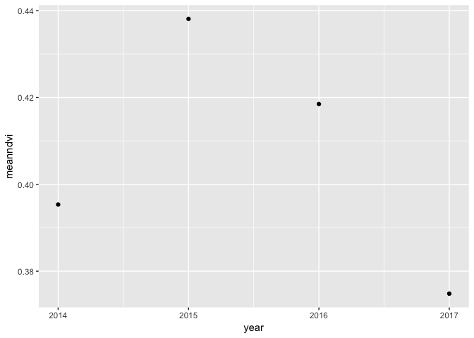

DS421 semester 2 final project
================
@xrwang
5/3/2018

\#Contents

This is a final project PDF document for DS421 stitched together from
other experiments in this rpo.

Some major goals were: - Get satellite data/imagery for village and
county names. - Poke around household income data - Poke around land use
change for a few Taobao villages.

## Section A

First we’ll take a look at household income data from CHIP, an{rd
geocode the counties based off a csv of “official administrative codes”.

We’ll also poke at the data a bit, looking at changes over time.

## Section B

\#\#CHIP

CHIP (China Household Income Project) is put out by the CIID Beijing as
a longitudinal survey. It’s been happening since 1988 and includes all
kinds of juicy stuff including land use.

Load up necessary libraries. Some data is in `.dta` which is Stata file.

``` r
library(tidyr)
library(tidyverse)
```

    ## Warning: package 'tibble' was built under R version 3.4.3

    ## Warning: package 'stringr' was built under R version 3.4.3

``` r
library(dplyr)
library(foreign)
library(reticulate)
```

    ## Warning: package 'reticulate' was built under R version 3.4.4

``` r
library(haven)
library(ggmap)
library(sf)
```

    ## Warning: package 'sf' was built under R version 3.4.3

``` r
library(raster)
library(spData)        # load geographic data
```

    ## Warning: package 'spData' was built under R version 3.4.4

``` r
library(httr)
library(jsonlite)
library(mapview)
library(leaflet)
```

``` r
chips_rur_1988 <- read_dta('data/1988/09836-0002-Data.dta')
chips_rur_1995 <- read_tsv('data/1995/DS0002/03012-0002-Data.tsv')
```

    ## Warning in rbind(names(probs), probs_f): number of columns of result is not
    ## a multiple of vector length (arg 1)

    ## Warning: 198 parsing failures.
    ## row # A tibble: 5 x 5 col     row col     expected               actual file                         expected   <int> <chr>   <chr>                  <chr>  <chr>                        actual 1  1499 B904E_2 no trailing characters .9     'data/1995/DS0002/03012-000… file 2  1500 B904E_2 no trailing characters .9     'data/1995/DS0002/03012-000… row 3  1501 B904E_2 no trailing characters .3     'data/1995/DS0002/03012-000… col 4  1502 B904E_2 no trailing characters .9     'data/1995/DS0002/03012-000… expected 5  1503 B904E_2 no trailing characters .9     'data/1995/DS0002/03012-000…
    ## ... ................. ... .......................................................................... ........ .......................................................................... ...... .......................................................................... .... .......................................................................... ... .......................................................................... ... .......................................................................... ........ ..........................................................................
    ## See problems(...) for more details.

``` r
chips_rur_2002<- read_tsv('data/2002/DS0006/21741-0006-Data.tsv')
```

    ## Warning in rbind(names(probs), probs_f): number of columns of result is not
    ## a multiple of vector length (arg 1)

    ## Warning: 244 parsing failures.
    ## row # A tibble: 5 x 5 col     row col   expected               actual           file                 expected   <int> <chr> <chr>                  <chr>            <chr>                actual 1  5632 p1_37 an integer             .100000001490116 'data/2002/DS0006/2… file 2  6685 p1_39 an integer             .5               'data/2002/DS0006/2… row 3  6780 p1_62 no trailing characters .5               'data/2002/DS0006/2… col 4  7848 p1_12 an integer             .5               'data/2002/DS0006/2… expected 5  8077 p1_62 no trailing characters .5               'data/2002/DS0006/2…
    ## ... ................. ... .......................................................................... ........ .......................................................................... ...... .......................................................................... .... .......................................................................... ... .......................................................................... ... .......................................................................... ........ ..........................................................................
    ## See problems(...) for more details.

``` r
chips_rur_2007abc <- read_dta('data/2007 (2008)/RHS_w1_abc.dta')
chips_rur_2007d <- read_dta('data/2007 (2008)/RHS_w1_d.dta')
chips_rur_2007e1 <- read_dta('data/2007 (2008)/RHS_w1_e1.dta')
chips_rur_2007e2 <- read_dta('data/2007 (2008)/RHS_w1_e2.dta')
chips_rur_2007e3 <- read_dta('data/2007 (2008)/RHS_w1_e3.dta')
chips_rur_2007e4 <- read_dta('data/2007 (2008)/RHS_w1_e4.dta')
chips_rur_2007hhiexp <- read_dta('data/2007 (2008)/CHIP2007_income_and_expenditure_20150408.dta')
chips_rur_2008abc <- read_dta('data/2008 (2009)/RHS_w2_abc.dta')
chips_rur_2008d <- read_dta('data/2008 (2009)/RHS_w2_d.dta')
chips_rur_2008e <- read_dta('data/2008 (2009)/RHS_w2_e.dta')
chips_rur_2008f <- read_dta('data/2008 (2009)/RHS_w2_f.dta')
chips_rur_2008hgsg <- read_dta('data/2008 (2009)/RHS_w2_hgsg.dta')
chips_rur_2008hijk <- read_dta('data/2008 (2009)/RHS_w2_hijk.dta')
chips_rur_2008vill <- read_dta('data/2008 (2009)/RHS_w2_vill.dta')
chips_rur_2013 <- read_dta('data/2013/CHIP2013_rural_household_f_income_asset.dta')


name_vill_id_2007 <- read_dta('data/2007 (2008)/name_id_and_village_id_20151010.dta')
```

### Table of columns used:

| Year | Net household income | Land cultivated | Number of rooms in House | Fixed production assets | Total household exp on production |
| ---- | -------------------- | --------------- | ------------------------ | ----------------------- | --------------------------------- |
| 1988 | HNET88               | LAT             | HHO                      | VHPFP                   | EFP88                             |
| 1995 | B602                 | B801            | B1001                    | B804\_1                 | B7130                             |
| 2002 | na                   | na              | na                       | na                      | na                                |
| 2007 | income\_net          | na              | na                       | na                      | na                                |
| 2009 | na                   | H01             | na                       | K01                     | na                                |
| 2013 | F01\_1               | L01\_1          | na                       | F07\_1 + F07\_2         | F02\_1                            |

``` r
# Filter out some data from 1988 because there's missing values. They got rid of missing values in later datasets.

chips_rur_1988_filt <- chips_rur_1988 %>% filter(HNET88 != 99999999, LAT != 999.9, HHO != 99, VHPFP != 99999, EFP88 != 99999999 ) 

base::mean(chips_rur_1988_filt$HNET88)
```

    ## [1] 2739.51

``` r
base::mean(chips_rur_1995$B602)
```

    ## [1] 6812.06

``` r
base::mean(chips_rur_2007hhiexp$income_net)
```

    ## [1] 19451.19

``` r
base::mean(chips_rur_2013$f01_1, na.rm=TRUE)
```

    ## [1] 45654.01

``` r
meanNetIncome <- new_tibble(list(year = c(1988,1995,2007,2013), 
                     meanInNet = c(base::mean(chips_rur_1988_filt$HNET88), base::mean(chips_rur_1995$B602), base::mean(chips_rur_2007hhiexp$income_net), base::mean(chips_rur_2013$f01_1, na.rm=TRUE))))

ggplot(meanNetIncome, aes(year, meanInNet)) +
  geom_line() +
  geom_point() +
  geom_label(label=meanNetIncome$meanInNet, nudge_x = 2, nudge_y = 1)
```

<!-- -->

``` r
chips_rur_1988_filt <- chips_rur_1988_filt %>%
  mutate(., PROVCOUNTY = paste0(PROVINCE, COUNTY)) 

chips_rur_1988_filt$UCODE <- substr(chips_rur_1988_filt$UCODE, 1,6)


#A1 is county and city code
chips_rur_1995 %>%
  mutate(., PROVCOUNTY = paste0(PROVINCE, COUNTY))
```

    ## # A tibble: 7,998 x 262
    ##        A1  B101  B401  B402  B403  B404  B405  B406  B407 B407A  B408
    ##     <int> <int> <int> <int> <int> <int> <int> <int> <int> <int> <int>
    ##  1 110221   101     1     1     2     2     2     2     2     0     1
    ##  2 110221   102     1     1     2     2     2     2     2     0     1
    ##  3 110221   103     1     1     2     2     2     2     2     0     1
    ##  4 110221   104     1     1     2     2     2     2     2     0     1
    ##  5 110221   105     1     1     2     2     2     2     2     0     1
    ##  6 110221   106     1     1     2     2     2     2     2     0     1
    ##  7 110221   107     1     1     2     2     2     2     2     0     1
    ##  8 110221   108     1     1     2     2     2     2     2     0     1
    ##  9 110221   109     1     1     2     2     2     2     2     0     1
    ## 10 110221   110     1     1     2     2     2     2     2     0     1
    ## # ... with 7,988 more rows, and 251 more variables: B409 <int>,
    ## #   B410 <int>, B411 <int>, B412 <int>, B412A <int>, B412B <int>,
    ## #   B412C <int>, B412D <int>, B413 <int>, B414 <int>, B501_1 <int>,
    ## #   B501_2 <int>, B501_3 <int>, B501A_1 <int>, B501A_2 <int>,
    ## #   B501A_3 <int>, B501B_1 <int>, B501B_2 <int>, B501B_3 <int>,
    ## #   B501C_1 <int>, B501C_2 <int>, B501C_3 <int>, B501D_1 <int>,
    ## #   B501D_2 <int>, B501D_3 <int>, B501E_1 <int>, B501E_2 <int>,
    ## #   B501E_3 <int>, B501F_1 <int>, B501F_2 <int>, B501F_3 <int>,
    ## #   B502_1 <int>, B502_2 <int>, B502_3 <int>, B502A_1 <int>,
    ## #   B502A_2 <int>, B502A_3 <int>, B502B_1 <int>, B502B_2 <int>,
    ## #   B502B_3 <int>, B502C_1 <int>, B502C_2 <int>, B502C_3 <int>,
    ## #   B502D_1 <int>, B502D_2 <int>, B502D_3 <int>, B502E_1 <int>,
    ## #   B502E_2 <int>, B502E_3 <int>, B502F_1 <int>, B502F_2 <int>,
    ## #   B502F_3 <int>, B502G_1 <int>, B502G_2 <int>, B502G_3 <int>,
    ## #   B502H_1 <int>, B502H_2 <int>, B502H_3 <int>, B503 <int>, B504 <int>,
    ## #   B504A <int>, B504B <int>, B504C <int>, B505 <int>, B506 <int>,
    ## #   B506A <int>, B506B <int>, B507 <int>, B508 <int>, B509 <int>,
    ## #   B510 <int>, B511_1 <int>, B511_2 <int>, B511A_1 <int>, B511A_2 <int>,
    ## #   B511B_1 <int>, B511B_2 <int>, B511C_1 <int>, B511C_2 <int>,
    ## #   B511D_1 <int>, B511D_2 <int>, B600 <int>, B601 <int>, B602 <int>,
    ## #   B700 <int>, B700A <int>, B701 <int>, B702 <int>, B703 <int>,
    ## #   B703A <int>, B703B <int>, B704 <int>, B705 <int>, B706 <int>,
    ## #   B707 <int>, B708 <int>, B708A <int>, B708B <int>, B708C <int>,
    ## #   B709 <int>, …

``` r
chips_rur_2007hhiexp$name_id <- substr(chips_rur_2007hhiexp$name_id, 1, 6)
```

\#\#County level variations in income

``` r
chips_rur_1988_filt %>%
  group_by(UCODE) %>%
  summarise(mean = base::mean(HNET88)) %>%
  mutate(., diff_from_country_mean = mean-base::mean(chips_rur_1988_filt$HNET88)) %>%
  ggplot(aes(UCODE,mean)) +
           geom_point()
```

<!-- -->

``` r
chips_rur_1995 %>%
  group_by(A1) %>%
  summarise(mean=base::mean(B602)) %>%
  mutate(., diff_from_country_mean = mean-base::mean(chips_rur_1995$B602))  %>%
  ggplot(aes(A1,mean)) +
           geom_point()
```

<!-- -->

``` r
chips_rur_2007hhiexp %>%
  group_by(name_id) %>%
  summarise(mean=base::mean(income_net)) %>%
  mutate(., diff_from_country_mean = mean-base::mean(chips_rur_2007hhiexp$income_net)) %>%
  ggplot(aes(name_id,mean)) +
           geom_point()
```

<!-- -->

``` r
chips_rur_2007hhiexp %>%
  group_by(name_id) 
```

    ## # A tibble: 8,000 x 14
    ## # Groups:   name_id [82]
    ##    name_id  exp1   exp2   exp3   exp4  exp5   exp6   exp7    exp8
    ##    <chr>   <dbl>  <dbl>  <dbl>  <dbl> <dbl>  <dbl>  <dbl>   <dbl>
    ##  1 130181  2670.    0.   2239. 1778.   971.  520.   386.    12.0 
    ##  2 130181  9633. 5364.   8978. 6396.   786. 1935.  1687.  1946.  
    ##  3 130181  4012.  442.   1941.  180.   120.  134.    13.0    3.00
    ##  4 130181  9487. 1986.   5853. 1020.   884. 4192.   386.   357.  
    ##  5 130181  3371. 1174.   2750.  712.   290.  270.    44.7   34.3 
    ##  6 130181  6559.   47.0 20386.  147.   432.  120.   102.    14.0 
    ##  7 130181  4449.  293.   1748.  201.  1254.  374.   118.    47.3 
    ##  8 130181  6968.  808.   1072.  147.   300.   69.2   72.0   65.4 
    ##  9 130181  3518.  742.   1344.  246.   567. 1162.   564.   137.  
    ## 10 130181  3805.  414.   9059.   48.0  959.  400.   473.   114.  
    ## # ... with 7,990 more rows, and 5 more variables: income_net <dbl>,
    ## #   income_net_1 <dbl>, income_net_2 <dbl>, income_net_3 <dbl>,
    ## #   income_net_4 <dbl>

``` r
chips_rur_2013 %>%
  group_by(coun) %>%
  summarise(mean=base::mean(f01_1)) %>%
  mutate(., diff_from_country_mean = mean-base::mean(chips_rur_2013$f01_1, na.rm=TRUE)) %>%
  ggplot(aes(coun,mean)) +
           geom_point()
```

    ## Warning: Removed 12 rows containing missing values (geom_point).

<!-- -->
\#\#dice off last 3 digits from `name id` of
chips\_rur\_2007hhiexp

``` r
outlier_values_1988 <- boxplot.stats(chips_rur_1988_filt$HNET88)$out  # outlier values.
outlier_values_1995 <- boxplot.stats(chips_rur_1995$B602)$out  # outlier values.
outlier_values_2007 <- boxplot.stats(chips_rur_2007hhiexp$income_net)$out  # outlier values.
outlier_values_2013 <- boxplot.stats(chips_rur_2013$f01_1)$out  # outlier values.
boxplot(chips_rur_1988_filt$LAT, chips_rur_1988_filt$HNET88)
```

<!-- -->

## Geocode county addresses based off the county codes

Data from
<https://raw.githubusercontent.com/modood/Administrative-divisions-of-China/>,
basically there’s a county code and name for each county. They are not
geocoded however (by geocoded I mean “center” of county).

\#Add long lat columns to the county code
table

``` r
counties_main <- read_csv('https://raw.githubusercontent.com/modood/Administrative-divisions-of-China/master/dist/areas.csv')

counties_main
```

    ## # A tibble: 2,856 x 4
    ##      code name     cityCode provinceCode
    ##     <int> <chr>       <int>        <int>
    ##  1 110101 东城区       1101           11
    ##  2 110102 西城区       1101           11
    ##  3 110105 朝阳区       1101           11
    ##  4 110106 丰台区       1101           11
    ##  5 110107 石景山区     1101           11
    ##  6 110108 海淀区       1101           11
    ##  7 110109 门头沟区     1101           11
    ##  8 110111 房山区       1101           11
    ##  9 110112 通州区       1101           11
    ## 10 110113 顺义区       1101           11
    ## # ... with 2,846 more rows

``` r
counties_main$lat <- 'NA'
counties_main$long <- 'NA'

city_main <- read_csv('https://raw.githubusercontent.com/modood/Administrative-divisions-of-China/master/dist/cities.csv')
province_main <- read_csv('https://raw.githubusercontent.com/modood/Administrative-divisions-of-China/master/dist/provinces.csv')

prov_county_main <- left_join(counties_main, province_main,
                              by=c('provinceCode'='code'))

prov_county_main <- prov_county_main %>%
    rename('cityName' = name.y, 
           'countyName' = name.x) %>%
    mutate(., geocodeAdd = paste0(cityName,countyName))


prov_county_main
```

    ## # A tibble: 2,856 x 8
    ##      code countyName cityCode provinceCode lat   long  cityName geocodeAdd
    ##     <int> <chr>         <int>        <int> <chr> <chr> <chr>    <chr>     
    ##  1 110101 东城区         1101           11 NA    NA    北京市   北京市东城区…
    ##  2 110102 西城区         1101           11 NA    NA    北京市   北京市西城区…
    ##  3 110105 朝阳区         1101           11 NA    NA    北京市   北京市朝阳区…
    ##  4 110106 丰台区         1101           11 NA    NA    北京市   北京市丰台区…
    ##  5 110107 石景山区       1101           11 NA    NA    北京市   北京市石景山区…
    ##  6 110108 海淀区         1101           11 NA    NA    北京市   北京市海淀区…
    ##  7 110109 门头沟区       1101           11 NA    NA    北京市   北京市门头沟区…
    ##  8 110111 房山区         1101           11 NA    NA    北京市   北京市房山区…
    ##  9 110112 通州区         1101           11 NA    NA    北京市   北京市通州区…
    ## 10 110113 顺义区         1101           11 NA    NA    北京市   北京市顺义区…
    ## # ... with 2,846 more rows

## Batch geocode using ggmap, h/t shayne lynn

# Set an API key for ggmap so we don’t go over the limit

``` r
ggmap_credentials()
register_google(key='insertyourkeyhere')
library(ggmap)
ggmap_credentials()
```

## Divide the table into two so as to preempt going over the free geocoding limit

``` r
# pcoun_codes_1 <- filter(prov_county_main, code < 400000)
# pcoun_codes_2 <- filter(prov_county_main, code >= 400000)
```

This section is commented out to prevent geocoding thousands of rows
everytime we knit….

``` r
# infile <- 'pcoun_2'
# data <-pcoun_codes_2
# 
# addresses = data$geocodeAdd
# 
# #define a function that will process googles server responses for us.
# getGeoDetails <- function(address){
#    #use the gecode function to query google servers
#    geo_reply = geocode(address, output='all', messaging=TRUE, override_limit=TRUE)
#    #now extract the bits that we need from the returned list
# 
#    answer <- data.frame(lat=NA, long=NA, accuracy=NA, formatted_address=NA, address_type=NA, status=NA)
#    answer$status <- geo_reply$status
# 
#    #if we are over the query limit - want to pause for an hour
#    while(geo_reply$status == "OVER_QUERY_LIMIT"){
#        print("OVER QUERY LIMIT - Pausing for 1 hour at:")
#        time <- Sys.time()
#        print(as.character(time))
#        Sys.sleep(60*60)
#        geo_reply = geocode(address, output='all', messaging=TRUE, override_limit=TRUE)
#        answer$status <- geo_reply$status
#    }
# 
#    #return Na's if we didn't get a match:
#    if (geo_reply$status != "OK"){
#        return(answer)
#    }
#    #else, extract what we need from the Google server reply into a dataframe:
#    answer$lat <- geo_reply$results[[1]]$geometry$location$lat
#    answer$long <- geo_reply$results[[1]]$geometry$location$lng
#    if (length(geo_reply$results[[1]]$types) > 0){
#        answer$accuracy <- geo_reply$results[[1]]$types[[1]]
#    }
#    answer$address_type <- paste(geo_reply$results[[1]]$types, collapse=',')
#    answer$formatted_address <- geo_reply$results[[1]]$formatted_address
# 
#    return(answer)
# }
# 
# #initialise a dataframe to hold the results
# geocoded <- data.frame()
# # find out where to start in the address list (if the script was interrupted before):
# startindex <- 1
# #if a temp file exists - load it up and count the rows!
# tempfilename <- paste0(infile, '_temp_geocoded.rds')
# if (file.exists(tempfilename)){
#        print("Found temp file - resuming from index:")
#        geocoded <- readRDS(tempfilename)
#        startindex <- nrow(geocoded)+1
#        print(startindex)
# }
# 
# # Start the geocoding process - address by address. geocode() function takes care of query speed limit.
# for (ii in seq(startindex, length(addresses))) {
#    print(paste("Working on index", ii, "of", length(addresses)))
#    #query the google geocoder - this will pause here if we are over the limit.
# 
#    result = getGeoDetails(addresses[ii])
#    print(result$status)
#    result$index <- ii
#    #append the answer to the results file.
#    geocoded <- rbind(geocoded, result)
#    #save temporary results as we are going along
#    saveRDS(geocoded, tempfilename)
# }

# geocodedTable <- data.frame(matrix(ncol = 3, nrow = 1516))
# #now we add the latitude and longitude to the main data
# 
# geocodedTable$status <- geocoded$status
# geocodedTable$formatted_address <- geocoded$formatted_address
# geocodedTable$index <- geocoded$index
# geocodedTable$lat <- geocoded$lat
# geocodedTable$long <- geocoded$long
# geocodedTable$accuracy <- geocoded$accuracy
# 
# 
# 
# #finally write it all to the output files
# saveRDS(data, paste0("../data/", infile ,"_geocoded.rds"))
# write.table(geocodedTable, file=paste0("", infile ,"_geocoded.csv"), sep=",", row.names=FALSE)
```

# Now there’s two tables because we split the county list, put together vertically

``` r
a <- read_csv('data/pcoun_1_geocoded.csv')
b <- read_csv('data/pcoun_2_geocoded.csv')
geocoded_areas <- bind_rows(a,b)

prov_county_main$lat <- geocoded_areas$lat
prov_county_main$long <- geocoded_areas$long

prov_county_main$engAdd <- geocoded_areas$formatted_address
```

## Join prov\_county\_main to the tables

``` r
chips_rur_1988_filt$UCODE <- strtoi(chips_rur_1988_filt$UCODE)
prov_county_main
```

    ## # A tibble: 2,856 x 9
    ##      code countyName cityCode provinceCode   lat  long cityName geocodeAdd
    ##     <int> <chr>         <int>        <int> <dbl> <dbl> <chr>    <chr>     
    ##  1 110101 东城区         1101           11  39.9  116. 北京市   北京市东城区…
    ##  2 110102 西城区         1101           11  39.9  116. 北京市   北京市西城区…
    ##  3 110105 朝阳区         1101           11  39.9  116. 北京市   北京市朝阳区…
    ##  4 110106 丰台区         1101           11  39.9  116. 北京市   北京市丰台区…
    ##  5 110107 石景山区       1101           11  39.9  116. 北京市   北京市石景山区…
    ##  6 110108 海淀区         1101           11  40.0  116. 北京市   北京市海淀区…
    ##  7 110109 门头沟区       1101           11  39.9  116. 北京市   北京市门头沟区…
    ##  8 110111 房山区         1101           11  39.7  116. 北京市   北京市房山区…
    ##  9 110112 通州区         1101           11  39.9  117. 北京市   北京市通州区…
    ## 10 110113 顺义区         1101           11  40.1  117. 北京市   北京市顺义区…
    ## # ... with 2,846 more rows, and 1 more variable: engAdd <chr>

``` r
chips_rur_1988_geocoded <- chips_rur_1988_filt %>% 
  inner_join(prov_county_main, by=c('UCODE'='code')) %>%
  na.omit()
```

## Maps of survey locations

``` r
leaflet(data = chips_rur_1988_geocoded) %>% 
  addTiles() %>%
  addMarkers(~long, ~lat, popup = ~as.character(HNET88), label = ~as.character(HNET88))
```

<!-- -->

# Taobao villages

## Geocoding taobao villages

There are 1312 taobao villages as of 2017.

I have data for Taobao villages from 2014-2016

Testing out the geocoding response, put the province and village
together (省 column + 村 column, separate by comma
)

``` r
taobao_villages_2016 <- read_csv('data/taobao-village-list/taobao_village_list_2016.csv',
                            col_names = c(
                              'sheng',
                              'shi',
                              'xian',
                              'xiangzhen',
                              'cun'
                            ),
                            skip=1)

taobao_villages_2015 <- readxl::read_excel('data/taobao-village-list/taobao-village-list-2015.xlsx',
                            col_names = c(
                              'sheng',
                              'shi',
                              'xian',
                              'xiangzhen',
                              'cun'
                            ),
                            skip=1)
taobao_villages_2015 <- taobao_villages_2015 %>% 
  mutate(., geocodeAdd = paste0(sheng,cun))

taobao_villages_2014 <- readxl::read_excel('data/taobao-village-list/taobao-village-list-2014.xlsx',
                            col_names = c(
                              'sheng',
                              'shi',
                              'xian',
                              'xiangzhen',
                              'cun',
                              'goods_made'
                            ),
                            skip=1)
```

\#Geocode taobao villages

``` r
taobao_villages_2016 <- taobao_villages_2016 %>% 
  mutate(., geocodeAdd = paste0(sheng,cun))
taobao_villages_2016 %>% count(xiangzhen)
```

    ## # A tibble: 493 x 2
    ##    xiangzhen      n
    ##    <chr>      <int>
    ##  1 丁家桥镇       1
    ##  2 丁蜀镇         2
    ##  3 万全镇         2
    ##  4 万田乡         1
    ##  5 万里镇         2
    ##  6 丈亭镇         1
    ##  7 三合镇         3
    ##  8 三班镇         4
    ##  9 三甲街道       1
    ## 10 三里河街道     1
    ## # ... with 483 more rows

``` r
taobao_villages_subset_2016 <- subset(taobao_villages_2016, xiangzhen == '三合镇' )
#Go through this list and geocode them all !

taobao_villages_subset_2016
```

    ## # A tibble: 3 x 6
    ##   sheng  shi    xian   xiangzhen cun      geocodeAdd    
    ##   <chr>  <chr>  <chr>  <chr>     <chr>    <chr>         
    ## 1 浙江省 台州市 天台县 三合镇    大横金村 浙江省大横金村
    ## 2 浙江省 台州市 天台县 三合镇    下坊村   浙江省下坊村  
    ## 3 浙江省 台州市 天台县 三合镇    洋头村   浙江省洋头村

## Set environment token for api call, geocode and bind together.

``` r
token <- Sys.getenv("GOOGMAPS")
#https://maps.googleapis.com/maps/api/geocode/json?address=1600+Amphitheatre+Parkway,+Mountain+View,+CA&key=YOUR_API_KEY
geocode_the_place_f <- function(geocodeAdd,...) {

  #http://api.iucnredlist.org/index/species/Acaena-exigua.json
    json <- httr::GET(paste0('https://maps.googleapis.com/maps/api/geocode/json?address=', geocodeAdd, '&key=', token))
  
    if (status_code(json) == 200) {
      results <- fromJSON(content(json, as='text'))$results$geometry$location

    } else {
      NULL
    }
}

taobao_villages_2016_geocoded <- taobao_villages_subset_2016 %>%
  bind_cols(., pmap_df(., geocode_the_place_f))
  

taobao_villages_2016_geocoded
```

    ## # A tibble: 3 x 8
    ##   sheng  shi    xian   xiangzhen cun      geocodeAdd       lat   lng
    ##   <chr>  <chr>  <chr>  <chr>     <chr>    <chr>          <dbl> <dbl>
    ## 1 浙江省 台州市 天台县 三合镇    大横金村 浙江省大横金村  29.1  121.
    ## 2 浙江省 台州市 天台县 三合镇    下坊村   浙江省下坊村    29.1  121.
    ## 3 浙江省 台州市 天台县 三合镇    洋头村   浙江省洋头村    27.6  119.

\#Did NDVI (Normalized difference vegetation index) change for a few of
the taobao
villages?

## Here I setup a location (lat long point) and then find the bounding box for it. I then am able to georeference jpgs like the ones that come from Google Satellite Maps

## Make bounding box off of one satellite tile.

bounding\_box function is from
<https://github.com/trinker/bounding_box>, an R implementation of Jan
Philip Matuschek’s algorithm.

``` r
bounding_box <- function(lat, lon, dist, in.miles = TRUE) {

    ## Helper functions
    if (in.miles) {
        ang_rad <- function(miles) miles/3958.756
    } else {
        ang_rad <- function(miles) miles/1000
    }
    `%+/-%` <- function(x, margin){x + c(-1, +1)*margin}
    deg2rad <- function(x) x/(180/pi)
    rad2deg <- function(x) x*(180/pi)
    lat_range <- function(latr, r) rad2deg(latr %+/-% r)
    lon_range <- function(lonr, dlon) rad2deg(lonr %+/-% dlon)

    r <- ang_rad(dist)
    latr <- deg2rad(lat)
    lonr <- deg2rad(lon)
    dlon <- asin(sin(r)/cos(latr))

    m <- matrix(c(lon_range(lonr = lonr, dlon = dlon), 
        lat_range(latr=latr, r=r)), nrow=2, byrow = TRUE)

    dimnames(m) <- list(c("lng", "lat"), c("min", "max"))
    m
}
```

``` r
#浙江省紫竹村 zizhucun not a TBC at al 30.222385 119.378449
longitude_zzc <- 119.378449
latitude_zzc <- 30.222385

library(dismo)

get_tile_save_geotiff <- function (long, lat, filename, zoom) {
    boundingbox <- bounding_box(lat, long, 0.62, in.miles=TRUE )
 
    xmax <- boundingbox[1, 2] 
    ymin <- boundingbox[2,1]
    xmin <- boundingbox[1, 1]
    ymax <- boundingbox[2, 2]

    
  extent_dismo <- extent(xmin, xmax, ymin, ymax)
  dismogmap_tile <- dismo::gmap(extent_dismo, type = 'satellite', zoom = zoom)
  plot(dismogmap_tile)
  projection(dismogmap_tile) <- CRS("+init=epsg:3857")
  writeRaster(dismogmap_tile, file = filename, format = "GTiff", overwrite = TRUE, 
    datatype = "INT1U")
}

# Comment out the actual call for testing purposes
# get_tile_save_geotiff(longitude_zzc, latitude_zzc, 'dismo_zzc', zoom = 16)
```

## After getting the geoTiff tile, crop the raster files from landsat as well

``` r
library(rgdal)
library(sp)

landsat <- brick('data/zzc/zzc_2016.tif')
#this landsat image is from libeicun
crs(landsat)
```

    ## CRS arguments:
    ##  +proj=longlat +datum=WGS84 +no_defs +ellps=WGS84 +towgs84=0,0,0

``` r
#cropped <- crop(landsat, extent(dismogmap_tile), 'croppedlandsat')

make_a_bbox_shapefile <- function (long, lat, filename) {
  bb <- bounding_box(lat, long, 0.62, in.miles=TRUE )

  xmax <- bb[1, 2] 
  ymin <- bb[2,1]
  xmin <- bb[1, 1]
  ymax <- bb[2, 2]
      
  
  coords = matrix(c(xmax, ymax,
                xmin, ymax,
               xmin, ymin,
               xmax, ymin,
               xmax, ymax), 
             ncol = 2, byrow = TRUE)


  #Tryig out making a bounding box to a shapefile, to cross check with Google Earth and QGIS
  P1 <- Polygon(coords)
  Ps1 <- SpatialPolygons(list(Polygons(list(P1), ID = "a")), proj4string=CRS("+proj=longlat +ellps=WGS84 +datum=WGS84 +no_defs"))
  Ps2 <- as(Ps1, "SpatialPolygonsDataFrame")
  writeOGR(Ps2, filename, layer=filename, driver='ESRI Shapefile' )
}

# This part is commented out because I already made the shapefiles

#make_a_bbox_shapefile(longitude_mdc, latitude_mdc, filename = 'madingcun')
#make_a_bbox_shapefile(longitude_chengloucun, latitude_chengloucun, filename = 'chengloucun')
#make_a_bbox_shapefile(longitude_zzc, latitude_zzc, filename = 'zhizhucun' )
```

# Quick analysis of taobao village sites NDVI change over the years

## Read in and get some stats

``` r
lbc2014 <- brick('data/lbc-raster-cropped/lbc_2014_cropped.tif')
lbc2015 <- brick('data/lbc-raster-cropped/lbc_2015_cropped.tif')
lbc2016 <- brick('data/lbc-raster-cropped/lbc_2016_cropped.tif')
lbc2017 <- brick('data/lbc-raster-cropped/lbc_2017_cropped.tif')

lbc2014
```

    ## class       : RasterBrick 
    ## dimensions  : 46, 52, 2392, 14  (nrow, ncol, ncell, nlayers)
    ## resolution  : 0.0002694946, 0.0002694946  (x, y)
    ## extent      : 106.7217, 106.7358, 27.03435, 27.04675  (xmin, xmax, ymin, ymax)
    ## coord. ref. : +proj=longlat +datum=WGS84 +no_defs +ellps=WGS84 +towgs84=0,0,0 
    ## data source : /Users/xiaoweirwang/Projects/taobao-villages/scripts/data/lbc-raster-cropped/lbc_2014_cropped.tif 
    ## names       : lbc_2014_cropped.1, lbc_2014_cropped.2, lbc_2014_cropped.3, lbc_2014_cropped.4, lbc_2014_cropped.5, lbc_2014_cropped.6, lbc_2014_cropped.7, lbc_2014_cropped.8, lbc_2014_cropped.9, lbc_2014_cropped.10, lbc_2014_cropped.11, lbc_2014_cropped.12, lbc_2014_cropped.13, lbc_2014_cropped.14 
    ## min values  :      -1.125000e+03,      -5.370000e+02,       1.870000e+02,       8.200000e+01,       1.080000e+03,       3.440000e+02,       1.540000e+02,       2.957000e+03,       2.922000e+03,        6.600000e+01,        3.220000e+02,        0.000000e+00,        1.357031e-01,        1.406691e+12 
    ## max values  :       1.563000e+03,       1.672000e+03,       2.062000e+03,       2.469000e+03,       5.057000e+03,       4.181000e+03,       5.077000e+03,       3.025000e+03,       2.977000e+03,        2.280000e+02,        3.860000e+02,        0.000000e+00,        9.007264e-01,        1.406691e+12

``` r
lbc2015
```

    ## class       : RasterBrick 
    ## dimensions  : 46, 52, 2392, 14  (nrow, ncol, ncell, nlayers)
    ## resolution  : 0.0002694946, 0.0002694946  (x, y)
    ## extent      : 106.7217, 106.7358, 27.03435, 27.04675  (xmin, xmax, ymin, ymax)
    ## coord. ref. : +proj=longlat +datum=WGS84 +no_defs +ellps=WGS84 +towgs84=0,0,0 
    ## data source : /Users/xiaoweirwang/Projects/taobao-villages/scripts/data/lbc-raster-cropped/lbc_2015_cropped.tif 
    ## names       : lbc_2015_cropped.1, lbc_2015_cropped.2, lbc_2015_cropped.3, lbc_2015_cropped.4, lbc_2015_cropped.5, lbc_2015_cropped.6, lbc_2015_cropped.7, lbc_2015_cropped.8, lbc_2015_cropped.9, lbc_2015_cropped.10, lbc_2015_cropped.11, lbc_2015_cropped.12, lbc_2015_cropped.13, lbc_2015_cropped.14 
    ## min values  :       1.240000e+02,       2.270000e+02,       4.960000e+02,       3.460000e+02,       1.321000e+03,       1.157000e+03,       6.070000e+02,       2.897000e+03,       2.883000e+03,        6.600000e+01,        3.220000e+02,        0.000000e+00,        1.429886e-01,        1.428809e+12 
    ## max values  :       1.996000e+03,       2.272000e+03,       2.856000e+03,       3.233000e+03,       4.079000e+03,       1.109100e+04,       1.456500e+04,       2.949000e+03,       2.929000e+03,        2.280000e+02,        3.220000e+02,        0.000000e+00,        8.287406e-01,        1.437103e+12

``` r
lbc2016
```

    ## class       : RasterBrick 
    ## dimensions  : 46, 52, 2392, 14  (nrow, ncol, ncell, nlayers)
    ## resolution  : 0.0002694946, 0.0002694946  (x, y)
    ## extent      : 106.7217, 106.7358, 27.03435, 27.04675  (xmin, xmax, ymin, ymax)
    ## coord. ref. : +proj=longlat +datum=WGS84 +no_defs +ellps=WGS84 +towgs84=0,0,0 
    ## data source : /Users/xiaoweirwang/Projects/taobao-villages/scripts/data/lbc-raster-cropped/lbc_2016_cropped.tif 
    ## names       : lbc_2016_cropped.1, lbc_2016_cropped.2, lbc_2016_cropped.3, lbc_2016_cropped.4, lbc_2016_cropped.5, lbc_2016_cropped.6, lbc_2016_cropped.7, lbc_2016_cropped.8, lbc_2016_cropped.9, lbc_2016_cropped.10, lbc_2016_cropped.11, lbc_2016_cropped.12, lbc_2016_cropped.13, lbc_2016_cropped.14 
    ## min values  :       9.600000e+01,       1.790000e+02,       3.050000e+02,       2.520000e+02,       7.460000e+02,       5.710000e+02,       3.780000e+02,       2.880000e+03,       2.867000e+03,        6.600000e+01,        3.220000e+02,        0.000000e+00,        1.801529e-01,        1.455075e+12 
    ## max values  :       1.212000e+03,       1.466000e+03,       1.995000e+03,       2.239000e+03,       4.673000e+03,       3.475000e+03,       3.211000e+03,       3.017000e+03,       2.975000e+03,        2.280000e+02,        3.220000e+02,        0.000000e+00,        9.206731e-01,        1.471663e+12

``` r
lbc2017
```

    ## class       : RasterBrick 
    ## dimensions  : 46, 52, 2392, 14  (nrow, ncol, ncell, nlayers)
    ## resolution  : 0.0002694946, 0.0002694946  (x, y)
    ## extent      : 106.7217, 106.7358, 27.03435, 27.04675  (xmin, xmax, ymin, ymax)
    ## coord. ref. : +proj=longlat +datum=WGS84 +no_defs +ellps=WGS84 +towgs84=0,0,0 
    ## data source : /Users/xiaoweirwang/Projects/taobao-villages/scripts/data/lbc-raster-cropped/lbc_2017_cropped.tif 
    ## names       : lbc_2017_cropped.1, lbc_2017_cropped.2, lbc_2017_cropped.3, lbc_2017_cropped.4, lbc_2017_cropped.5, lbc_2017_cropped.6, lbc_2017_cropped.7, lbc_2017_cropped.8, lbc_2017_cropped.9, lbc_2017_cropped.10, lbc_2017_cropped.11, lbc_2017_cropped.12, lbc_2017_cropped.13, lbc_2017_cropped.14 
    ## min values  :      -2.650000e+02,       1.300000e+01,       2.730000e+02,       1.790000e+02,       1.037000e+03,       6.610000e+02,       3.130000e+02,       2.934000e+03,       2.907000e+03,        6.600000e+01,        3.220000e+02,        0.000000e+00,        1.513150e-01,        1.491017e+12 
    ## max values  :       1.618000e+03,       1.869000e+03,       2.274000e+03,       2.369000e+03,       6.053000e+03,       3.695000e+03,       4.299000e+03,       3.015000e+03,       2.978000e+03,        2.280000e+02,        3.860000e+02,        0.000000e+00,        9.478509e-01,        1.500694e+12

``` r
#12 band data from tif

plotRGB(lbc2014, r = 4, g = 3, b = 2, axes = TRUE, stretch = "lin",
        main = "Landsat True Color Composite lbc 2014")
```

<!-- -->

``` r
# plotRGB(lbc2015, r = 4, g = 3, b = 2, axes = TRUE, stretch = "lin",
#         main = "Landsat True Color Composite lbc2015")
# 
# plotRGB(lbc2016, r = 4, g = 3, b = 2, axes = TRUE, stretch = "lin",
#         main = "Landsat True Color Composite lbc2016")
# 
# plotRGB(lbc2017, r = 4, g = 3, b = 2, axes = TRUE, stretch = "lin",
#         main = "Landsat True Color Composite lbc2017")
```

\#\#compute ndvi for LBC

``` r
NDVI <- function(img, i, k) {
   bi <- img[[i]]
   bk <- img[[k]]
   vi <- (bk - bi) / (bk + bi)
   return(vi)
}
```

\#\#function for NDBI

``` r
NDBI <- function (img, w, n) {
  bw <- img[[w]]
  bn <- img[[n]]
  vn <- (bw - bn) / (bw + bn)
}
```

``` r
# For landsat 8, NIR is 5, red is 4.
ndvilbc_2014 <- NDVI(lbc2014, 4, 5)
ndvilbc_2015 <- NDVI(lbc2015, 4 , 5)
ndvilbc_2016 <- NDVI(lbc2016, 4, 5)
ndvilbc_2017 <- NDVI(lbc2017, 4, 5)


ndbilbc_2014 <- NDBI(lbc2014, 7, 5)
ndbilbc_2015 <- NDBI(lbc2015, 7 , 5)
ndbilbc_2016 <- NDBI(lbc2016, 7, 5)
ndbilbc_2017 <- NDBI(lbc2017, 7, 5)
```

``` r
plot(ndvilbc_2014, col = rev(terrain.colors(30)), main = 'NDVI lbc2014')
```

<!-- -->

``` r
plot(ndvilbc_2015, col = rev(terrain.colors(30)), main = 'NDVI lbc2015')
```

<!-- -->

``` r
 plot(ndvilbc_2016, col = rev(terrain.colors(30)), main = 'NDVI lbc2016')
```

<!-- -->

``` r
 plot(ndvilbc_2017, col = rev(terrain.colors(30)), main = 'NDVI lbc2017')
```

<!-- -->

``` r
# view distribution of NDVI values
# hist(ndvilbc_2014,
#   main = "NDVI: Distribution of pixels\n Landsat 2014 Libeicun",
#   col = "springgreen",
#   xlab = "NDVI lbc2014")
# 
```

``` r
plot(ndbilbc_2014, col = rev(terrain.colors(30)), main = 'NDBI lbc2014')
```

<!-- -->

``` r
# plot(ndbilbc_2015, col = rev(terrain.colors(30)), main = 'NDBI lbc2015')
# plot(ndbilbc_2016, col = rev(terrain.colors(30)), main = 'NDBI lbc2016')
# plot(ndbilbc_2017, col = rev(terrain.colors(30)), main = 'NDBI lbc2017')
```

## Calculate average NDVI as a time series

``` r
ndvi_lbc_stack <- stack(ndvilbc_2014,ndvilbc_2015,ndvilbc_2016, ndvilbc_2017)
#names(ndvi_lbc_stack) <- c(2014,2015,2016,2017)
avg_ndvi_lbc <- cellStats(ndvi_lbc_stack, mean)

avg_ndvi_lbc <- as_tibble(avg_ndvi_lbc)
# add a site column to our data


# add a "year" column to our data
avg_ndvi_lbc$'year' <- c(2014,2015,2016,2017)
hist(ndvi_lbc_stack)
```

<!-- -->

``` r
avg_ndvi_lbc <- avg_ndvi_lbc[c("year", "value")]
avg_ndvi_lbc = rename(avg_ndvi_lbc, `meanndvi` = value)
# avg_ndvi_lbc

ggplot(data = avg_ndvi_lbc, aes(x=year, y=meanndvi)) +
  geom_point()
```

<!-- -->

### Calculate average NDBI as a time series

``` r
ndbi_lbc_stack <- stack(ndbilbc_2014,ndbilbc_2015,ndbilbc_2016, ndbilbc_2017)
#names(ndbi_lbc_stack) <- c(2014,2015,2016,2017)
avg_ndbi_lbc <- cellStats(ndbi_lbc_stack, mean)

avg_ndbi_lbc <- as_tibble(avg_ndbi_lbc)
# add a site column to our data


# add a "year" column to our data
avg_ndbi_lbc$'year' <- c(2014,2015,2016,2017)
hist(ndbi_lbc_stack)
```

<!-- -->

``` r
avg_ndbi_lbc <- avg_ndbi_lbc[c("year", "value")]
avg_ndbi_lbc = rename(avg_ndbi_lbc, `meanndbi` = value)
# avg_ndbi_lbc

ggplot(data = avg_ndbi_lbc, aes(x=year, y=meanndbi)) +
  geom_point()
```

<!-- -->

## NDVI for non taobao village, 安徽省程楼村, Chengloucun

``` r
clc2014 <- brick('data/clc/clc_2014.tif')
clc2015 <- brick('data/clc/clc_2015.tif')
clc2016 <- brick('data/clc/clc_2016.tif')
clc2017 <- brick('data/clc/clc_2017.tif')
clc2014nl <- brick('data/clc/clc_2014_nlviirs.tif')


#12 band data from tif
plotRGB(clc2014, r = 4, g = 3, b = 2, axes = TRUE, stretch = "lin",
        main = "Landsat True Color Composite clc 2014")
```

<!-- -->

``` r
# plotRGB(clc2015, r = 4, g = 3, b = 2, axes = TRUE, stretch = "lin",
#         main = "Landsat True Color Composite clc2015")
# 
# plotRGB(clc2016, r = 4, g = 3, b = 2, axes = TRUE, stretch = "lin",
#         main = "Landsat True Color Composite clc2016")

plotRGB(clc2017, r = 4, g = 3, b = 2, axes = TRUE, stretch = "lin",
        main = "Landsat True Color Composite clc2017")
```

<!-- -->

``` r
ndviclc_2014 <- NDVI(clc2014, 4, 5)
ndviclc_2015 <- NDVI(clc2015, 4 , 5)
ndviclc_2016 <- NDVI(clc2016, 4, 5)
ndviclc_2017 <- NDVI(clc2017, 4, 5)
```

``` r
plot(clc2014nl, col = gray.colors(10, start = 0, end = 1, gamma = 2.2, alpha = NULL))
```

<!-- -->

``` r
plot(ndviclc_2014, col = rev(terrain.colors(30)), main = 'NDVI clc2014')
```

<!-- -->

``` r
# plot(ndviclc_2015, col = rev(terrain.colors(30)), main = 'NDVI clc2015')
# plot(ndviclc_2016, col = rev(terrain.colors(30)), main = 'NDVI clc2016')
# plot(ndviclc_2017, col = rev(terrain.colors(30)), main = 'NDVI clc2017')
# 


ndvi_clc_stack <- stack(ndviclc_2014,ndviclc_2015,ndviclc_2016, ndviclc_2017)
#names(ndvi_clc_stack) <- c(2014,2015,2016,2017)
avg_ndvi_clc <- cellStats(ndvi_clc_stack, mean)

avg_ndvi_clc <- as_tibble(avg_ndvi_clc)
# add a site column to our data


# add a "year" column to our data
avg_ndvi_clc$'year' <- c(2014,2015,2016,2017)
hist(ndvi_clc_stack)
```

<!-- -->

``` r
avg_ndvi_clc <- avg_ndvi_clc[c("year", "value")]
avg_ndvi_clc = rename(avg_ndvi_clc, `meanndvi` = value)
# avg_ndvi_clc

ggplot(data = avg_ndvi_clc, aes(x=year, y=meanndvi)) +
  geom_point()
```

<!-- -->

## NDVI for a Taobao village, 浙江省马丁村 Madingcun which was implemented as a Taobao village in 2015

``` r
mdc2014 <- brick('data/mdc/mdc_2014.tif')
mdc2015 <- brick('data/mdc/mdc_2015.tif')
mdc2016 <- brick('data/mdc/mdc_2016.tif')
mdc2017 <- brick('data/mdc/mdc_2017.tif')
mdc2014nl <- brick('data/mdc/mdc_2014_nlviirs.tif')

mdc2014
```

    ## class       : RasterBrick 
    ## dimensions  : 67, 77, 5159, 14  (nrow, ncol, ncell, nlayers)
    ## resolution  : 0.0002694946, 0.0002694946  (x, y)
    ## extent      : 120.1132, 120.1339, 29.39054, 29.4086  (xmin, xmax, ymin, ymax)
    ## coord. ref. : +proj=longlat +datum=WGS84 +no_defs +ellps=WGS84 +towgs84=0,0,0 
    ## data source : /Users/xiaoweirwang/Projects/taobao-villages/scripts/data/mdc/mdc_2014.tif 
    ## names       : mdc_2014.1, mdc_2014.2, mdc_2014.3, mdc_2014.4, mdc_2014.5, mdc_2014.6, mdc_2014.7, mdc_2014.8, mdc_2014.9, mdc_2014.10, mdc_2014.11, mdc_2014.12, mdc_2014.13, mdc_2014.14

``` r
#12 band data from tif


ndvimdc_2014 <- NDVI(mdc2014, 4, 5)
ndvimdc_2015 <- NDVI(mdc2015, 4 , 5)
ndvimdc_2016 <- NDVI(mdc2016, 4, 5)
ndvimdc_2017 <- NDVI(mdc2017, 4, 5)
```

``` r
plotRGB(mdc2014, r = 4, g = 3, b = 2, axes = TRUE, stretch = "lin",
        main = "Landsat True Color Composite mdc 2014")
```

<!-- -->

``` r
# plotRGB(mdc2015, r = 4, g = 3, b = 2, axes = TRUE, stretch = "lin",
#         main = "Landsat True Color Composite mdc2015")
# 
# plotRGB(mdc2016, r = 4, g = 3, b = 2, axes = TRUE, stretch = "lin",
#         main = "Landsat True Color Composite mdc2016")
# 
# plotRGB(mdc2017, r = 4, g = 3, b = 2, axes = TRUE, stretch = "lin",
#         main = "Landsat True Color Composite mdc2017")
plot(ndvimdc_2014, col = rev(terrain.colors(30)), main = 'NDVI mdc2014')
```

<!-- -->

``` r
# plot(ndvimdc_2015, col = rev(terrain.colors(30)), main = 'NDVI mdc2015')
# plot(ndvimdc_2016, col = rev(terrain.colors(30)), main = 'NDVI mdc2016')
# plot(ndvimdc_2017, col = rev(terrain.colors(30)), main = 'NDVI mdc2017')
# 


ndvi_mdc_stack <- stack(ndvimdc_2014,ndvimdc_2015,ndvimdc_2016, ndvimdc_2017)
#names(ndvi_mdc_stack) <- c(2014,2015,2016,2017)
avg_ndvi_mdc <- cellStats(ndvi_mdc_stack, mean)

avg_ndvi_mdc <- as_tibble(avg_ndvi_mdc)
# add a site column to our data


# add a "year" column to our data
avg_ndvi_mdc$'year' <- c(2014,2015,2016,2017)
hist(ndvi_mdc_stack)
```

<!-- -->

``` r
avg_ndvi_mdc <- avg_ndvi_mdc[c("year", "value")]
avg_ndvi_mdc = rename(avg_ndvi_mdc, `meanndvi` = value)
# avg_ndvi_mdc

ggplot(data = avg_ndvi_mdc, aes(x=year, y=meanndvi)) +
  geom_point()
```

<!-- -->

## Try another non-taobao village, Zizhucun

``` r
zzc2014 <- brick('data/zzc/zzc_2014.tif')
zzc2015 <- brick('data/zzc/zzc_2015.tif')
zzc2016 <- brick('data/zzc/zzc_2016.tif')
zzc2017 <- brick('data/zzc/zzc_2017.tif')

zzcnl_2014 <- brick('data/zzc/zzc_2014_nlviirs.tif')
zzcnl_2015 <- brick('data/zzc/zzc_2015_nlviirs.tif')
zzcnl_2016 <- brick('data/zzc/zzc_2016_nlviirs.tif')
zzcnl_2017 <- brick('data/zzc/zzc_2017_nlviirs.tif')


#12 band data from tif


ndvizzc_2014 <- NDVI(zzc2014, 4, 5)
ndvizzc_2015 <- NDVI(zzc2015, 4 , 5)
ndvizzc_2016 <- NDVI(zzc2016, 4, 5)
ndvizzc_2017 <- NDVI(zzc2017, 4, 5)
```

``` r
# plotRGB(zzc2014, r = 4, g = 3, b = 2, axes = TRUE, stretch = "lin",
#         main = "Landsat True Color Composite zzc 2014")
# 
# plotRGB(zzc2015, r = 4, g = 3, b = 2, axes = TRUE, stretch = "lin",
#         main = "Landsat True Color Composite zzc2015")
# 
# plotRGB(zzc2016, r = 4, g = 3, b = 2, axes = TRUE, stretch = "lin",
#         main = "Landsat True Color Composite zzc2016")
# 
# plotRGB(zzc2017, r = 4, g = 3, b = 2, axes = TRUE, stretch = "lin",
#         main = "Landsat True Color Composite zzc2017")
raster::plot(zzcnl_2014, col = gray.colors(10, start = 0, end = 1, gamma = 2.2, alpha = NULL))
```

<!-- -->

``` r
# raster::plot(zzc2015nl, col = gray.colors(10, start = 0, end = 1, gamma = 2.2, alpha = NULL))
# raster::plot(zzc2016nl, col = gray.colors(10, start = 0, end = 1, gamma = 2.2, alpha = NULL))
# raster::plot(zzc2017nl, col = gray.colors(10, start = 0, end = 1, gamma = 2.2, alpha = NULL))


plot(ndvizzc_2014, col = rev(terrain.colors(30)), main = 'NDVI zzc2014')
```

<!-- -->

``` r
# plot(ndvizzc_2015, col = rev(terrain.colors(30)), main = 'NDVI zzc2015')
# plot(ndvizzc_2016, col = rev(terrain.colors(30)), main = 'NDVI zzc2016')
# plot(ndvizzc_2017, col = rev(terrain.colors(30)), main = 'NDVI zzc2017')
# 


ndvi_zzc_stack <- stack(ndvizzc_2014,ndvizzc_2015,ndvizzc_2016, ndvizzc_2017)
nl_zzc_stack <- stack(zzcnl_2014,zzcnl_2015,zzcnl_2016, zzcnl_2017)

#names(ndvi_zzc_stack) <- c(2014,2015,2016,2017)
avg_ndvi_zzc <- cellStats(ndvi_zzc_stack, mean)

avg_ndvi_zzc <- as_tibble(avg_ndvi_zzc)
# add a site column to our data


# add a "year" column to our data
avg_ndvi_zzc$'year' <- c(2014,2015,2016,2017)
hist(ndvi_zzc_stack)
```

<!-- -->

``` r
avg_ndvi_zzc <- avg_ndvi_zzc[c("year", "value")]
avg_ndvi_zzc = rename(avg_ndvi_zzc, `meanndvi` = value)
# avg_ndvi_zzc

ggplot(data = avg_ndvi_zzc, aes(x=year, y=meanndvi)) +
  geom_point()
```

<!-- -->

``` r
# night lights
#names(ndvi_zzc_stack) <- c(2014,2015,2016,2017)
avg_nl_zzc <- cellStats(nl_zzc_stack, mean)

avg_nl_zzc <- as_tibble(avg_nl_zzc)
# add a site column to our data


# add a "year" column to our data
avg_nl_zzc$'year' <- c(2014,2015,2016,2017)
hist(nl_zzc_stack)
```

<!-- -->

``` r
avg_nl_zzc <- avg_nl_zzc[c("year", "value")]
avg_nl_zzc = rename(avg_nl_zzc, `meannl` = value)
avg_nl_zzc
```

    ## # A tibble: 4 x 2
    ##    year meannl
    ##   <dbl>  <dbl>
    ## 1 2014.   10.5
    ## 2 2015.   14.0
    ## 3 2016.   12.9
    ## 4 2017.   14.4

``` r
ggplot(data = avg_nl_zzc, aes(x=year, y=meannl)) +
  geom_point()
```

<!-- -->

## All four together

``` r
#Taobao villages
ggplot(data = avg_ndvi_lbc, aes(x=year, y=meanndvi)) +
  geom_point()
```

<!-- -->

``` r
ggplot(data = avg_ndvi_mdc, aes(x=year, y=meanndvi)) +
  geom_point()
```

<!-- -->

``` r
ggplot(data = avg_ndvi_clc, aes(x=year, y=meanndvi)) +
  geom_point()
```

<!-- -->

``` r
ggplot(data = avg_ndvi_zzc, aes(x=year, y=meanndvi)) +
  geom_point()
```

<!-- -->

``` r
hist(ndvi_lbc_stack)
```

<!-- -->

``` r
hist(ndvi_mdc_stack)
```

<!-- -->

``` r
hist(ndvi_clc_stack)
```

<!-- -->

``` r
hist(ndvi_zzc_stack)
```

<!-- -->
