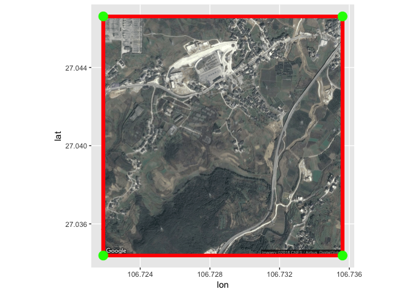
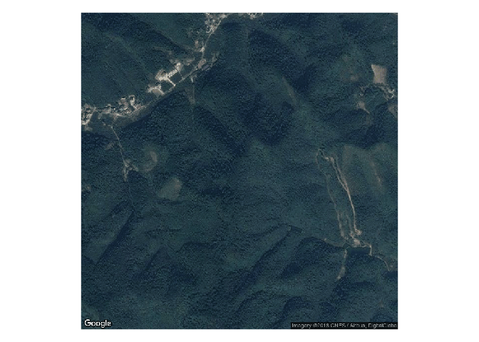

processing longlat coordinates to grab tiles, georeference and
================
Xiaowei Wang

## Make bounding box off of one satellite tile.

bounding\_box function is from
<https://github.com/trinker/bounding_box>, an R implementation of Jan
Philip Matuschek’s algorithm.

``` r
bounding_box <- function(lat, lon, dist, in.miles = TRUE) {

    ## Helper functions
    if (in.miles) {
        ang_rad <- function(miles) miles/3958.756
    } else {
        ang_rad <- function(miles) miles/1000
    }
    `%+/-%` <- function(x, margin){x + c(-1, +1)*margin}
    deg2rad <- function(x) x/(180/pi)
    rad2deg <- function(x) x*(180/pi)
    lat_range <- function(latr, r) rad2deg(latr %+/-% r)
    lon_range <- function(lonr, dlon) rad2deg(lonr %+/-% dlon)

    r <- ang_rad(dist)
    latr <- deg2rad(lat)
    lonr <- deg2rad(lon)
    dlon <- asin(sin(r)/cos(latr))

    m <- matrix(c(lon_range(lonr = lonr, dlon = dlon), 
        lat_range(latr=latr, r=r)), nrow=2, byrow = TRUE)

    dimnames(m) <- list(c("lng", "lat"), c("min", "max"))
    m
}
```

``` r
library(ggmap)
```

    ## Loading required package: ggplot2

    ## Google Maps API Terms of Service: http://developers.google.com/maps/terms.

    ## Please cite ggmap if you use it: see citation("ggmap") for details.

``` r
library(dismo)
```

    ## Loading required package: raster

    ## Loading required package: sp

    ## 
    ## Attaching package: 'raster'

    ## The following object is masked from 'package:ggplot2':
    ## 
    ##     calc

    ## 
    ## Attaching package: 'dismo'

    ## The following object is masked from 'package:ggmap':
    ## 
    ##     geocode

``` r
#  test out the get map based on long lat

#libeicun 106.728735, 27.040506, this is one of the newest TBC
longitude_lb <- 106.728735
latitude_lb <- 27.040506

#madingcun 120.123507, 29.399521, change over multiple years, was in 2015 and 2016, not 2014
longitude_mdc <- 120.123507
latitude_mdc <- 29.399521


#安徽省程楼村 116.8437324, 34.2820951 not a TBC at all 

longitude_chengloucun <- 116.8437324
latitude_chengloucun <- 34.2820951


#浙江省紫竹村 zizhucun not a TBC at al 30.222385 119.378449
longitude_zzc <- 119.378449
latitude_zzc <- 30.222385

bbox_tile_plotter <- function (boundingbox, tile, longitude, latitude) {
      
    xmax <- boundingbox[1, 2] 
    ymin <- boundingbox[2,1]
    xmin <- boundingbox[1, 1]
    ymax <- boundingbox[2, 2]
      
      
     points_frame <- data.frame(lon = c(xmax, longitude, xmin),
                               lat = c(ymax, latitude, ymin),
                               name = c('max', 'center', 'min'))
      
          ggmap(tile, 
          extent="normal",
          ylab = "lat",
          xlab = "lon") +
        geom_rect(aes(xmin = xmin, xmax = xmax, ymin = ymin, ymax = ymax), color="red", fill=NA, size=2) +
      geom_point(aes(xmin = xmin, xmax = xmax, ymin = ymin, ymax = ymax), size=5, color = "green") 
}

get_tile_save <- function (longitude, latitude, filename) {
  one_tile <- get_map(location = c(lon = longitude, lat = latitude), zoom = 16, maptype = "satellite")
  df <- data.frame(longitude, latitude)
  plot <- ggmap(one_tile, extent ="device") +
    geom_point(data=df,aes(x=longitude,y=latitude))
  
    ggsave(filename, plot, device='tiff')

    bb <- bounding_box(latitude, longitude, 0.62, in.miles=TRUE )
    
    bbox_tile_plotter(bb, one_tile, longitude, latitude)
    
}

get_tile_save(longitude = longitude_lb, latitude = latitude_lb, filename = 'lb')
```

    ## Source : https://maps.googleapis.com/maps/api/staticmap?center=27.040506,106.728735&zoom=16&size=640x640&scale=2&maptype=satellite&language=en-EN

    ## Saving 7 x 5 in image

    ## Warning: Ignoring unknown aesthetics: xmin, xmax, ymin, ymax

<!-- -->

``` r
get_tile_save(longitude = longitude_mdc, latitude = latitude_mdc, filename = 'mdc')
```

    ## Source : https://maps.googleapis.com/maps/api/staticmap?center=29.399521,120.123507&zoom=16&size=640x640&scale=2&maptype=satellite&language=en-EN
    ## Saving 7 x 5 in image

    ## Warning: Ignoring unknown aesthetics: xmin, xmax, ymin, ymax

<!-- -->

``` r
get_tile_save(longitude = longitude_chengloucun, latitude = latitude_chengloucun, filename = 'mdc')
```

    ## Source : https://maps.googleapis.com/maps/api/staticmap?center=34.282095,116.843732&zoom=16&size=640x640&scale=2&maptype=satellite&language=en-EN
    ## Saving 7 x 5 in image

    ## Warning: Ignoring unknown aesthetics: xmin, xmax, ymin, ymax

<!-- -->

``` r
get_tile_save(longitude = longitude_zzc, latitude = latitude_zzc, filename = 'zhizucun')
```

    ## Source : https://maps.googleapis.com/maps/api/staticmap?center=30.222385,119.378449&zoom=16&size=640x640&scale=2&maptype=satellite&language=en-EN
    ## Saving 7 x 5 in image

    ## Warning: Ignoring unknown aesthetics: xmin, xmax, ymin, ymax

<!-- -->

## Now let’s georeference the satellite tile that we saved\!

``` r
#plot
#test_tile <- raster('a')
#extents <- c(xmin, xmax, ymin, ymax)
#setExtent(test_tile, extent(extents), keepres = FALSE, snap = FALSE )

#plot(test_tile)
```

## Well it turns out that there’s an easier way to save geoTiffs and assign them a CRS… and that is using the dismo package in R\!

``` r
get_tile_save_geotiff <- function (long, lat, filename, zoom) {
    boundingbox <- bounding_box(lat, long, 0.62, in.miles=TRUE )
 
    xmax <- boundingbox[1, 2] 
    ymin <- boundingbox[2,1]
    xmin <- boundingbox[1, 1]
    ymax <- boundingbox[2, 2]

    
  extent_dismo <- extent(xmin, xmax, ymin, ymax)
  dismogmap_tile <- dismo::gmap(extent_dismo, type = 'satellite', zoom = zoom)
  plot(dismogmap_tile)
  projection(dismogmap_tile) <- CRS("+init=epsg:3857")
  writeRaster(dismogmap_tile, file = filename, format = "GTiff", overwrite = TRUE, 
    datatype = "INT1U")
}

get_tile_save_geotiff(longitude_zzc, latitude_zzc, 'dismo_zzc', zoom = 16)
```

    ## Loading required namespace: rgdal

<!-- --><!-- -->

## After getting the geoTiff tile, crop the raster files from landsat as well

``` r
library(rgdal)
```

    ## rgdal: version: 1.2-16, (SVN revision 701)
    ##  Geospatial Data Abstraction Library extensions to R successfully loaded
    ##  Loaded GDAL runtime: GDAL 2.1.3, released 2017/20/01
    ##  Path to GDAL shared files: /Library/Frameworks/GDAL.framework/Versions/2.1/Resources/gdal
    ##  GDAL binary built with GEOS: TRUE 
    ##  Loaded PROJ.4 runtime: Rel. 4.9.1, 04 March 2015, [PJ_VERSION: 491]
    ##  Path to PROJ.4 shared files: (autodetected)
    ##  Linking to sp version: 1.2-5

``` r
library(sp)

landsat <- brick('data/lbc_2017.tif')
#this landsat image is from libeicun
crs(landsat)
```

    ## CRS arguments:
    ##  +proj=longlat +datum=WGS84 +no_defs +ellps=WGS84 +towgs84=0,0,0

``` r
#cropped <- crop(landsat, extent(dismogmap_tile), 'croppedlandsat')

make_a_bbox_shapefile <- function (long, lat, filename) {
  bb <- bounding_box(lat, long, 0.62, in.miles=TRUE )

  xmax <- bb[1, 2] 
  ymin <- bb[2,1]
  xmin <- bb[1, 1]
  ymax <- bb[2, 2]
      
  
  coords = matrix(c(xmax, ymax,
                xmin, ymax,
               xmin, ymin,
               xmax, ymin,
               xmax, ymax), 
             ncol = 2, byrow = TRUE)


  #Tryig out making a bounding box to a shapefile, to cross check with Google Earth and QGIS
  P1 <- Polygon(coords)
  Ps1 <- SpatialPolygons(list(Polygons(list(P1), ID = "a")), proj4string=CRS("+proj=longlat +ellps=WGS84 +datum=WGS84 +no_defs"))
  Ps2 <- as(Ps1, "SpatialPolygonsDataFrame")
  writeOGR(Ps2, filename, layer=filename, driver='ESRI Shapefile' )
}

#make_a_bbox_shapefile(longitude_mdc, latitude_mdc, filename = 'madingcun')
#make_a_bbox_shapefile(longitude_chengloucun, latitude_chengloucun, filename = 'chengloucun')
#make_a_bbox_shapefile(longitude_zzc, latitude_zzc, filename = 'zhizhucun' )
```

\#Projections are off\!

Landsat projection
and

``` r
#landsat: +proj=longlat +datum=WGS84 +no_defs +ellps=WGS84 +towgs84=0,0,0
#dismotile: +init=epsg:3857 +proj=merc +a=6378137 +b=6378137 +lat_ts=0.0 +lon_0=0.0 +x_0=0.0 +y_0=0 +k=1.0 +units=m +nadgrids=@null +no_defs
latt <- latitude_lb
longt <- longitude_lb

longitude_chengloucun
```

    ## [1] 116.8437

``` r
    boundingboxt <- bounding_box(latt, longt, 0.62, in.miles=TRUE )
 

    txmax <- boundingboxt[1, 2] 
    tymin <- boundingboxt[2,1]
    txmin <- boundingboxt[1, 1]
    tymax <- boundingboxt[2, 2]
textent_dismo <- extent(txmin, txmax, tymin, tymax)
dismogmapt_tile <- dismo::gmap(textent_dismo, type = 'satellite', zoom = 16)
newproj <- "+proj=longlat +datum=WGS84 +no_defs +ellps=WGS84 +towgs84=0,0,0"
dismogmap_tile_wgs <- projectRaster(dismogmapt_tile, crs = newproj)
identicalCRS(dismogmapt_tile,landsat)
```

    ## [1] FALSE

``` r
cropped <- crop(landsat, extent(dismogmap_tile_wgs))

plotRGB(cropped, r = 3, g = 2, b = 1, axes = TRUE, stretch = "lin",
        main = "Landsat True Color Composite")
```

<!-- -->

``` r
rf <- writeRaster(cropped, filename="data/lbc_2017_cropped.tif", format="GTiff", overwrite=TRUE)
```
